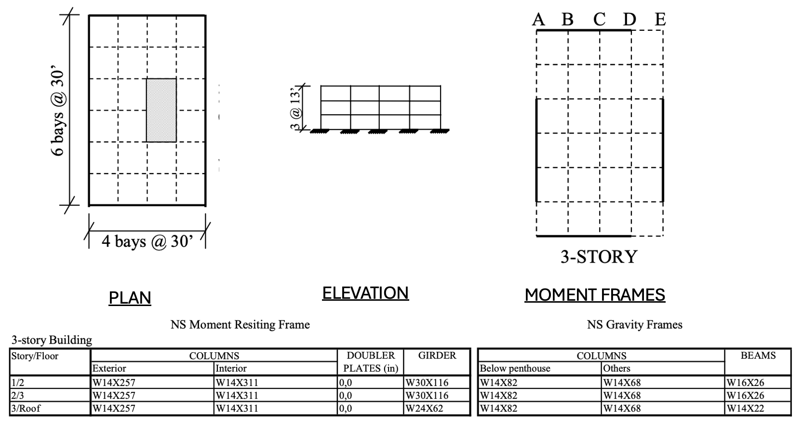

.. _eeuq-0000:

A Test of Different Random Variable Types, Multiple Analysis and Multiple Model Options
=======================================================================================

This example is for demo purposes. It's intent is to show the options available in the use of random variables,
multiple models, and multiple analysis options. 

The building being modeled is the LA Post-Northridge 3 story North-South no cover plates, no column splice
building from the  FEMA-355C/Sept. 2000  report. (https://www.nehrp.gov/pdf/fema355c.pdf).

Two structural models are used: 1) a 2d nonlinear beam column model of the moment frame, 2) an elastic stick model of same frame. Two analysis models are used to explore effect of model and rayleigh damping on the results.

For the moment frame and stick model, the columns of each story are provided a unique youngs modululs. All beams have same modulus. For the columns each story has same yield and hardening ratios (OpenSees Steel01 material is used).

	      
   LA 3-Story Post Northridge Building FEMA 355-c Building.

