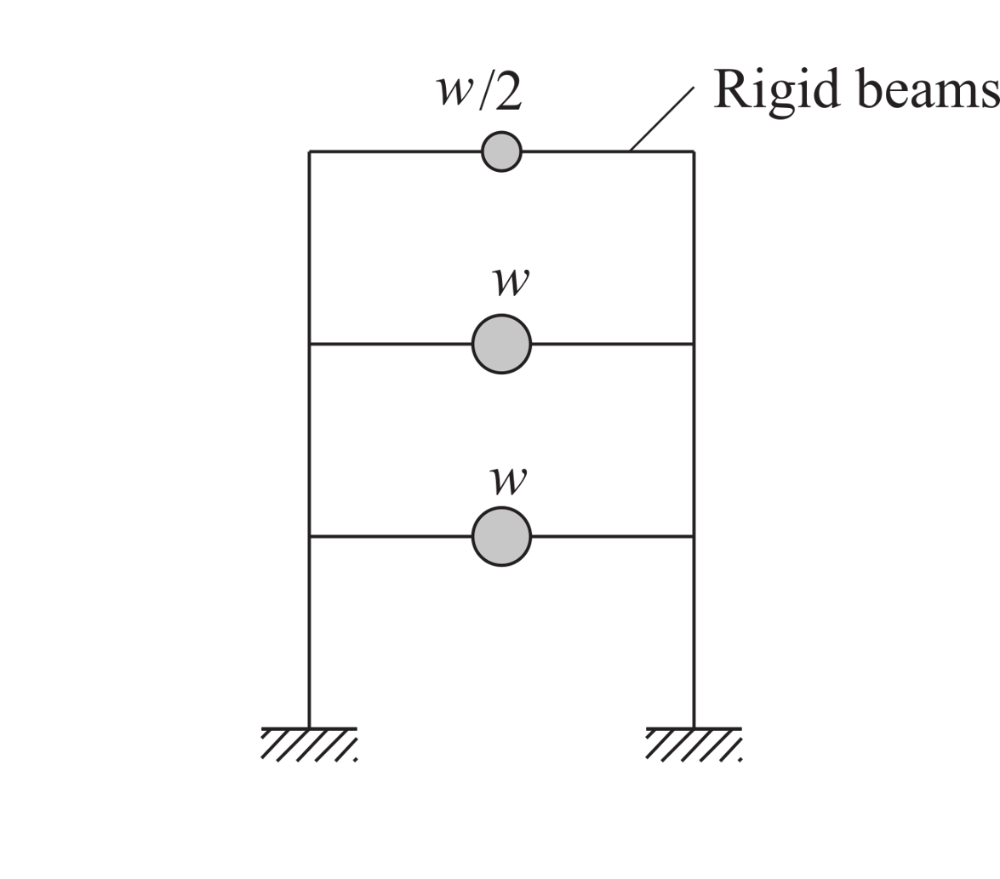
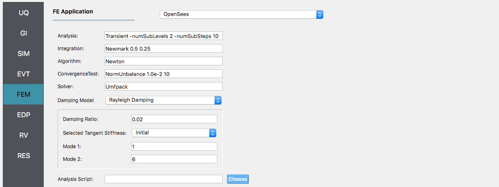
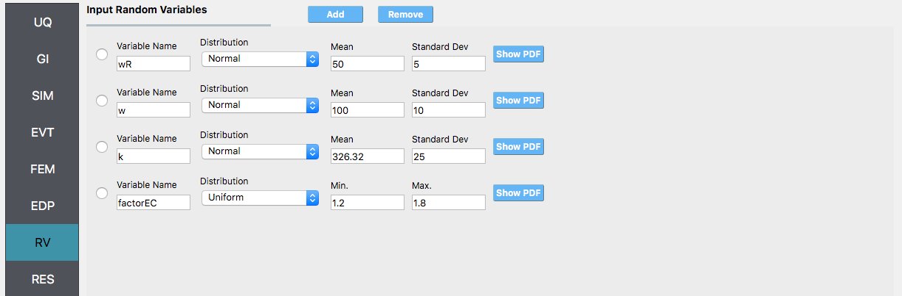
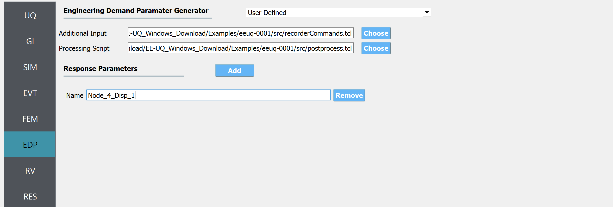

.. _eeuq-0001:

Sampling, Reliability and Sensitivity Analysis of a Shear Building
=================================================================

Consider the problem of uncertainty quantification for a three-story shear building

support.
   :width: 400
   :figclass: align-center

   Three Story Shear Building Model (P10.2.9, "Dynamics of Structures", A.K.Chopra)

The structure has uncertain properties that all follow a normal distribution:

#. Weight of Typical Floor (``w``): mean :math:`\mu_E=100 \mathrm{kip}` and standard deviation :math:`\sigma_E =10 \mathrm{kip}` (COV = 10%)
#. Weight of Roof (``wR``): mean :math:`\mu_E=50 \mathrm{kip}` and standard deviation :math:`\sigma_E =5 \mathrm{kip}` (COV = 10%)
#. Story Stiffness (``k``): mean :math:`\mu_k =326.32 \mathrm{kip/in}` and a standard deviation of :math:`\sigma_P = 3 \mathrm{kN}`, (COV = 12%).

The goal of the exercise is to estimate the mean and standard deviation of the relative displacement of the fourth node when subjected to an El Centro ground motion record.

The exercise will use both the MDOF, :ref:`lblMDOFSIM`,  and OpenSees, :ref:`lblOpenSeesSIM`, structural generators. For the OpenSees generator the following model script, `ShearBuilding3.tcl <https://github.com/NHERI-SimCenter/EE-UQ/blob/master/Examples/eeuq-0001/src/ShearBuilding3.tcl>`_ , is used:

.. literalinclude:: src/ShearBuilding3.tcl
   :language: tcl

.. note::
   
   1. The first lines containing ``pset`` will be read by the application when the file is selected and the application will autopopulate the random variables ``w``, ``wR``, and ``k`` in the **RV**  panel with these same variable names. 

.. warning::

   Do not place the file in your root, downloads, or desktop folder as when the application runs it will copy the contents on the directories and subdirectories containing this file multiple times (a copy will be made for each sample specified). If you are like us, your root, Downloads or Documents folders contain and awful lot of files and when the backend workflow runs you will slowly find you will run out of disk space!

Sampling Analysis with El Centro
^^^^^^^^^^^^^^^^^^^^^^^^^^^^^^^^

We will first demonstrate the steps to perform a sampling analysis to study the effects of the roof response of models of the building subjected to the El Centro ground motion. We will scale the input motion using a scale factor (which we name ``factorEC``) following a uniform distribution between **1.2** and **1.8**, i.e. mean :math:`\mu_{factorEC} = 1.5` and a standard deviation of :math:`\sigma_{factorEC} = 0.1732`, (COV = 12%).

To perform a Sampling or Forward propagation uncertainty analysis the user would perform the following steps:

1. Upon opening the application the **UQ** tab will be highlighted. In is panel, keep the **UQ engine** as that selected, i.e. Dakota, and the **UQ Method Category** as **Forward Propagation**, and the **Method** field as **LHS** (Latin Hypercube). Change the **#samples** field to ``1000`` and the **Seed** to ``20`` as shown in the following figure.

.. figure:: figures/shearUQ.png
   :align: center
   :alt: Screenshot of a user interface with a left-side menu showing categories like UQ, GI, SIM, EVT, FEM, EDP, RV, and RES. On the right, there is a section titled "UQ Engine" with a dropdown menu selecting "Dakota," another dropdown for "Dakota Method Category" selecting "Forward Propagation," with options below for "Method" choosing "LHS," a field to input the number of samples (set to 1000), and a field for the seed value (set to 20).
   :figclass: align-center

.. note::

   When loading the example from the tool page, the number of samples is set to ``50``.
	      
2. The **GI** panel will not be used for this run; For the time being leave the default values as is, and they will be automatically updated based on the information entered in the remaining tabs.

3. Next select the **SIM** panel from the input panel. This will default in the MDOF model generator. We will use this generator (the NOTE below contains instructions on how to use the OpenSees script instead). In the building information panel, specify the number of stories as **3** (this will change the graphic). Also in the Building information frame specify **w** for the floor weights and **k** for story stiffness. Finally, in the table below, go to the third row and enter **wR** for the roof weight (you will notice that when you enter that table cell the node at the top of the model will turn red, indicating you are editing the information for the top most node).

.. figure:: figures/shearSIM.png
   :align: center
   :alt: Screenshot of a Building Model Generator software interface with various input fields for defining building specifications such as number of stories, floor weights, story heights, and stiffness values. On the right side of the screen is a diagram representing a multi-degree of freedom (MDOF) model of a building with three levels, indicated by blue squares, and a vertical line representing the structure's height.
   :figclass: align-center

.. note::

   To specify instead to use the OpenSees script, from the **Model Generator** pull-down menu select **OpenSees**. For the fields in the panel presented enter the path to the ``ShearBuilding3d.tcl`` script. Also, specify three Response Nodes as **1 2 3 4** in the panel. This field will tell the model generator which nodes correspond to nodes at the four-floor levels at which responses are to be obtained when using the standard earthquake EDPs.

   .. figure:: figures/shearSIM-OpenSees.png
      :align: center
      :alt: Screenshot of a Building Model Generator software interface showing a selected file path for an Input Script labeled "ShearBuilding3.tcl", fields for specifying Response Nodes, Spatial Dimension, and Degrees Of Freedom (DOF) at Nodes. There are tabs on the left side for various modules like UQ, GI, SIM, EVT, FEM, EDP, RV, and RES, with SIM currently selected or highlighted. A drop-down menu at the top right corner indicates the software is integrated with or supports OpenSees.
      :figclass: align-center

4. Next select the **EVT** panel. From the **Load Generator** pull-down menu select the **Multiple PEER** option. This will present a panel with three buttons: **Add**, **Remove** and **Load Directory**. Click the **Add** button. Give the motion a name, here enter ``elCentro`` in the first line edit. Now for the motion, enter the path to the ``elCentro.AT2`` motion. Leave the motion acting in the **1** dof direction and for the scale factor in this direction, enter **factorEC**.

.. figure:: figures/shearEVT.png
   :align: center
   :alt: A screenshot of a software interface with a sidebar on the left containing menu items such as UQ, GI, SIM, EVT (highlighted), FEM, EDP, RV, and RES. The main area is titled "Load Generator" and includes a dropdown menu with the option "Multiple PEER" selected, a section titled "List of PEER Events" with a radio button option labeled "elCentro" and another radio button option next to a file path input box. There are buttons labeled "Add," "Remove," and "Load Directory," as well as a "Choose" button next to the file path. At the end, there are input boxes for "DOF" with a value of "1" and a "Factor" labeled "factorEC." The interface appears to be for configuring events, possibly for engineering simulations or analyses.
   :figclass: align-center

5. Next choose the **FEM** panel. Here we will change the entries to use Rayleigh damping, with Rayleigh factor chosen using the first and third modes. For the **MDOF** model generator, because it generates a model with two translational and one rotational degree-of-freedom in each direction and because we have provided the same ``k`` values in each translational direction (i.e. we will have duplicate eigenvalues), we specify as shown in the figure modes **1** and **6**.

g Model," "Damping Ratio," "Selected Tangent Stiffness," and modes 1 and 2 with numerical input fields. There's also a field for "Analysis Script" at the bottom. The interface has a sidebar with tabs labeled "UQ," "GI," "SIM," "EVT," "FEM," "EDP," "RV," "RES," with the "FEM" tab highlighted.
   :figclass: align-center

.. note::

   If instead we were using the OpenSees model, which does not have the duplicate eigenvalues, it being a planar problem with constrained degrees-of-freedom, we specify modes **1** and **3** as shown.

   .. figure:: figures/shearFEM-OpenSees.png
      :align: center
      :alt: Screenshot of a software interface with the title "FE Application" selected from a menu. The interface is divided into various settings grouped under Analysis, Integration, Algorithm, ConvergenceTest, Solver, and Damping Model, with parameters like "Transient -numSubLevels 2 -numSubSteps 10", "Newmark 0.5 0.25", "Newton", "NormUnbalance 1.0e-2 10", and "Umfpack" filled in the respective text fields. There is also a section for Damping Model showing "Rayleigh Damping" selected from a dropdown menu, alongside fields for Damping Ratio, Selected Tangent Stiffness, Mode 1, and Mode 2 with numerical values set. A button labeled "Choose" next to an empty field for Analysis Script is located at the bottom of the interface.
      :figclass: align-center

6. We will skip the **EDP** panel leaving it in its default condition, that is to use the **Standard Earthquake** EDP generator.

7. For the **RV** panel, we will enter the distributions and values for our random variables. Because of the steps we have followed and entries we have made, when this tab is opened it should contain the four random variables and they should all be set constant. For the ``w``, ``wR`` and ``k`` random variables we change the distributions to normal and enter the values given for the problem, as shown in the figure below. For the ``factorEC`` variable, change the distribution to **uniform** and enter the values in the figure.

stribution and a range from 1.2 to 1.8. To the left, a vertical navigation bar lists categories such as UQ, GI, SIM, EVT, FEM, EDP, RV, and RES, with RV highlighted in blue.
   :figclass: align-center

.. warning::   

   The user cannot leave any of the distributions for these values as constant for the Dakota UQ engine.

8. Next click on the **Run** button. This will cause the backend application to launch Dakota. When the analysis is complete the **RES** tab will be selected and the results will be displayed. The results show the values for the mean and standard deviation. The relative displacement of the roof is the quantity **1-PFD-3-1**. This identifier signifies the first event, 3rd floor (in the US the ground floor is considered 0), and the first dof direction.

.. figure:: figures/shearRES1.png
   :align: center
   :alt: Screenshot of a computer interface showing a statistical data analysis with several entries. The interface includes categories on the left such as UQ, GI, SIM, EVT, FEM, EDP, RV, and RES which are highlighted one by one. The main panel displays tables of different datasets, each with a Name, Mean, StdDev (standard deviation), Skewness, and Kurtosis values. The data fields show numerical values for different parameters named 1-PFA-0-1, 1-PFA-1-1, 1-PFD-1-1, among others, indicating different mean values and variation measures. The top of the main panel has tabs labeled 'Summary' and 'Data Values,' with 'Summary' currently selected.
   :figclass: align-center

If the user selects the **Data** tab in the **RES** panel, they will be presented with both a graphical plot and a tabular listing of the data. By left- and right-clicking with the mouse in the individual columns the axis changes (the left mouse click controls the vertical axis, right mouse clicks the horizontal axis).

.. figure:: figures/shearRES7.png
   :align: center
   :alt: Two side-by-side images of graphical user interfaces containing scatter plots with numerous blue dots representing data points. The plots are labeled with various factor levels on the x-axis and a FP-BF metric on the y-axis. There are tables below the scatter plots with numerical data, and elements of the user interface, such as buttons labeled "Save Data," "Summary," and "Data Values," are visible in each image. The interfaces have additional sections labeled with acronyms such as UQ, GI, SIM, EVT, FEM, EDP, RV, and RES. The exact data values and specific interface functionality are not discernible.
   :figclass: align-center

Various views of the graphical display can be obtained by left- and right-clicking in the columns of the tabular data. If a singular column of the tabular data is selected with both right and left mouse buttons, a frequency and CDF plot will be displayed, as shown in the figure below.

.. figure:: figures/shearRES6.png
   :align: center
   :alt: The image displays two charts side by side within a software interface. On the left is a histogram with the x-axis labeled '-1*PFD-p-1' showing a distribution of values with various frequencies. On the right is a cumulative distribution curve that gradually increases and flattens out as it progresses along the same x-axis label. Below each chart, there is a table titled 'RES' with columns 'Run #', 'W', 'R', 'N', 'a', 'factor_EC', 'factor_FC-p-1', 'factor_FC-p+1', 'factor_FC-p+1.10', 'factor_FC-p+3', 'factor_FC-p+1.50', 'factor_FC-p+3.01'. The first row of the table displays numerical data. The top of the interface includes tabs labeled 'Summary' and 'Data Values' suggesting these charts are part of a data analysis or simulation program.
   :figclass: align-center

Sampling Analysis with ElCentro and Reduced Output
^^^^^^^^^^^^^^^^^^^^^^^^^^^^^^^^^^^^^^^^^^^^^^^^^^

In the previous example, we got the standard output, which can be both a lot and also limited (in the sense you don't get the information you want). In this example we will present how to obtain results just for the roof displacement, the displacement of node **4** in both the **MDOF** and **OpenSees** model generator examples. The examples could be extended to output for example the story shear forces, element forces, element end rotations, etc.

For this example, you will need two additional files `recorderCommands.tcl <https://github.com/NHERI-SimCenter/EE-UQ/blob/master/Examples/ShearBuilding3/recorderCommands.tcl>`_ and `postprocess.tcl <https://github.com/NHERI-SimCenter/EE-UQ/blob/master/Examples/ShearBuilding3/postprocess.tcl>`_. The ``recorderCommands.tcl`` script as shown below will record the envelope displacements in the first two degrees of freedom for nodes **1** through **4**. 

.. literalinclude:: src/recorderCommands.tcl
   :language: tcl

The postprocess.tcl script shown below will accept as input any of the 4 nodes *in the domain and for each of the two dof directions.

.. literalinclude:: src/postprocess.tcl
   :language: tcl

.. note::

   The user has the option to provide no postprocess script (in which case the main script must create a ``results.out`` file containing a single line with as many space-separated numbers as QoI or the user may provide a Python script that also performs the postprocessing. An example of a postprocessing Python script is `postprocess.py <https://github.com/NHERI-SimCenter/EE-UQ/blob/master/examples/ShearBuilding3/postprocess.py>`_. 

   .. literalinclude:: postprocess.py
      :language: python

The steps are the same as the previous example, with the exception of step 4 defining the **EDP**. 5. 

1. For the **EDP** panel, we will change the generator to **User Defined**. In the panel that presents itself, the user must provide the paths to both the recorder commands and the postprocessing script. Next, the user must provide information on the response parameters they are interested in. The user presses the **Add** button and enters ``Node_4_Disp_1`` in the entry field as shown in the figure below.

button. There's a "Response Parameters" section with "Name Node_4_Disp_1" listed, and two buttons labeled "Add" and "Remove." To the left, there is a sidebar with various options including UQ, GI, SIM, EVT, FEM, EDP (highlighted), RV, and RES.
   :figclass: align-center

2. Next click on the **Run** button. This will cause the backend application to launch dakota. When done the **RES** panel will be selected and the results will be displayed. The results show the values of the mean and standard deviation as before but now only for the one quantity of interest.

.. figure:: figures/shearRES-UO.png
   :align: center
   :alt: A screenshot of a statistical analysis software interface displaying a table under the tab "Summary." The table lists statistical values for an entity named "Node_4_Disp_1," with the mean value at 1.99797, standard deviation at 0.327398, skewness at 0.615724, and kurtosis at 3.88743. On the left side, a vertical menu with various options like UQ, GI, SIM, EVT, FEM, EDP, RV, and RES is partially visible. The RES option is highlighted in blue, suggesting it is the current selection.
   :figclass: align-center

Global Sensitivity
^^^^^^^^^^^^^^^^^^

In a global sensitivity analysis, the user wishes to understand what is the influence of the individual random variables on the quantities of interest. This is typically done before the user launches large-scale forward uncertainty problems in order to limit the number of random variables used so as to limit the number of simulations performed.

To perform a reliability analysis, the steps above would be repeated with the exception that the user would select a reliability analysis method instead of a Forward Propagation method. To obtain reliability results using the global reliability method for this problem the user would follow the same sequence of steps as previously. The difference would be in the **UQ** panel in which the user would select a **Reliability** as the Dakota Method Category and then choose GLobal reliability. In the figure, the user is specifying that they are interested in the probability that the displacement will exceed certain response levels.

.. figure:: figures/shearSensitivityUQ.png
   :align: center
   :alt: Screenshot of a user interface for an UQ (Uncertainty Quantification) Engine, specifically displaying the adaptation for the Dakota engine. There are dropdown menus for 'Dakota Method Category' with 'Sensitivity Analysis' selected and 'Method' with 'LHS' selected. Below the dropdown menus are input fields for 'Number of Samples' set to 1000 and 'Seed' set to 20. On the left side, there is a vertical navigation bar with various acronyms such as UQ, GI, SIM, EVT, FEM, EDP, RV, and RES, indicating different sections of the software. The rest of the graphical user interface elements are minimally displayed and the overall color scheme is a combination of light and dark blue with white text.
   :figclass: align-center

After the user fills in the rest of the tabs as per the previous section, the user would then press the **RUN** button. The application (after spinning for a while with the wheel of death) will present the user with the results.

.. figure:: figures/shearSensitivityRES.png
   :align: center
   :alt: Screenshot of a software interface displaying a table titled "Node_4_Disp_1_Sobol' indices:" with columns for Random Variable, Main, and Total. The Random Variable column lists four items: wR, w, k, and factorEC, each with corresponding numerical values in the Main and Total columns. The interface has tabs labeled Summary and Data Values at the top and a sidebar on the left with options UQ, GI, SIM, EVT, FEM, EDP, RV, and RES highlighted in teal.
   :figclass: align-center

The results showing that the earthquake factor has the largest influence on the response followed by the stiffness value k, as the results graphically would indicate.

Reliability Analysis
^^^^^^^^^^^^^^^^^^^^

If the user is interested in the probability that certain response measures will be exceeded an alternative strategy is to perform a reliability analysis. To perform a reliability analysis the steps above would be repeated with the exception that the user would select a reliability analysis method instead of a Forward Propagation method. To obtain reliability results using the Global Reliability method presented in Dakota choose the **Global Reliability** methods from the methods drop-down menu. In the response levels enter a value of **2.5**, specifying that we are interested in the value of the CDF for a displacement of the roof of 2.5in, i.e. what is the probability that displacement will be less than 2.5in.

.. figure:: figures/shearReliabilityUQ.png
   :align: center
   :alt: Screenshot of a software interface for uncertainty quantification (UQ) featuring the UQ Engine section. The selected engine is "Dakota" with a "Reliability Analysis" Dakota Method Category. Below, the "Reliability Method" is set to "Global Reliability," the "GP Approximation" is chosen as "x_gaussian_process," "Response Levels" has a value of 2.50, and "Seed" is set to 48. The sidebar contains abbreviations like GI, SIM, EVT, FEM, EDP, RV, and RES, each indicating different sections of the software interface.
   :figclass: align-center

After the user fills in the rest of the tabs as per the previous section, the user would then press the **RUN** button. The application (after spinning for a while with the wheel of death) will present the user with the results, which as shown below, indicate that the probability is **91.5%**.

.. figure:: figures/shearReliabilityRes.png
   :align: center
   :alt: A screenshot of a software interface displaying a graph with a single data point plotted. The horizontal axis is labeled from 2.25 to 2.75 and the vertical axis is labeled 'Probability' from 0.00 to 1.00. The data point is located around 2.50 on the horizontal axis and approximately 0.92 on the vertical axis. Below the graph, there is a table with numerical data corresponding to the plotted point, showing a value of approximately 0.92, and a second value aligned with the position on the horizontal axis labeled "2.5000000000e+00". The interface includes menu options on the left, but the labels are not completely visible, with only the leftmost portion of each label shown, such as "UQ", "GI", "SIM", and so on. A blue tab labeled "RES" is highlighted on the left side menu and there are text boxes or indicators for "Node_4_Disp:1" above and below the plot which suggest the graph relates to some node displacement measurement.
   :figclass: align-center

.. warning::

   Reliability analysis can only be performed when there is only one EDP.

