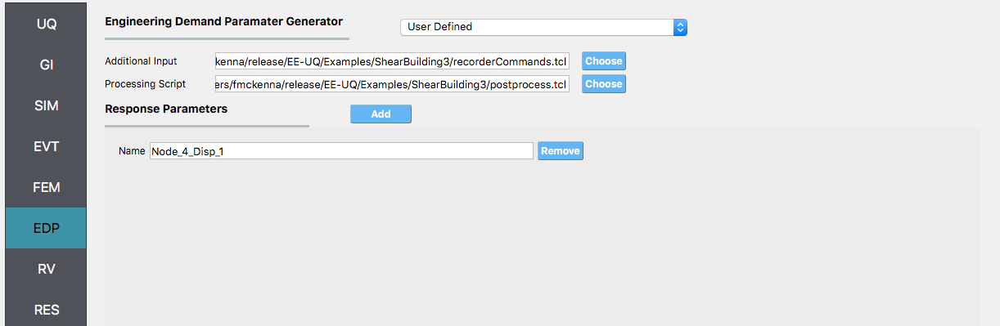
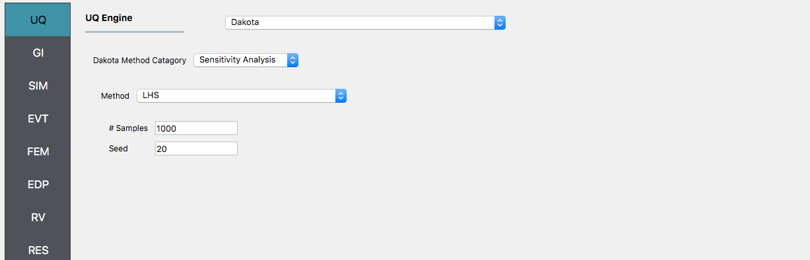

3-Story Frame - EDP Sampling
============================

Consider the problem of uncertainty quantification in a three story shear building

.. figure:: figures/model.png
   :align: center
   :width: 400
   :figclass: align-center

   Three Story Shear Building Model (P10.2.9, "Dynamics of Structures", A.K.Chopra)

The structure has uncertain properties that all follow normal distribution:

1. Weight of Typical Floor (``w``): mean :math:`\mu_E=100 \mathrm{kip}` and standard deviation :math:`\sigma_E =10 \mathrm{kip}` (COV = 10%)
2. Weight of Roof (``wR``): mean :math:`\mu_E=50 \mathrm{kip}` and standard deviation :math:`\sigma_E =5 \mathrm{kip}` (COV = 10%)
3. Story Stiffness (``k``): mean :math:`\mu_k =326.32 \mathrm{kip/in}` and a standard deviation of :math:`\sigma_P = 3 \mathrm{kN}`, (COV = 12%).

The goal of the exercise is to estimate the mean and standard deviation of the relative displacement of the fourth node when subjected to an El Centro ground motion record.

The exercise will use both the MDOF, :numref:`lblMDOF`,  and OpenSees, :numref:`lblOpenSeesSIM`, structural generators. For the OpenSees generator the following model script, `ShearBuilding3.tcl <https://github.com/NHERI-SimCenter/EE-UQ/blob/master/Examples/ShearBuilding3/ShearBuilding3.tcl>`_ , is used:

.. literalinclude:: ShearBuilding3.tcl
   :language: tcl

.. note::
   
   1. The first lines containing ``pset`` will be read by the application when the file is selected and the application will autopopulate the random variables ``w``, ``wR``, and ``k`` in the **RV**  panel with these same variable names. It is of course possible to explicitly use Random Variables without the ``pset`` command by "RV.**variable name" in the input file. However, no random variables will be autopopulated if user chooses this route.

.. warning::

   Do not place the file in your root, downloads, or desktop folder as when the application runs it will copy the contents on the directories and subdirectories containing this file multiple times (a copy will be made for each sample specified). If you are like us, your root, Downloads or Documents folders contains and awful lot of files and when the backend workflow runs you will slowly find you will run out of disk space!

Sampling Analysis with ElCentro and Reduced Output
^^^^^^^^^^^^^^^^^^^^^^^^^^^^^^^^^^^^^^^^^^^^^^^^^^

In example :eeuq-01:`/` we got the standard output, which can be both a lot and also limited (in sense you don't get the information you want). In this example we will present how to obtain results just for the roof displacement, the displacement of node **4** in both the **MDOF** and **OpenSees** model generator examples. The examples could be extended to output for example the story shear forces, element forces, element end rotations, ...

For this example you will need two additional file `recorderCommands.tcl <https://github.com/NHERI-SimCenter/EE-UQ/blob/master/Examples/ShearBuilding3/recorderCommands.tcl>`_ and `postprocess.tcl <https://github.com/NHERI-SimCenter/EE-UQ/blob/master/Examples/ShearBuilding3/postprocess.tcl>`_. 

The ``recorderCommands.tcl`` script as shown below will record the envelope displacements in the first two degrees-of-freedom for nodes **1** through **4**. 

.. literalinclude:: recorderCommands.tcl
   :language: tcl

The postprocess.tcl script shown below will accept as input any of the 4 nodes *in the domain and for each of the two dof directions.

.. literalinclude:: postprocess.tcl
   :language: tcl

.. note::

   The use has the option to provide no postprocess script (in which case the main script must create a ``results.out`` file containing a single line with as many space separated numbers as QoI or the user may provide a Python script that also performs the postprocessing. An example of a postprocessing Python script is `postprocess.py <https://github.com/NHERI-SimCenter/EE-UQ/blob/master/examples/ShearBuilding3/postprocess.py>`_. 

   .. literalinclude:: postprocess.py
      :language: python

The steps are the same as the previous example, with exception of step 4 defining the **EDP**. 5. 

1. For the **EDP** panel, we will change the generator to **User Defined**. In the panel that presents itself the user must provide the paths to both the recorder commands and the postprocessing script. Next the user must provide information on the response parameters they are interested in. The user presses the **Add** button and the enters ``Node_4_Disp_1`` in the entry field as shown in figure below.

2. Next click on the **Run** button. This will cause the backend application to launch dakota. When done the **RES** panel will be selected and the results will be displayed. The results show the values the mean and standard deviation as before but now only for the one quantity of interest.

.. figure:: figures/shearRES-UO.png
   :align: center
   :figclass: align-center

Global Sensitivity
^^^^^^^^^^^^^^^^^^

In a global sensitivity analysis the user is wishing to understand what is the influence of the individual random variables on the quantities of interest. This is typically done before the user launches large scale forward uncertainty problems in order to limit the number of random variables used so as to limit the number of simulations performed.

To perform a reliability analysis the steps above would be repeated with the exception that the user would select a reliability analysis method instead of a Forward Propagation method. To obtain reliability results using the global reliability method for this problem the user would follow the same sequence of steps as previously. The difference would be in the **UQ** panel in which the user would select a **Reliability** as the Dakota Method Category and then choose GLobal reliability. In the figure the user is specifying that they are interested in the probability that the displacement will exceed certain response levels.

After the user fills in the rest of the tabs as per the previous section, the user would then press the **RUN** button. The application (after spinning for a while with the wheel of death) will present the user with the results.

.. figure:: figures/shearSensitivityRES.png
   :align: center
   :figclass: align-center

The results showing that the earthquake factor has the largest influence on the response followed  by the stiffness value k, as the results graphically would indicate.

Reliability Analysis
^^^^^^^^^^^^^^^^^^^^

If the user is interested in the probability that certain response measure will be exceeded an alternative strategy is to perform a reliability analysis. To perform a reliability analysis the steps above would be repeated with the exception that the user would select a reliability analysis method instead of a Forward Propagation method. To obtain reliability results using the Global Reliability method presented in Dakota choose the **Global Reliability** methods from the methods drop down menu. In the response levels enter a value of **2.5**, specifying that we are interested in the value of the CDF for a displacement of the roof of 2.5in, i.e. what is probability that displacement will be less than 2.5in.

.. figure:: figures/shearReliabilityUQ.png
   :align: center
   :figclass: align-center

After the user fills in the rest of the tabs as per the previous section, the user would then press the **RUN** button. The application (after spinning for a while with the wheel of death) will present the user with the results, which as shown below, indicate that the probability is **91.5%**/

.. figure:: figures/shearReliabilityRes.png
   :align: center
   :figclass: align-center

.. warning::

   Reliability analysis can only be performed when their is only one EDP.

