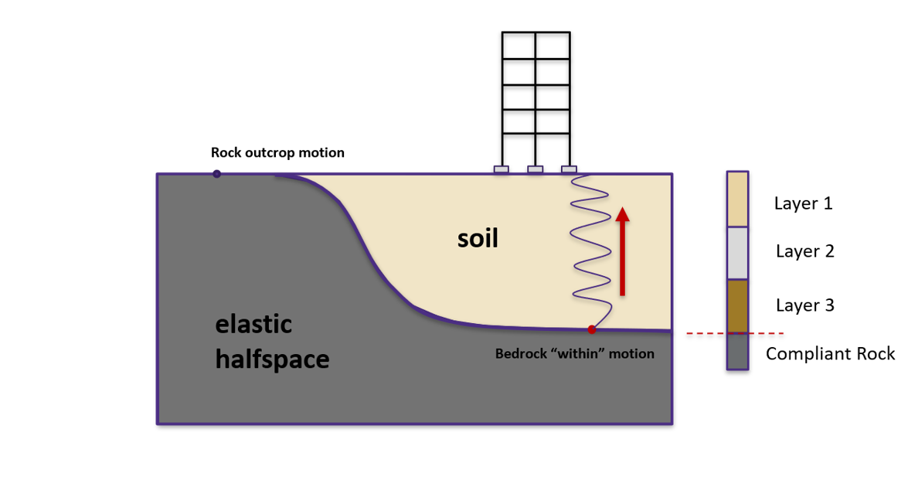

.. _eeuq-0002:

Site Response Analysis with Spatial Variability
=======================================================

This page shows two examples of how to incorporate spatial variability into UQ analysis by using various special materials, namely ElasticIsotropic,
PM4Sand, and PDMY03, in the Site Response option under the EVENT tab.

Problem Statement
---------------------------------------------
Site response analysis is commonly performed to analyze the propagation of seismic waves through soil. As shown in the below figure, one-dimensional response analyses, as a simplified method, assume that all boundaries are horizontal and that the response of a soil deposit is
predominately caused by SH-waves propagating vertically from the underlying bedrock. Ground surface response is usually the major output from these analyses, together with profile plots such as peak horizontal acceleration along the soil profile. When liquefiable soils are presenting,
maximum shear strain and excess pore pressure ratio plots are also important.

 there is a stylized drawing of a spring with an arrow indicating upward 'Bedrock "within" motion.' To the right, a rectangle represents a cross-section through soil layers, with a dashed line, indicating a reference level."
   :align: center
   :figclass: align-center

   Simplified 1D site response analysis (courtesy of Prof. Pedro Arduino)

In real-world conditions, the physical properties of soils vary from place to place within a soil deposit due to varying geologic formation and loading histories such as sedimentation, erosion, transportation,
and weathering processes. This spatial variability in the soil properties cannot be simply described by a mean and variance, as commonly adopted in UQ analyses
since the estimation of the two statistic values does not account for the spatial variation of the soil property data in the soil profile.
Spatial variability is often modeled using two separated components: a known deterministic trend and a residual variability about the trend.
These components are illustrated below.

.. figure:: figures/InherentVariability.png
   :scale: 60 %
   :alt: The image depicts a schematic representation of soil layers and a variability profile used in geotechnical or geological analysis. At the top is the ground surface, followed by labeled horizontal layers 'Layer 1', 'Layer i', and 'Layer j'. On the right side of 'Layer j', the profile illustrates a vertical trend line labeled 'Trend, t(z)' that shows a wavy deviation around it labeled 'Deviation from trend, w(z)'. This depicts the fluctuating nature of a specific soil property. At the bottom of the trend, there are two labels: 'Soil Property, ξ(z)' which points to the trend line, and 'Scale of Fluctuation, δv', which indicates the distance between peaks of the wavy pattern representing variance in soil properties. Vertical double-headed arrows show the depths 'l1', 'li', and 'lj' from the ground surface to the respective layers.
   :align: center
   :figclass: align-center

   Inherent soil variability (after :cite:`Phoon1999`).

A summary of the random field preparation procedure for the site response event analysis is summarized here:

1. Generate mean field using mean target soil property, e.g., relative density (Dr) or shear wave velocity (Vs)
2. Generate Gaussian random field for target soil property using *Gauss1D.py* with mean = 0.0 and :math:`\sigma` = 1.0
3. Interpolate Gaussian field to FEM mesh
4. Combine the mean (trend) field and Gaussian (residual variability) field to obtain a stochastic field
5. Generate material input for site response analysis based on predefined model calibration methods
6. Perform site response analysis using the randomized material input and obtain acceleration response at the surface of the soil column for subsequent UQ analysis

.. note::
   Currently, only **2D** plain-strain materials (including PDMY03 and ElasticIsotropic) are supported when using random fields. Therefore, 1-component motions are required.

General Workflow for Global Sensitivity Analysis
-----------------------------------------------------------

In a global sensitivity analysis, the user wishes to understand what is the influence of the individual random variables on the quantities of interest.
This is typically done before the user launches large-scale forward uncertainty problems in order to limit the number of random variables used so as to limit the number of simulations performed.

.. note::
   For this problem, we will limit the response quantities of interest to the following six quantities. Peak Roof displacement in 1 and 2 directions, root mean square (RMS) accelerations in 1 and 2 directions, Peak BAse shear and moments in 1 and 2 directions. 

To perform a Global Sensitivity analysis the user would perform the following steps:

1. Start the application and the UQ Selection will be highlighted. In the panel for the UQ selection, keep the UQ engine as that selected, i.e. Dakota. From the UQ Method Category drop-down menu
select Sensitivity Analysis, Keeping the method as LHS (Latin Hypercube). Change the **# Samples** to 20 and the **Seed** to 273 as shown in the figure. The seed specification allows a user to obtain repeatable
results from multiple runs. 

.. figure:: figures/randomField-UQ.png
   :align: center
   :alt: Screenshot of a graphical user interface for a software, with a navigation menu on the left side containing options like UQ, GI, SIM, EVT, FEM, EDP, RV, RES in a vertical alignment. On the right, there is a section titled "UQ Engine" with "Dakota" selected from a dropdown menu. Below, the "Dakota Method Category" is set to "Forward Propagation" and the "Method" chosen is "LHS." Two fields labeled "# Samples" with a value "20" and "Seed" with a value "273" are displayed. The rest of the interface is mostly blank, indicating potential areas for input or interaction.
   :figclass: align-center

2. Next select the **GI** panel. In this panel, the building properties and units are set. For this example enter **1** for the number of stories, **144** for building height, **360** for building width,
and **360** for building depth.

.. figure:: figures/randomField-GI.png
   :align: center
   :alt: The image displays a user interface with a section labeled "Building Information". It contains fields for inputting the name, properties such as the number of stories, height, width, depth, and plan area of a building. There is also a location section with fields for latitude and longitude, and a unit selection area where force is set to Kips, length to inches, and temperature to Celsius. The form is partially filled out with numerical values for the building's dimensions and geographic coordinates. There are sidebar navigation tabs with various abbreviations like UQ, GI, SIM, EVT, and others. The interface appears to be part of a software application used for building simulation or analysis.
   :figclass: align-center

4. Next select the **SIM** tab from the input panel. This will default in the MDOF model generator. 
Define other input variables as shown in figure:

.. figure:: figures/randomField-SIM.png
   :align: center
   :alt: Screenshot of a "Building Model Generator" interface with various parameters for building simulation. The left panel includes inputs for number of stories, floor weights, story stiffness, yield strength, hardening ratio, rotational story stiffness, and mass and response eccentricity along X and Y directions. The right panel is mostly empty with a small blue rectangle in the upper corner, possibly representing a model or graphical output area. There's a navigation menu on the left with tabs labeled as UQ, GI, SIM, EVT, FEM, EDP, RV, and RES.
   :figclass: align-center

5. Next select the **EVT** panel. From the Load Generator pull-down menu select the **Site Response** option. Define soil profile, groundwater table (GWT), and mesh. Then select interested material, e.g., 
*PM4Sand_Random*, *PDMY03_Random*, or *Elastic_Random*. Under **Configure** tab, select the path to the input motion.

.. note::
   - A reasonable mesh resolution is recommended. Selection of element size should consider several factors, including but not limited to, layer shear wave velocity (for frequency resolution), correlation length (for random field resolution), and computation efficiency.

.. figure:: figures/randomField-EVT.png
   :align: center
   :alt: Screenshot of a geotechnical engineering software interface with "Load Generator" and "Site Response" sections. On the left, a vertical navigation bar lists options like UQ, GI, SIM, and others, highlighted on SIM. The main area shows a graphical representation of soil layers and a corresponding table with parameters like height, total layer, density, Vs, and material. The right portion displays detailed settings for the "PM4Sand model with spatial variability," including parameters like Dr, G0, hp0, density, and hydraulic properties. Various dropdown menus and input fields indicate the program's complexity and customization capabilities.
   :figclass: align-center

6. Next choose the **FEM** panel. Here we will change the entries to use Rayleigh damping, with the Rayleigh factor chosen using **1** mode.

.. figure:: figures/randomField-FEM.png
   :align: center
   :alt: Screenshot of a user interface for an FE (Finite Element) Application titled "OpenSees." The interface contains various dropdown menus and input fields for configuring a finite element analysis. Options include setting the type of analysis (Transient with additional numerical parameters), integration method (Newmark), algorithm (Newton), and others such as convergence test, solver, damping models, damping ratio, and selecting tangent stiffness. There are numeric input fields for Mode 1 and Mode 2, along with a field for an analysis script. The interface includes sidebar navigation with acronyms like UQ, GI, SIM, EVT, FEM, EDP, RV, and RES.
   :figclass: align-center

7. We will skip the **EDP** panel leaving it in its default condition, that being to use the **Standard Earthquake** EDP generator.

.. figure:: figures/randomField-EDP.png
   :align: center
   :alt: Screenshot of a software interface with a dark theme, displaying a vertical navigation bar on the left side with various options such as UQ, GI, SIM, EVT, FEM, EDP, RV, RES, highlighted in light blue and dark gray. Along the top is a heading labeled "Engineering Demand Parameter Generator" with a dropdown menu next to it titled "Standard Earthquake." The rest of the screen remains largely empty and awaiting interaction.
   :figclass: align-center

8. For the **RV** panel, we will enter the distributions and values for our random variables. If only the uncertainty related to spatial variability is of interest, a dummy random variable can be defined in this tab.
Then all the variability shown in the response will solely be due to spatial variability in the site response analysis. 

.. figure:: figures/randomField-RV.png
   :align: center
   :alt: Screenshot of a software interface related to statistical or data analysis. On the left side, there's a vertical menu with options such as UQ, GI, SIM, EVT, FEM, EDP, RV, and RES highlighted in different shades of blue. The selected option is "RV," which is highlighted in a lighter blue shade. On the right side, there's a section titled "Input Random Variables" with options to 'Add' and 'Remove' variables, as well as access a 'Correlation Matrix.' Below, a table lists one variable named "dummy" with 'Distribution' set to 'Normal,' 'Mean' to 10, and 'Standard Dev' to 1. There's also a button to 'Show PDF.' The overall interface has a minimalist design with shades of blue and gray.
   :figclass: align-center

.. warning::   

   The user cannot leave any of the distributions for these values as constant for the Dakota UQ engine.

9. Next click on the 'Run' button. This will cause the backend application to launch dakota. When done the **RES** tab will be selected and the results will be displayed. The results show the values of the mean and standard deviation. 
The peak displacement of the roof is the quantity **PFD**. The **PFA** and **PFD** quantity defines peak floor acceleration and displacement, respectively, and the **PID** quantity corresponds to peak inter-story drift.

.. figure:: figures/Elastic-RES.png
   :align: center
   :alt: Screenshot of a computer interface displaying a table of statistical data. The categories along the top include 'Name', 'Mean', 'StdDev' (Standard Deviation), 'Skewness', and 'Kurtosis'. Each row lists a different item designated as '1-PFA-0-1', '1-PFA-1-1', '1-PFD-1-1', '1-PID-1-1', and '1-PRD-1-1', with values provided for each statistical category. The layout includes tabs on the left for 'UQ', 'GI', 'SIM', 'EVT', 'FEM', 'EDP', 'RV', with 'RES' highlighted, and two tabs on the top for 'Summary' and 'Data Values'.
   :figclass: align-center

Adding Spatial Variability
-----------------------------------------------------------

Case 1: using ElasticIsotropic material
^^^^^^^^^^^^^^^^^^^^^^^^^^^^^^^^^^^^^^^^

For the **Elastic_Random** material, shear wave velocity (Vs) can be selected to be randomized. Then select the **Mean** and **COV** (coefficient of variation :math:`=\frac{\sigma}{\mu}`) for shear wave velocity.  
**Correlation length** defines how shear wave velocities are vertically correlated. Subsequently, Young's modulus is calculated based on the stochastic shear velocity profile at the center of each element. No special calibration is required.

.. note::
   - Vs is bounded between 50 and 1500 m/s. These limits can be modified in *calibration.py*.

.. figure:: figures/Elastic-Random.png
   :scale: 60 %
   :alt: Screenshot of a geotechnical engineering software interface featuring 'Load Generator' and 'Site Response' tabs. The left side shows a graphical representation of soil layers with a blue highlighted section and red border, possibly indicating loading conditions. The right side includes input fields and parameters such as 'Height,' 'GWT,' 'Total Layer,' and 'LayerName' with 'Rock' listed as a layer. Detailed settings include 'Elastic modulus,' 'Poisson's ratio,' 'Vs,' 'COV,' and 'Correlation Length.' The interface also has options for adding or removing layers, configuring layers, and setting various properties, indicating that the software is used for simulating and analyzing soil response under various conditions.
   :align: center
   :figclass: align-center

   Define inputs for Elastic_Random material.

The below image presents the profiles of shear wave velocity, peak horizontal acceleration, maximum shear strain, and maximum excess pore pressure ratio (Ru) obtained from 20 realizations.
Ru is always zero since there is no volumetric strain in ElasticIsotropic material. It shows the mean and each individual response spectra (5% damping) at the surface were obtained from 20 realizations.

.. figure:: figures/Elastic-Average-Profile.png
   :scale: 40 %
   :alt: The image shows four adjacent line graphs on a white background, representing different geotechnical parameters with depth from 0 to 6 meters. The first graph from the left depicts 'Shear Wave Velocity' in meters per second, with multiple overlaid blue lines indicating variability and a prominent thick black line showing the average. The second graph presents 'PHA' in units of g, again with multiple blue lines and a thick black average. The third graph shows 'Max Shear Strain' in percentage, with a similar pattern of individual lines and an average. The fourth graph illustrates 'Max Ru' with only two lines: one dark blue representing individual realization, and a light grey for the average. Each graph has its own x-axis scale relevant to the parameter it represents.
   :align: center
   :figclass: align-center

   Profiles of shear wave velocity, peak horizontal acceleration, maximum shear strain, and maximum excess pore pressure ratio (Ru) were obtained from 20 realizations (postprocessed from realization output data).

.. figure:: figures/Elastic-Average-RespSpect.png
   :scale: 20 %
   :alt: A line graph displaying spectral acceleration (S_a in g) on the y-axis and period (sec) on the logarithmic x-axis. Multiple light blue lines representing individual realizations fluctuate and overlap, peaking around a period of 0.1 seconds. A bold black line, labelled 'Average', tracks the central tendency of these realizations, showing a sharp peak at the same period. The peak of the black line indicates a spectral acceleration of just above 1.5 g. A legend in the upper right corner distinguishes between 'Average' (black line) and 'Individual Realization' (blue lines). The background is white with a grid to facilitate reading of values.
   :align: center
   :figclass: align-center

   Response spectra (5% damping) at the surface obtained from 20 realizations (postprocessed from realization output data).

Case 2: using PM4Sand material
^^^^^^^^^^^^^^^^^^^^^^^^^^^^^^^^^^^^^^
For the **PM4Sand_Random** material, relative density (Dr) can be selected to be randomized. Then select the **Mean** and **COV** (coefficient of variation :math:`COV=\frac{\sigma}{\mu}`) for shear wave velocity.  
**Correlation length** defines how shear wave velocities are vertically correlated. In the current calibration procedure, all the other parameters are kept as input except for the contraction rate parameter hpo, which is calibrated based on the empirical triggering model proposed by Idriss and Boulanger 2008.

.. figure:: figures/PM4Sand-Random.png
   :scale: 60 %
   :alt: Screenshot of a geotechnical engineering software interface showing the Load Generator and Site Response sections. The left side of the screen includes a vertical navigation menu with options such as UQ, GI, SIM, EVT, FEM, EDP, RV, and RES. In the center, there are two graphical representations of soil layers; the left graph depicts a single red-framed blue layer while the right graph shows a series of smaller blue layers stacked vertically. On the right side of the screen, there are input fields and parameters related to the PM4Sand model with spatial variability, including various engineering coefficients and values like Dr, Go, hpo, and Den. The Hydraulic properties of this layer are displayed at the bottom right corner with additional parameters like kPerm and vPerm. Highlighted sections in the interface indicate a focus on specific variables such as Dr mean and correlation length.
   :align: center
   :figclass: align-center

   Define inputs for PM4Sand_Random material.

.. note::
   - Dr is bounded between 0.2 and 0.95. These limits can be modified in *calibration.py*.

The below image presents the profiles of shear wave velocity, peak horizontal acceleration, maximum shear strain, and maximum excess pore pressure ratio (Ru) obtained from 20 realizations.
Compared to elastic material, more variability is shown among these realizations. It depicts the mean and each individual response spectra (5% damping) at the surface obtained from 20 realizations.

.. _fig_PM4Sand-Average-Profile:
.. figure:: figures/PM4Sand-Average-Profile.png
   :scale: 40 %
   :alt: "A set of four closely aligned vertical graphs showing various geotechnical parameters as a function of depth. Each graph has a collection of thin blue lines representing individual realizations and a thick black line indicating the average. From left to right, the graphs are titled Relative Density, PHA(g), Max Shear Strain (%), and Max Ru, with the depth indicated in meters on the vertical axis ranging from 0 to 6. The x-axes represent different scales for each parameter. The graphs illustrate the variability and complexity of soil behavior with depth."
   :align: center
   :figclass: align-center

   Profiles of shear wave velocity, peak horizontal acceleration, maximum shear strain, and maximum excess pore pressure ratio (Ru) were obtained from 20 realizations (postprocessed from realization output data).

.. _fig_PM4Sand-Average-RespSpect:
.. figure:: figures/PM4Sand-Average-RespSpect.png
   :scale: 20 %
   :alt: A graph displaying spectral acceleration (Sa) in g (gravity) against the period in seconds (sec) on a logarithmic scale. Multiple light blue lines representing individual realizations are shown, varying across the graph, with a bold black line highlighting the average of these realizations. The spectral acceleration fluctuates, with higher values at certain periods, indicating a significant response at specific frequencies. A legend in the upper right corner indicates the color coding for the average and individual realizations.
   :align: center
   :figclass: align-center

   Response spectra (5% damping) at the surface obtained from 20 realizations (postprocessed from realization output data).

