.. _lbl-example_randomField:

Including Spatial Variability in Site Response Event
=======================================================

This page shows two examples of how to incorporate spatial variability into UQ analysis by using various special materials, namely ElasticIsotropic,
PM4Sand, and PDMY03, in the Site Response option under the EVENT tab.

Problem Statement
---------------------------------------------
Site response analysis is commonly performed to analyze the propagation of seismic waves through soil. As shown in :numref:`fig_siteResponse`, 
one-dimensional response analyses, as a simplified method, assume that all boundaries are horizontal and that the response of a soil deposit is
predominately caused by SH-waves propagating vertically from the underlying bedrock. Ground surface response is usually the major output from
these analyses, together with profile plots such as peak horizontal acceleration along the soil profile. When liquefiable soils are presenting,
maximum shear strain and excess pore pressure ratio plots are also important.

In real-world conditions, the physical properties of soils vary from place to place within a soil deposit due to varying geologic formation and loading histories such as sedimentation, erosion, transportation,
and weathering processes. This spatial variability in the soil properties cannot be simply described by a mean and variance, as commonly adopted in UQ analyses
since the estimation of the two statistic values does not account for the spatial variation of the soil property data in the soil profile.
Spatial variability is often modeled using two separated components: a known deterministic trend and a residual variability about the trend.
These components are illustrated in :numref:`fig_InherentVariability`.

.. _fig_siteResponse:
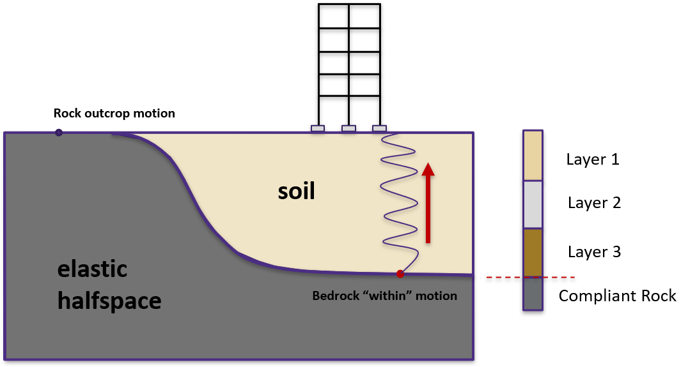

   Simplified 1D site response analysis (courtesy of Pedro Arduino)

.. _fig_InherentVariability:
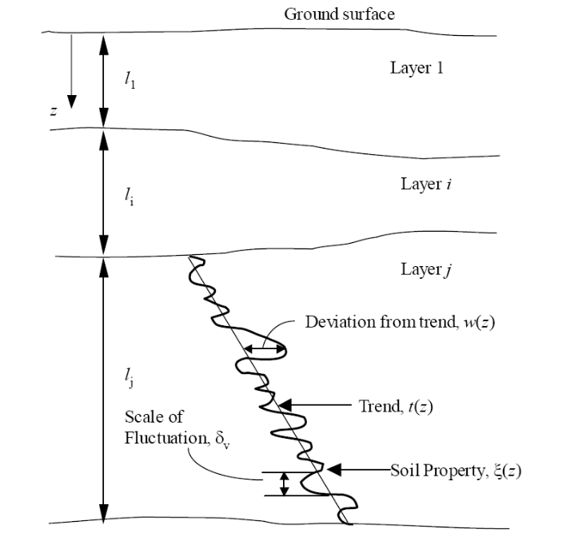

   Inherent soil variability (after :cite:`Phoon1999`).

A summary of the random field preparation procedure for the site response event analysis is summarized here:

1. Generate mean field using mean target soil property, e.g., relative density (Dr) or shear wave velocity (Vs)
2. Generate Gaussian random field for target soil property using *Gauss1D.py* with mean = 0.0 and :math:`\sigma` = 1.0
3. Interpolate Gaussian field to FEM mesh
4. Combine the mean (trend) field and Gaussian (residual variability) field to obtain a stochastic field
5. Generate material input for site response analysis based on predefined model calibration methods
6. Perform site response analysis using the randomized material input and obtain acceleration response at the surface of the soil column for subsequent UQ analysis

.. note::
   - Currently only **2D** plain-strain materials (including PDMY03 and ElasticIsotropic) are supported when using random field. Therefore, 1-component motions are required.

General Workflow for Global Sensitivity Analysis
-----------------------------------------------------------

In a global sensitivity analysis, the user wishes to understand what is the influence of the individual random variables on the quantities of interest.
This is typically done before the user launches large-scale forward uncertainty problems in order to limit the number of random variables used so as to limit the number of simulations performed.

..
   For this problem, we will limit the response quantities of interest to the following six quantities. Peak Roof displacement in 1 and 2 directions,
root mean square (RMS) accelerations in 1 and 2 directions, Peak BAse shear and moments in 1 and 2 directions. 

To perform a Global Sensitivity analysis the user would perform the following steps:

The steps involved:

1. Start the application and the UQ Selection will be highlighted. In the panel for the UQ selection, keep the UQ engine as that selected, i.e. Dakota. From the UQ Method Category drop-down menu
select Sensitivity Analysis, Keeping the method as LHS (Latin Hypercube). Change the **# Samples** to 20 and the **Seed** to 273 as shown in the figure. The seed specification allows a user to obtain repeatable
results from multiple runs. 

.. figure:: figures/randomField-UQ.png
   :align: center
   :figclass: align-center

2. Next select the **GI** panel. In this panel, the building properties and units are set. For this example enter **1** for the number of stories, **144** for building height, **360** for building width,
and **360** for building depth.

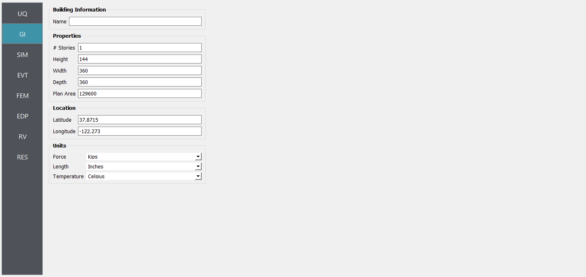

3. Next select the **SIM** tab from the input panel. This will default in the MDOF model generator. 
Define other input variables as shown in figure:

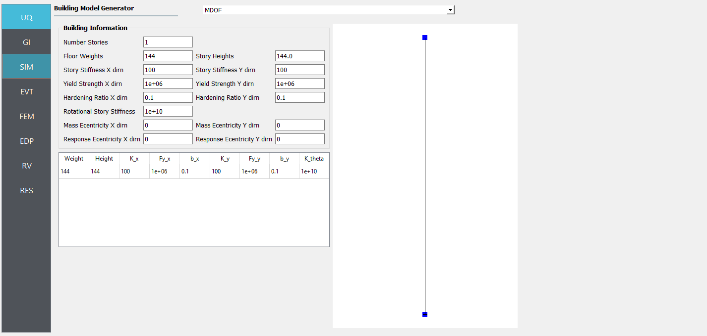

3. Next select the **EVT** panel. From the Load Generator pull-down menu select the **Site Response** option. Define soil profile, groundwater table (GWT), and mesh. Then select interested material, e.g., 
*PM4Sand_Random*, *PDMY03_Random*, or *Elastic_Random*. Under **Configure** tab, select the path to the input motion.

.. note::
   - A reasonable mesh resolution is recommended. Selection of element size should consider several factors, including but not limited to, layer shear wave velocity (for frequency resolution), correlation length (for random field resolution), and computation efficiency.

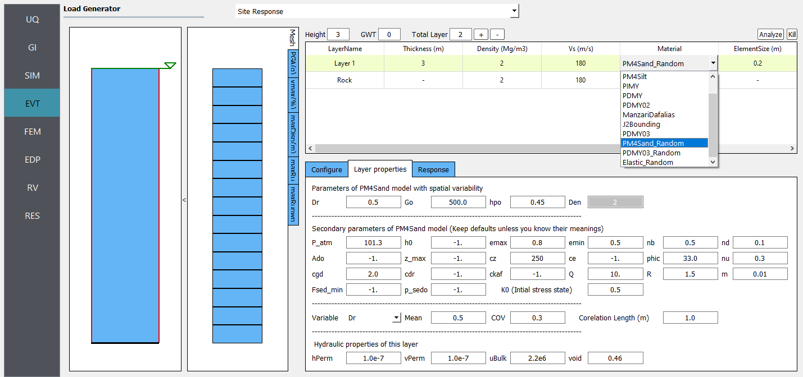

3. Next choose the **FEM** panel. Here we will change the entries to use Rayleigh damping, with rayleigh factor chosen using **1** mode.

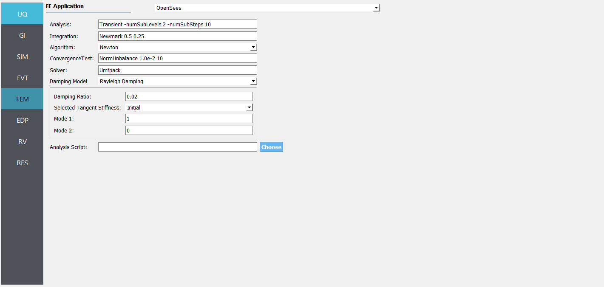

4. We will skip the **EDP** panel leaving it in its default condition, that being to use the **Standard Earthquake** EDP generator.

.. figure:: figures/randomField-EDP.png
   :align: center
   :figclass: align-center

5. For the **RV** panel, we will enter the distributions and values for our random variables. If only the uncertainty related to spatial variability is of interest, a dummy random variable can be defined in this tab.
Then all the variability shown in the response will solely be due to spatial variability in the site response analysis. 

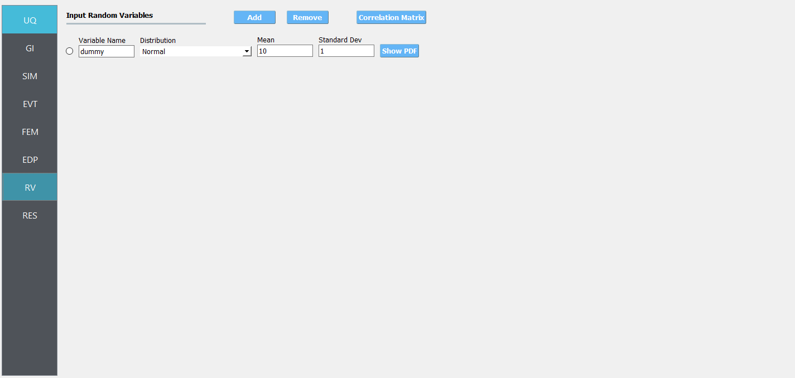

.. warning::   

   The user cannot leave any of the distributions for these values as constant for the Dakota UQ engine.

5. Next click on the 'Run' button. This will cause the backend application to launch dakota. When done the **RES** tab will be selected and the results will be displayed. The results show the values of the mean and standard deviation. 
The peak displacement of the roof is the quantity **PFD**. The **PFA** and **PFD** quantity defines peak floor acceleration and displacement, respectively, and the **PID** quantity corresponds to peak inter-story drift.

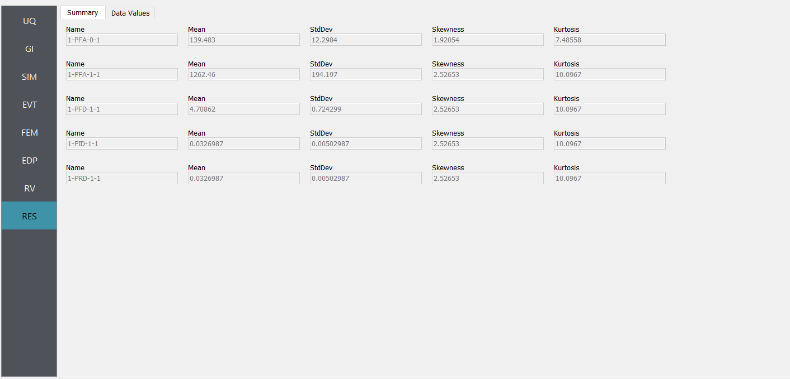

Adding Spatial Variability
-----------------------------------------------------------

Case 1: using ElasticIsotropic material
^^^^^^^^^^^^^^^^^^^^^^^^^^^^^^^^^^^^^^^^

For the **Elastic_Random** material, shear wave velocity (Vs) can be selected to be randomized. Then select the **Mean** and **COV** (coefficient of variation :math:`=\frac{\sigma}{\mu}`) for shear wave velocity.  
**Correlation length** defines how shear wave velocities are vertically correlated. Subsequently, Young's modulus is calculated based on the stochastic shear velocity profile at the center of each element. No special calibration is required.

.. note::
   - Vs is bounded between 50 and 1500 m/s. These limits can be modified in *calibration.py*.

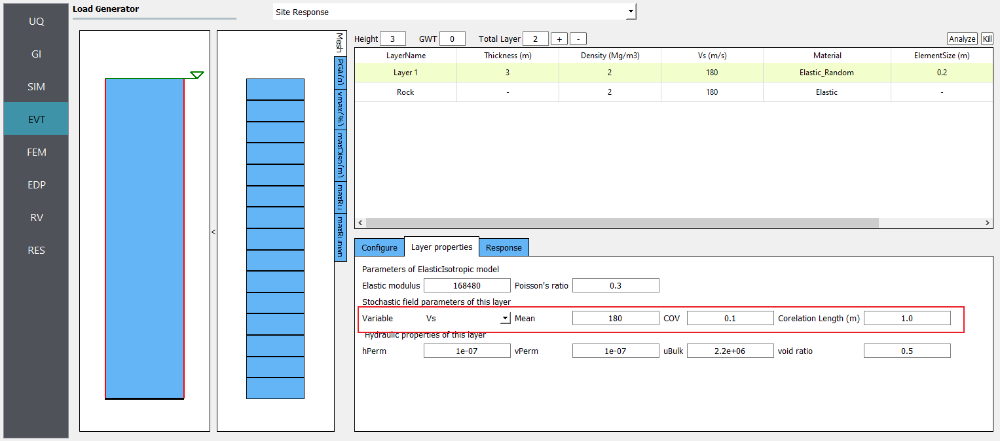

   Define inputs for Elastic_Random material.

:numref:`fig_Elastic-Average-RespSpect` presents the profiles of shear wave velocity, peak horizontal acceleration, maximum shear strain, and maximum excess pore pressure ratio (Ru) obtained from 20 realizations.
Ru is always zero since there is no volumetric strain in ElasticIsotropic material. :numref:`fig_Elastic-Average-RespSpect` depicts the mean and each individual response spectra (5% damping) at the surface obtained from 20 realizations.

.. _fig_Elastic-Average-Profile:
.. figure:: figures/Elastic-Average-Profile.png
   :scale: 40 %
   :align: center
   :figclass: align-center

   Profiles of shear wave velocity, peak horizontal acceleration, maximum shear strain, and maximum excess pore pressure ratio (Ru) were obtained from 20 realizations (postprocessed from realization output data).

.. _fig_Elastic-Average-RespSpect:
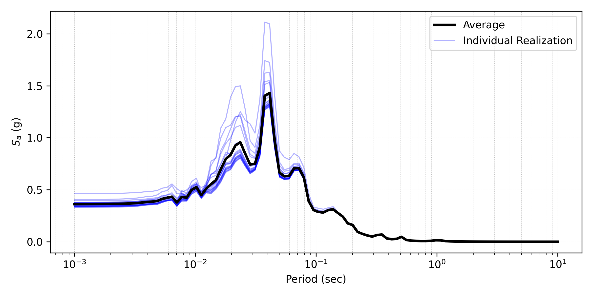

   Response spectra (5% damping) at the surface obtained from 20 realizations (postprocessed from realization output data).

Case 2: using PM4Sand material
^^^^^^^^^^^^^^^^^^^^^^^^^^^^^^^^^^^^^^
For the **PM4Sand_Random** material, relative density (Dr) can be selected to be randomized. Then select the **Mean** and **COV** (coefficient of variation :math:`COV=\frac{\sigma}{\mu}`) for shear wave velocity.  
**Correlation length** defines how shear wave velocities are vertically correlated. In the current calibration procedure, all the other parameters are kept as input except for the contraction rate
parameter hpo, which is calibrated based on the empirical triggering model proposed by Idriss and Boulanger 2008.

:numref:`fig_PM4Sand-Average-RespSpect` presents the profiles of shear wave velocity, peak horizontal acceleration, maximum shear strain, and maximum excess pore pressure ratio (Ru) obtained from 20 realizations.
Compared to elastic material, more variability is shown among these realizations. :numref:`fig_PM4Sand-Average-RespSpect` depicts the mean and each individual response spectra (5% damping) at the surface obtained from 20 realizations.

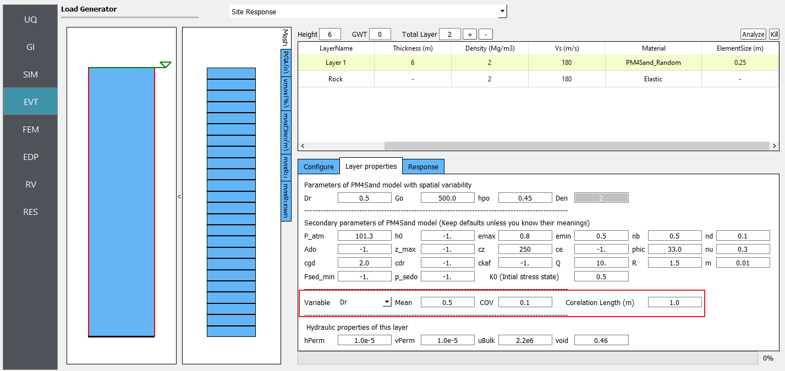

   Define inputs for PM4Sand_Random material.

.. note::
   - Dr is bounded between 0.2 and 0.95. These limits can be modified in *calibration.py*.

.. _fig_PM4Sand-Average-Profile:
.. figure:: figures/PM4Sand-Average-Profile.png
   :scale: 40 %
   :align: center
   :figclass: align-center

   Profiles of shear wave velocity, peak horizontal acceleration, maximum shear strain, and maximum excess pore pressure ratio (Ru) were obtained from 20 realizations (postprocessed from realization output data).

.. _fig_PM4Sand-Average-RespSpect:
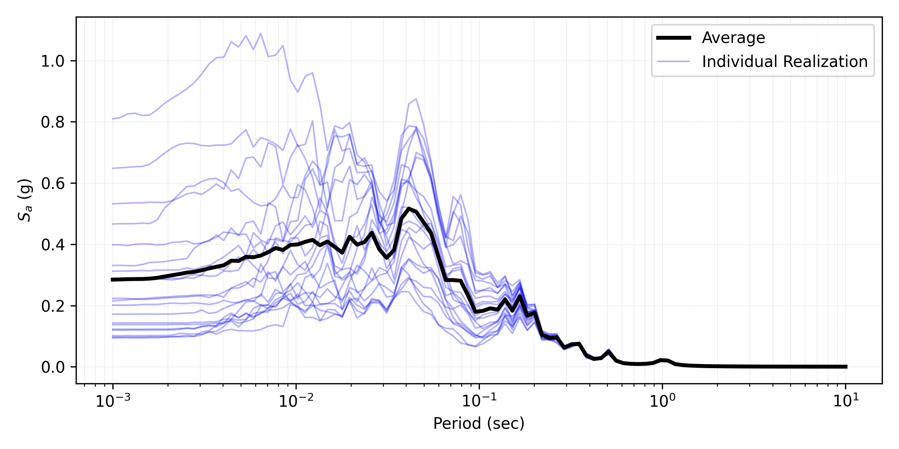

   Response spectra (5% damping) at the surface obtained from 20 realizations (postprocessed from realization output data).

