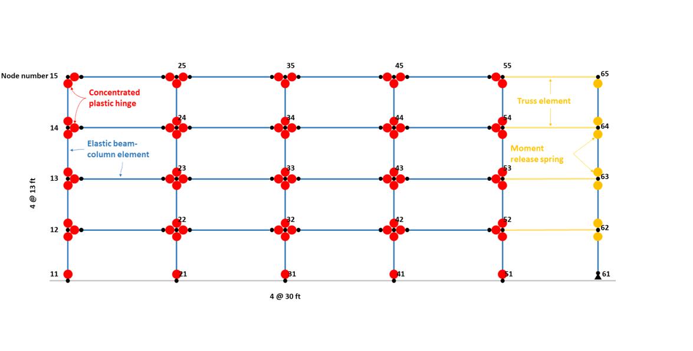

.. _eeuq-0003:

PEER Ground Motion Selection and Nonlinear Response Analysis
==============================================================

.. warning:: To reproduce the result of this example, the user should first click **EVT** and **Select Records**, and then click the **RUN** button. See the below procedure for details.

Shown below is an OpenSees model sketch of a 2D steel-moment frame building. The building has a four-bay lateral frame with gravity system which is modeled by the leaning column in the model. The bottom two stories 
use the column section of :math:`W24 \times 207` and the beam section of :math:`30 \times 108`.  The top two stories use the column section of :math:`W24 \times 162`and the beam section of :math:`24 \times 84`. The reduced beam section 
(RBS) connections are adopted in all beams. This OpenSees model can be `downloaded  <https://github.com/NHERI-SimCenter/EE-UQ/blob/master/Examples/eeuq-0003/src/MRF_4Story_Concentrated_model.tcl>`_.

ent beams or columns. The red nodes are labeled as being 'Concentrated plastisc hinge' The blue lines are labeled as being "elastic beam column elements". On the right side, a yellow line are used to indicate "truss elements". These connect the floor nodes to the nodes of the gravity column. The yellow nodes on the gravity volumn indicate "moment release springs".
   :align: center
   :width: 800
   :figclass: align-center

   Four-story steel moment frame with reduced beam sections (RBS).

This example shows how to select ground motion records and run nonlinear time history analysis for the OpenSees/tcl
model of interest.
   
Load OpenSees/tcl model and analysis script
^^^^^^^^^^^^^^^^^^^^^^^^^^^^^^^^^^^^^^^^^^^^

1. Navigate to the **SIM** tab in the left menu. In this panel, select the **OpenSees** as the 
   **Building Model Generator**. Use the **Choose** button to select the `OpenSees tcl file <https://github.com/NHERI-SimCenter/EE-UQ/blob/master/Examples/eeuq-0003/src/MRF_4Story_Concentrated_model.tcl>`_ as the **Input** **Script**. For 
   the **Response** **Nodes**, specify the node numbers on any one column line (e.g., 11, 12, 13, 14, 15 on 
   the left column line). The problem will then automatically create recorders to save the peak story responses 
   given the specified nodes.

.. figure:: figures/sim.png
   :name: fig_sim
   :alt: Screenshot of a software interface titled "EE-UQ: Response of Building to Earthquake" with a menu containing options like File and Help. The interface shows a section called "Building Model Generator" with a dropdown menu set to OpenSees, an input script path, and fields to enter response nodes and spatial dimensions for a building simulation. There are tabs labeled UQ, GI, SIM, EVT, FEM, EDP, RV, and RES on the left, and buttons at the bottom for RUN, RUN at DesignSafe, GET from DesignSafe, and Exit.
   :align: center
   :width: 800
   :figclass: align-center

2. Navigate to the **FEM** tab and **Choose** the user-defined `analysis script <https://github.com/NHERI-SimCenter/EE-UQ/blob/master/Examples/eeuq-0003/src/MRF_4Story_Concentrated_solver.tcl>`_. Note that the user-defined analysis script will overwrite other specifications in the fill-in boxes above.

.. figure:: figures/fem.png
   :name: fig_fem
   :alt: Screenshot of a software interface titled "EE-UQ: Response of Building to Earthquake". The interface is divided into several sections for user input including FE Application, Analysis, Integration, Solver, Damping Model, Damping Ratio, Selected Tangent Stiffness, and Analysis Script with options and fields like OpenSees, Transient analysis, Newmark integration, and Rayleigh damping. The application looks to be a scientific tool for simulating the response of structures to seismic events. There are buttons at the bottom for running the simulation, obtaining information from DesignSafe, and exiting the program.
   :align: center
   :width: 800
   :figclass: align-center

Select and scale ground motion records
^^^^^^^^^^^^^^^^^^^^^^^^^^^^^^^^^^^^^^^^^^^^

1. Navigate to the **EVT** panel and select the **PEER NGA Records** as the **Load Generator**. We can use the 
   **Design Spectrum (ASCE 7-10)** as an example target spectrum here. First, please specify the :math:`S_{DS}`, 
   :math:`S_{D1}`, and :math:`T_L`. Then on the left panel, please specify the number of records with optional 
   filters on the earthquake magnitude, site-source distance, and :math:`V_{S30}`.

2. In the **Scaling** panel, we could use the **Minimize MSE** as the **Scaling Method** which will compute and 
   minimize the mean standard error between the average response spectrum and the target spectrum. You can specify 
   a set of periods and corresponding error-calucation weights.

.. note::

   As specified by ASCE 7-16, you may want to let the period points at least cover the :math:`0.2T_1` to 
   :math:`1.5T_1` (:math:`T_1` is the fundamental period of the structure).

3. For the 2D model in this example, we should use the acceleration components **H1** or **H2**, while the other 
   options (**GeoMean**, **RotD50**, and **RotD100**) are available for 3D models.

4. Once set up the configurations above, please click the **Select Records** which will connect the `PEER NGA West 
   Ground Motion Database <https://ngawest2.berkeley.edu/users/sign_in?unauthenticated=true>`_. You could use your 
   account and password to login and execute the selection and scaling.

.. figure:: figures/evt.png
   :name: fig_evt
   :alt: Screenshot of an earthquake engineering software interface titled "EE-UQ: Response of Building to Earthquake." The left side features various input fields and settings for load generation, target spectrum parameters, and scaling methods, with a section for selected ground motions from the PEER NGA Records, including metrics like acceleration, earthquake, station, magnitude, and distance. The right side displays a graph of response spectra with multiple lines representing mean, mean plus standard deviation, and target spectral acceleration over a range of periods in seconds. There are options to run analysis and download data, as well as a login button in the top right corner.
   :align: center
   :width: 800
   :figclass: align-center

Run the analysis and postprocess results
^^^^^^^^^^^^^^^^^^^^^^^^^^^^^^^^^^^^^^^^^^^

1. Navigate to the **UQ** panel, use the default **Forward Propagation** method with the **# Sample** same as 
   the number of selected records.

.. figure:: figures/uq.png
   :name: fig_uq
   :alt: Screenshot of a software interface titled 'EE-UQ: Response of Building to Earthquake'. The interface shows a menu with the tabs UQ, GI, SIM, EVT, FEM, EDP, RV, and RES listed vertically on the left. In the open UQ tab, there are settings for UQ Engine with 'Dakota' selected, Dakota Method Category set to 'Forward Propagation', Method as 'LHS', a field for '# Samples' with '11' entered, and a 'Seed' number '633'. Below are options to 'Keep Samples' with a checkbox, and three buttons at the bottom: 'RUN', 'RUN at DesignSafe', and 'GET from DesignSafe'. On the top right, there is a 'Login' button. The interface has a clean, minimalistic design with a light grey and white color scheme.
   :align: center
   :width: 800
   :figclass: align-center

2. Next click on the **Run** button. This will cause the backend application to launch the analysis. When done 
   the **RES** panel will be selected and the results will be displayed. The results show the values of the mean 
   and standard deviation as before but now only for the one quantity of interest.

.. figure:: figures/res.png
   :name: fig_res
   :alt: Screenshot of a software application showing a table titled "EE-UQ: Response of Building to Earthquake". The table contains columns for Name, Mean, StdDev, Skewness, and Kurtosis, with multiple rows of data grouped under headings such as GI, SIM, EVT, FEM, EDP, RV, and RES. At the bottom, there are three buttons labeled "RUN", "RUN at DesignSafe", and "Exit", and a "Login" button in the top right corner.
   :align: center
   :width: 800
   :figclass: align-center

3. Users can save the analysis results in the **Data Value** window to a text file (e.g., csv file) which 
   can be further processed for different purposes. For example, the figure below shows the maximum story 
   drift ratios and peak floor accelerations of the 4-story frame.

.. figure:: figures/sdr_pfa.png
   :name: fig_res
   :alt: Two side-by-side scatter plots displaying structural engineering data. The left plot shows the relationship between peak story drift ratio (in/in) on the x-axis and story number on the y-axis. The right plot shows peak floor acceleration (g) on the x-axis and story number on the y-axis. Both plots include a series of black dashed lines representing 11 ground motions (GM), a red line with circle markers for the mean, a blue line with square markers for the median, and a pair of dashed blue lines indicating plus or minus one standard deviation (+/- 1σ) from the mean. The data points suggest a trend of increasing values from the bottom of the structure (story number 0) to the top (story number 4).
   :align: center
   :width: 600
   :figclass: align-center

