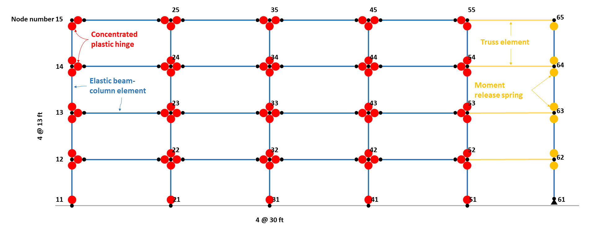
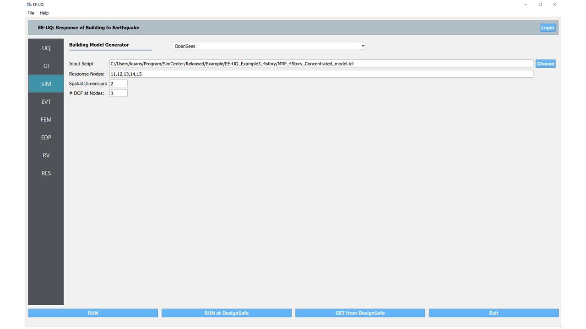
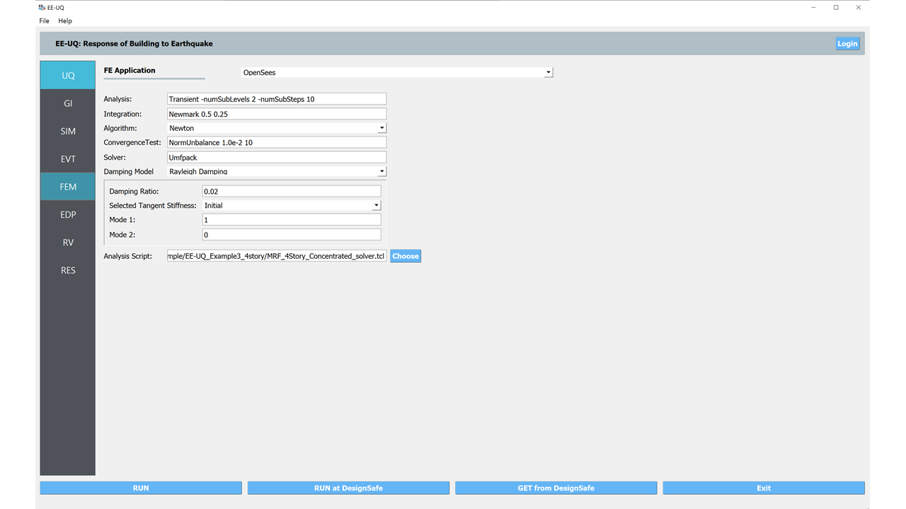
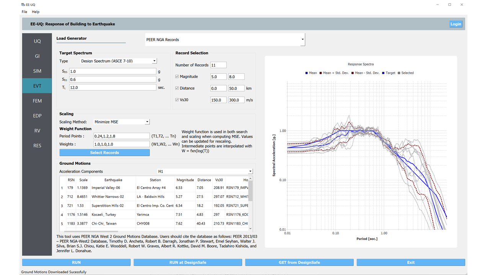
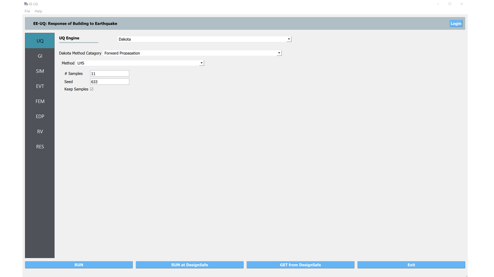
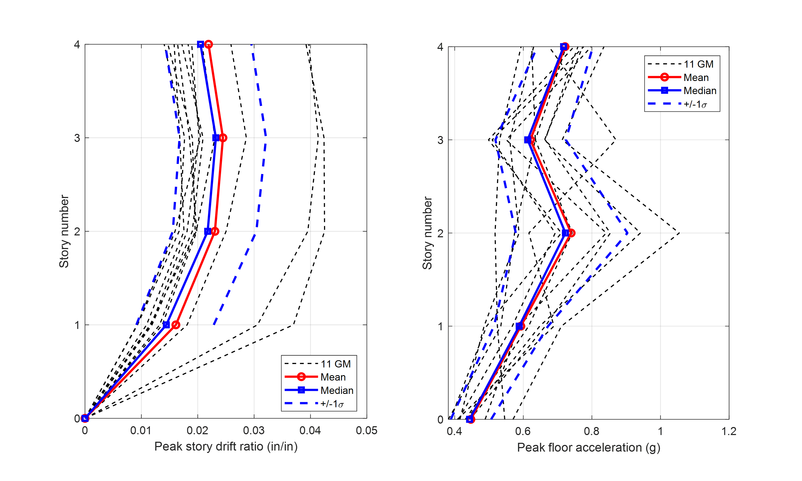

Ground Motion Selection and Nonlinear Response Analysis
========================================================

Shown in :numref:`fig_frame` is an OpenSees model sketch of a 2D steel moment frame building. 
The building has a four-bay lateral frame with gravity system 
which is modeled by the leaning column in the model. The bottom two stories 
use the column section of :math:`W24 \times 207` and beam section of :math:`30 \times 108`.  The top two stories 
use the column section of :math:`W24 \times 162`and beam section of :math:`24 \times 84`. The reduced beam section 
(RBS) connections are adopted in all beams. This OpenSees model can be 
:download:`downloaded <src/MRF_4Story_Concentrated_model.tcl>`.

   Four-story steel moment frame with reduced beam sections (RBS).

This example shows how to select ground motion records and run nonlinear time history analysis for the OpenSees/tcl
model of interest.
   
Load OpenSees/tcl model and analysis script
^^^^^^^^^^^^^^^^^^^^^^^^^^^^^^^^^^^^^^^^^^^^

1. Navigate to the **SIM** tab in the left menu. In is panel, select the **OpenSees** as the 
   **Building Model Generator**. Use the **Choose** button to select the 
   :download:`OpenSees tcl file <src/MRF_4Story_Concentrated_model.tcl>` as the **Input** **Script**. For 
   the **Response** **Nodes**, specify the node numbers on any one column line (e.g., 11, 12, 13, 14, 15 on 
   the left column line). The problem will then automatically create recorders to save the peak story responses 
   given the specified nodes.

2. Navigate to the **FEM** tab and **Choose** the user-defined :download:`analysis script <src/MRF_4Story_Concentrated_solver.tcl>`.
   Note that the user-defined analysis script will overwrite other specifications in the fill-in boxes above.

Select and scale ground motion records
^^^^^^^^^^^^^^^^^^^^^^^^^^^^^^^^^^^^^^^^^^^^

1. Navigate to the **EVT** panel and select the **PEER NGA Records** as the **Load Generator**. We can use the 
   **Design Spectrum (ASCE 7-10)** as an example target spectrum here. First, please specify the :math:`S_{DS}`, 
   :math:`S_{D1}`, and :math:`T_L`. Then on the left panel, please specify the number of records with optional 
   filters on the earthquake magnitude, site-source distance, and :math:`V_{S30}`.

2. In the **Scaling** panel, we could use the **Minimize MSE** as the **Scaling Method** which will compute and 
   minimize the mean standard error between the average response spectrum and the target spectrum. You can specify 
   a set of periods and corresponding error-calucation weights.

.. note::

   As specified by ASCE 7-16, you may want to let the period points at least cover the :math:`0.2T_1` to 
   :math:`1.5T_1` (:math:`T_1` is the fundamental period of the structure).

3. For the 2D model in this example, we should use the acceleration components **H1** or **H2**, while the other 
   options (**GeoMean**, **RotD50**, and **RotD100**) are available for 3D models.

4. Once set up the configurations above, please click the **Select Records** which will connect the `PEER NGA West 
   Ground Motion Database <https://ngawest2.berkeley.edu/users/sign_in?unauthenticated=true>`_. You could use your 
   account and password to login and execute the selection and scaling.

Run the analysis and postprocess results
^^^^^^^^^^^^^^^^^^^^^^^^^^^^^^^^^^^^^^^^^^^

1. Navigate to the **UQ** panel, use the default **Forward Propagation** method with the **# Sample** same as 
   the number of selected records.

2. Next click on the **Run** button. This will cause the backend application to launch the analysis. When done 
   the **RES** panel will be selected and the results will be displayed. The results show the values the mean 
   and standard deviation as before but now only for the one quantity of interest.

.. figure:: figures/res.png
   :name: fig_res
   :align: center
   :width: 800
   :figclass: align-center

3. Users can save the analysis results in the **Data Value** window to a text file (e.g., csv file) which 
   can be further processed for different purposes. For example, the figure below show the maximum story 
   drift ratios and peak floor accelerations of the 4-story frame.

