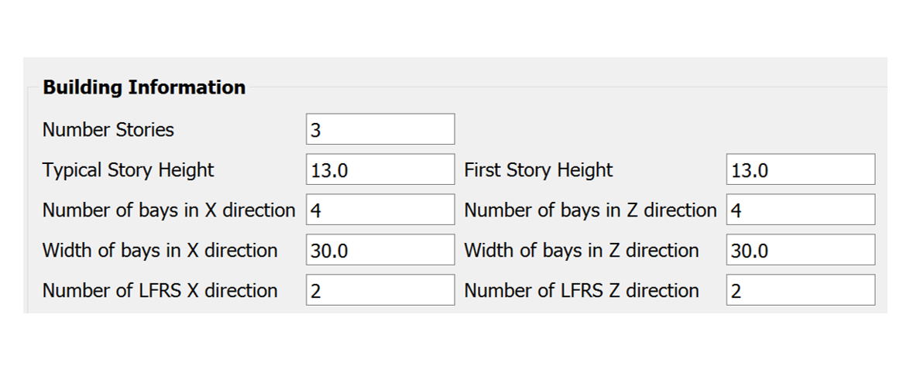

.. _eeuq-0004:

AutoSDA and Nonlinear Response Analysis
=========================================

This example demonstrates the use of a Python-based computation platform to automate seismic design and analysis of 
of steel moment resisting frames (**AutoSDA**) ([GBS20]_).
   
), width of bays in both X and Z directions (30.0 ft each), and number of Lateral Force Resisting Systems (LFRS) in both X and Z directions (2 each).
   :align: center
   :width: 50%
   :figclass: align-center

   Basic building information in AutoSDA

Design and create a numerical model
^^^^^^^^^^^^^^^^^^^^^^^^^^^^^^^^^^^^^^^^^^^^

1. Navigate to the **SIM** tab in the left menu. In this panel, select the **Steel Building Model** as the 
   **Building Model Generator**. In the user interface, five major input sections: (1) 
   Building Information, (2) ELF Parameters, (3) Member Depth, (4) Loading, and (5) Building Data Files. 

.. figure:: figures/sbm.png
   :name: fig_sbm
   :alt: Screenshot of a software application titled "EE-UQ: Response of Building to Earthquake" with interface sections for inputting building model information, including parameters such as the number of stories, story height, and various loading data. There are options for saving and loading files, and buttons for running simulations, with additional references to ELF parameters and a literature citation for users to follow. The interface is designed with various tabs, input fields, drop-down menus, checkboxes, and buttons organized in a structured layout.
   :align: center
   :width: 100%
   :figclass: align-center

2. In the Building Information section, we define the number of stories of the example steel moment frame to 3 and 
   the uniform story height to 13.0 ft. There are 4 bays in both horizontal directions with a uniform bay width 
   of 30 ft. 

.. figure:: figures/bim.png
   :name: fig_bim
   :alt: Screenshot of a form labeled "Building Information" with fields and numeric values. It specifies details such as Number Stories (3), Typical Story Height (13.0), First Story Height (13.0), Number and Width of bays in X direction (4 and 30.0 respectively), Number and Width of bays in Z direction (4 and 30.0 respectively), and Number of LFRS (Lateral Force Resisting System) in X and Z directions (2 for each). All values are given in text boxes that seem editable.
   :align: center
   :width: 50%
   :figclass: align-center

3. In the ELF Parameters section, the seismic design parameters box contains the Equivalent Lateral Force 
(ELF) design parameters as specified by ASCE 7-10. For the example frame, we assume :math:`Ss = 1.5g` and 
:math:`S1 = 0.6` with a site class of D. The frame is designed with a :math:`R` factor of 8.

.. figure:: figures/elf.png
   :name: fig_elf
   :alt: A screenshot of a table labeled "ELF Parameters - Reference: ASCE 7-10 Section 12.8" displaying seismic design parameters. The table includes fields for Ss (1.5g), TL (8), Cd (5.5), Ie (1), Site Class (D), S1 (0.6g), R (8), rho (1), Ct (0.028), and x (0.8), with some values filled in and others left blank for user input.
   :align: center
   :width: 50%
   :figclass: align-center

4. In the Member Depth section, users can specify cross sections in the table list
   for the interior columns, exterior columns, and beams. Starting from top to bottom, each row 
   corresponds to one story from bottom story to top story. In this example, we simplify all columns to have 
   the same :math:`W14` section, and use three sections for beams.

.. figure:: figures/mem.png
   :name: fig_mem
   :alt: Screenshot of a table with the header "Member Depth" and three columns titled "Exterior Column," "Interior Column," and "Beam." Each column lists "W14" in the first three rows under "Exterior Column" and "Interior Column," and "W27, W30, W33" in the first three rows under "Beam." There are no entries in the fourth row across all columns.
   :align: center
   :width: 100%
   :figclass: align-center

5. In the Loading section, users can specify the loading values for the floors, beams, and columns. And for the top 
   story, the live load on the leaning column is specified to be a random variable :math:`DL` with a uniform 
   distribution from 450 kips to 550 kips (as defined in the **RV** panel).

.. figure:: figures/ldg.png
   :name: fig_ldg
   :alt: A screenshot of a table labeled "Loading" with six columns titled Floor Weight [kips], Floor Dead Load [psf], Floor Live Load [psf], Beam Dead Load [lb/ft], Beam Live Load [lb/ft], Leaning Column Dead Load [kips], and Leaning Column Live Load [kips]. Each column contains three identical numerical entries, with "2289" under Floor Weight, "106" under Floor Dead Load, "50" under Floor Live Load, "1590" under Beam Dead Load, "750" under Beam Live Load, "954" under Leaning Column Dead Load, and "450" under Leaning Column Live Load.
   :align: center
   :width: 100%
   :figclass: align-center

5. In the Building Data Files section, clicking the Save File button will automatically generate four modeling data 
   files in the user-defined location (:eeuq-0004:`ELFParameters.csv <src/Test/ELFParameters.csv>`, 
   :eeuq-0004:`Geometry.csv <src/Test/Geometry.csv>`, :eeuq-0004:`Loads.csv <src/Test/Loads.csv>`, and 
   :eeuq-0004:`MemberDepth.csv <src/Test/MemberDepth.csv>`). These four files store the data from the four discussed 
   sections above. Users can also directly modify these data tables. 

.. figure:: figures/bdf.png
   :name: fig_bdf
   :alt: Screenshot of a user interface titled "Building Data Files" with options for "Building Data Folder," a text box displaying a file path "C:/Users/kuans/Desktop/Test," a "Choose" button, and two buttons below labeled "Save File" and "Load File."
   :align: center
   :width: 50%
   :figclass: align-center

Select and scale ground motion records
^^^^^^^^^^^^^^^^^^^^^^^^^^^^^^^^^^^^^^^^^^^^

1. Navigate to the **EVT** panel and select the **PEER NGA Records** as the **Load Generator**. We can use the 
   **Uniform Hazard Spectrum** as an example target spectrum here. We can specify the site location, the 
   site class (D) and the return period (2500 years). Then on the left panel, please specify the number of records with optional 
   filters on the earthquake magnitude, site-source distance, and :math:`V_{S30}`.

2. In the **Scaling** panel, we could use the **Minimize MSE** as the **Scaling Method** which will compute and 
   minimize the mean standard error between the average response spectrum and the target spectrum. You can specify 
   a set of periods and corresponding error-calculation weights.

.. note::

   As specified by ASCE 7-16, you may want to let the period points at least cover the :math:`0.2T_1` to 
   :math:`1.5T_1` (:math:`T_1` is the fundamental period of the structure).

3. For the 2D model in this example, we should use the acceleration components **H1** or **H2**, while the other 
   options (**GeoMean**, **RotD50**, and **RotD100**) are available for 3D models.

4. Once set up the configurations above, please click the **Select Records** which will connect the `PEER NGA West 
   Ground Motion Database <https://ngawest2.berkeley.edu/users/sign_in?unauthenticated=true>`_. You could use your 
   account and password to log in and execute the selection and scaling.

.. figure:: figures/evt.png
   :name: fig_evt
   :alt: Screenshot of the EE-UQ software interface showing the 'Response of Building to Earthquake' module with various input parameters and a graph of the response spectra. On the left side, input fields are visible for selection of earthquake records from the PEER NGA database with options like 'Target Spectrum,' 'Scaling,' and 'Ground Motions.' In the center, a table lists earthquake events with details such as scale, station, and magnitude. On the right side, the graph displays multiple lines representing the mean, mean plus and minus standard deviation, target, and selected response spectra for earthquakes, with the spectral acceleration on the y-axis and the period in seconds on the x-axis. The bottom of the interface has a 'RUN' button and two mentions to GET from DesignSafe and Exit options.
   :align: center
   :width: 100%
   :figclass: align-center

Run the analysis and post-process results
^^^^^^^^^^^^^^^^^^^^^^^^^^^^^^^^^^^^^^^^^^^

1. Navigate to the **UQ** panel, use the default **Forward Propagation** method with the **# Sample** same as 
   the number of selected records.

.. figure:: figures/uq.png
   :name: fig_uq
   :alt: Screenshot of a graphical user interface titled "EE-UQ: Response of Building to Earthquake" with a menu of options on the left including UQ, GI, SIM, EVT, FEM, EDP, RV, and RES. In the right panel, under UQ Engine, there are fields for selecting 'Dakota' and method settings with options like 'Forward Propagation' and 'LHS' selected, and fields for '# Samples' set to 11 and 'Seed' with a value of 633. At the bottom, there are buttons for 'RUN', 'RUN at DesignSafe', 'GET from DesignSafe', and 'Exit'. The overall layout suggests a software application for uncertainty quantification and simulation in engineering or scientific analysis related to earthquake response.
   :align: center
   :width: 100%
   :figclass: align-center

2. Next click on the **Run** button. This will cause the backend application to launch the analysis. When done 
   the **RES** panel will be selected and the results will be displayed. The results show the values of the mean 
   and standard deviation as before but now only for the one quantity of interest.

.. figure:: figures/res.png
   :name: fig_res
   :alt: Screenshot of a software interface titled "EE-UQ: Response of Building to Earthquake" that displays a tabbed panel with tabs like "Summary" and "Data Values". Several rows of data are shown including terms like 'Mean', 'StdDev', 'Skewness', 'Kurtosis' and numerical values associated with each term under event names like '1-PFA-0-1' and '1-PED-3-1'. The interface includes options like "RUN", "RUN at DesignSafe", "GET from DesignSafe", and "Exit" at the bottom. The software appears to be related to engineering or scientific analysis for earthquake response.
   :align: center
   :width: 100%
   :figclass: align-center

.. [GBS20]
   Xingquan Guan, Henry Burton, and Thomas Sabol. Python-based computational platform to automate seismic design, nonlinear structural model construction and analysis of steel moment resisting frames. Engineering Structures, 224:111199, 2020.