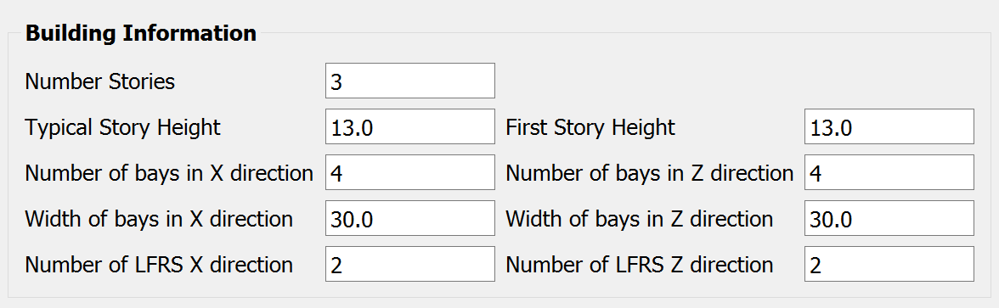
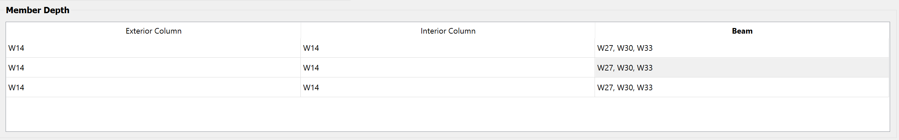
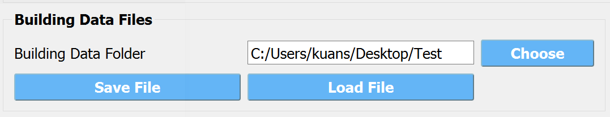
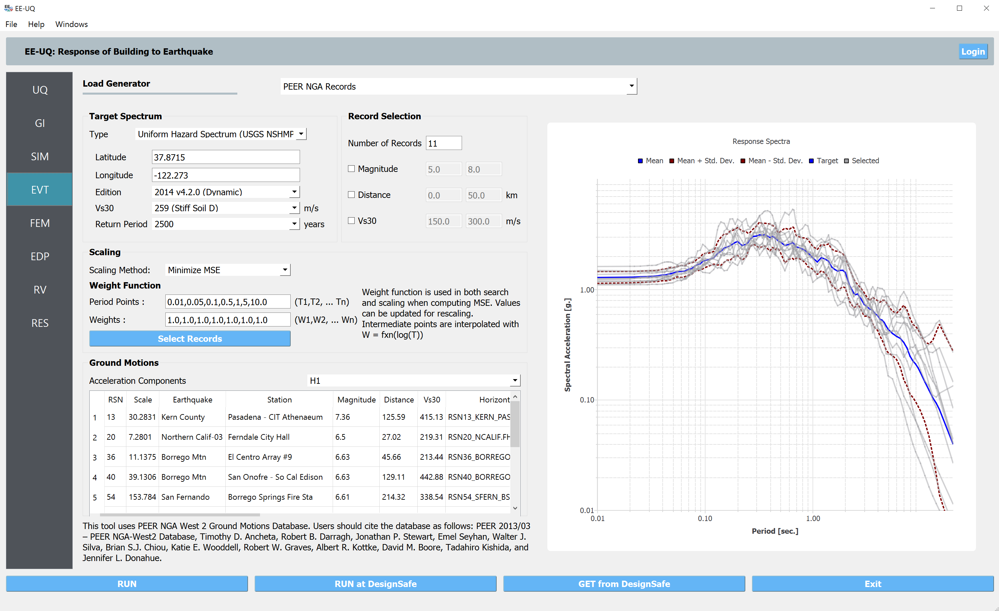
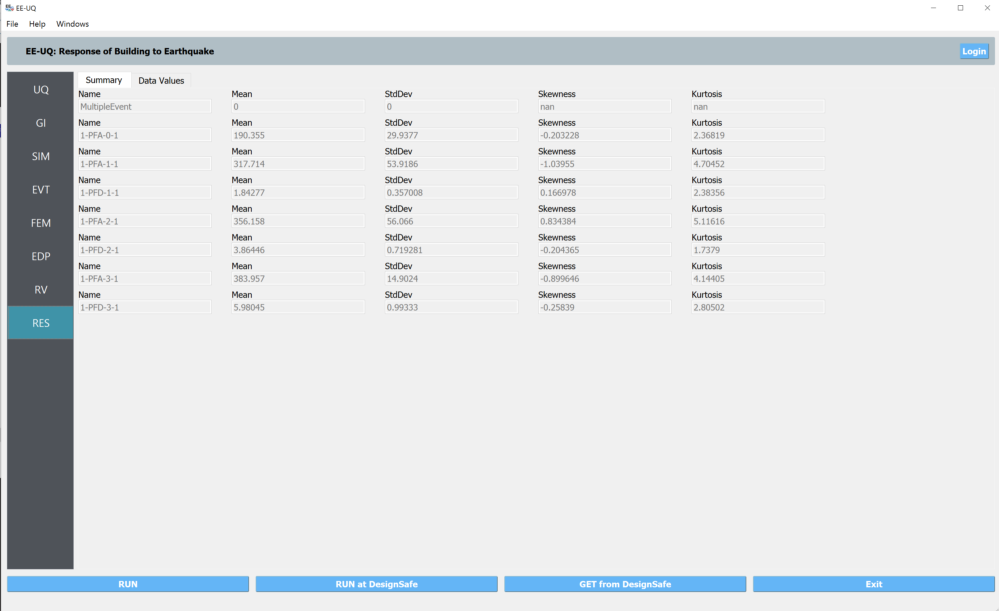

AutoSDA and Nonlinear Response Analysis
=========================================

This example demonstrate the use of a python-based computation platform to automate seismic desing and analysis of 
of steel moment resisting frames (**AutoSDA**) ([GBS20]_).
   
Design and create numerical model
^^^^^^^^^^^^^^^^^^^^^^^^^^^^^^^^^^^^^^^^^^^^

1. Navigate to the **SIM** tab in the left menu. In is panel, select the **Steel Building Model** as the 
   **Building Model Generator**. In the user interface, five major input sections: (1) 
   Building Information, (2) ELF Parameters, (3) Member Depth, (4) Loading, and (5) Building Data Files. 

.. figure:: figures/sbm.png
   :name: fig_sbm
   :align: center
   :width: 800
   :figclass: align-center

2. In the Building Information section, we define the number of stories of the example steel moment frame to 3 and 
   the uniform story height to 13.0 ft. There are 4 bays in both horizontal directions with the uniform bay width 
   of 30 ft. 

3. In the ELF Parameters section, the seismic design parameters box contains the Equivalent Lateral Force 
(ELF) design parameters as specified by ASCE 7-10. For the example frame, we assume :math:`Ss = 1.5g` and 
:math:`S1 = 0.6` with a site class of D. The frame is designed with a :math:`R` factor of 8.

.. figure:: figures/elf.png
   :name: fig_elf
   :align: center
   :width: 400
   :figclass: align-center

4. In the Member Depth section, users can specify cross sections in the the table list
   for the interior columns, exterior columns, and beams. Starting from top to bottom, each row 
   corresponding to one story from bottom story to top story. In this example, we simplify all columns to have 
   the same :math:`W14` section, and use three sections for beams.

5. In the Loading section, users can specify the loading values for the floors, beams, and columns. And for the top 
   story, the live load on the leaning column is specified to be a random variable :math:`DL` with a uniform 
   distribution from 450 kips to 550 kips (as defined in the **RV** panel).

.. figure:: figures/ldg.png
   :name: fig_ldg
   :align: center
   :width: 600
   :figclass: align-center

5. In the Building Data Files section, clicking the Save File button will automatically generate four modeling data 
   files in the user-defined location (:download:`ELFParameters.csv <src/ELFParameters.csv>`, 
   :download:`Geometry.csv <src/Geometry.csv>`, :download:`Loads.csv <src/Loads.csv>`, and 
   :download:`MemberDepth.csv <src/MemberDepth.csv>`). These four files store the data from the four discussed 
   sections above. Users can also directly modified these data tables. 

Select and scale ground motion records
^^^^^^^^^^^^^^^^^^^^^^^^^^^^^^^^^^^^^^^^^^^^

1. Navigate to the **EVT** panel and select the **PEER NGA Records** as the **Load Generator**. We can use the 
   **Uniform Hazard Spectrum** as an example target spectrum here. We can specify the site lcoation, the 
   site class (D) and return period (2500 years). Then on the left panel, please specify the number of records with optional 
   filters on the earthquake magnitude, site-source distance, and :math:`V_{S30}`.

2. In the **Scaling** panel, we could use the **Minimize MSE** as the **Scaling Method** which will compute and 
   minimize the mean standard error between the average response spectrum and the target spectrum. You can specify 
   a set of periods and corresponding error-calucation weights.

.. note::

   As specified by ASCE 7-16, you may want to let the period points at least cover the :math:`0.2T_1` to 
   :math:`1.5T_1` (:math:`T_1` is the fundamental period of the structure).

3. For the 2D model in this example, we should use the acceleration components **H1** or **H2**, while the other 
   options (**GeoMean**, **RotD50**, and **RotD100**) are available for 3D models.

4. Once set up the configurations above, please click the **Select Records** which will connect the `PEER NGA West 
   Ground Motion Database <https://ngawest2.berkeley.edu/users/sign_in?unauthenticated=true>`_. You could use your 
   account and password to login and execute the selection and scaling.

Run the analysis and postprocess results
^^^^^^^^^^^^^^^^^^^^^^^^^^^^^^^^^^^^^^^^^^^

1. Navigate to the **UQ** panel, use the default **Forward Propagation** method with the **# Sample** same as 
   the number of selected records.

.. figure:: figures/uq.png
   :name: fig_uq
   :align: center
   :width: 800
   :figclass: align-center

2. Next click on the **Run** button. This will cause the backend application to launch the analysis. When done 
   the **RES** panel will be selected and the results will be displayed. The results show the values the mean 
   and standard deviation as before but now only for the one quantity of interest.

.. [GBS20]
   Xingquan Guan, Henry Burton, and Thomas Sabol. Python-based computational platform to automate seismic design, nonlinear structural model construction and analysis of steel moment resisting frames. Engineering Structures, 224:111199, 2020.