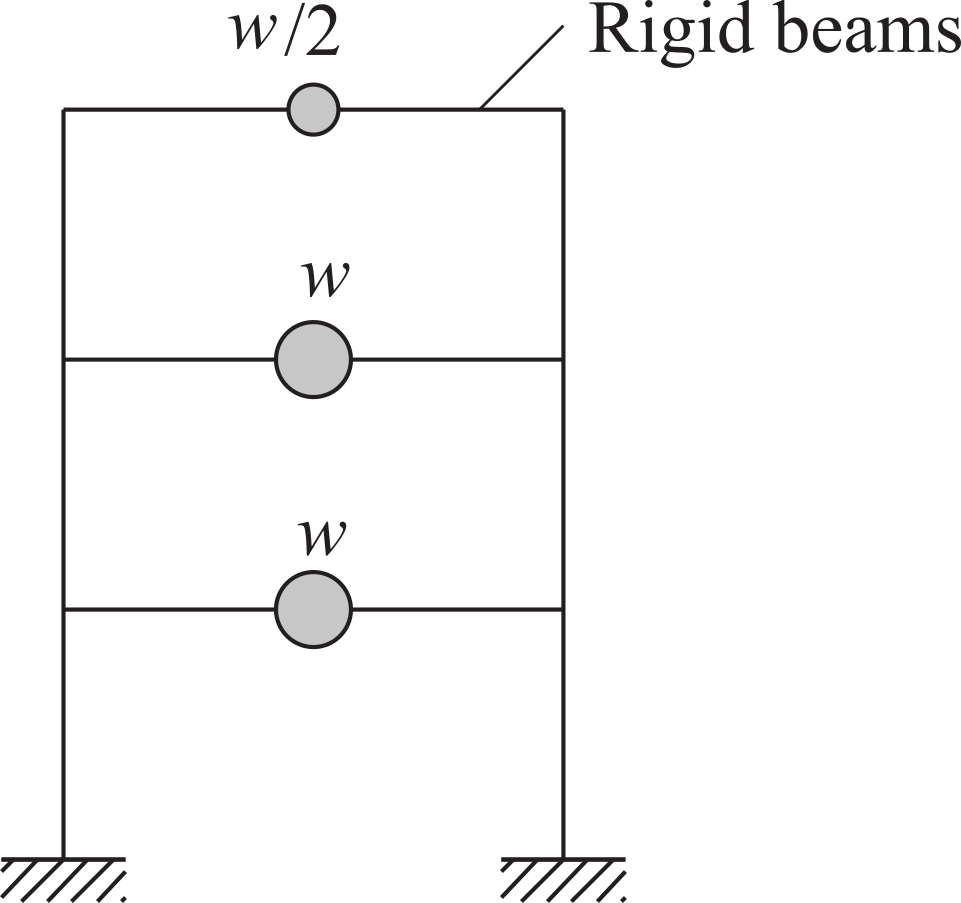
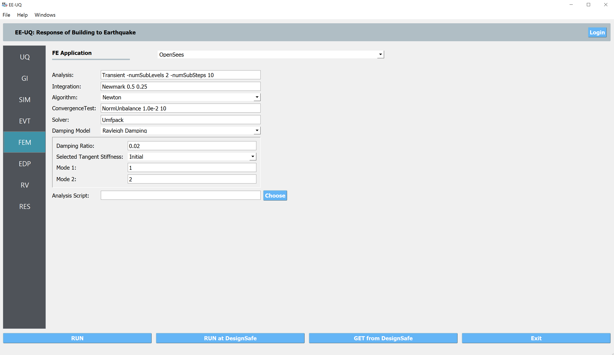
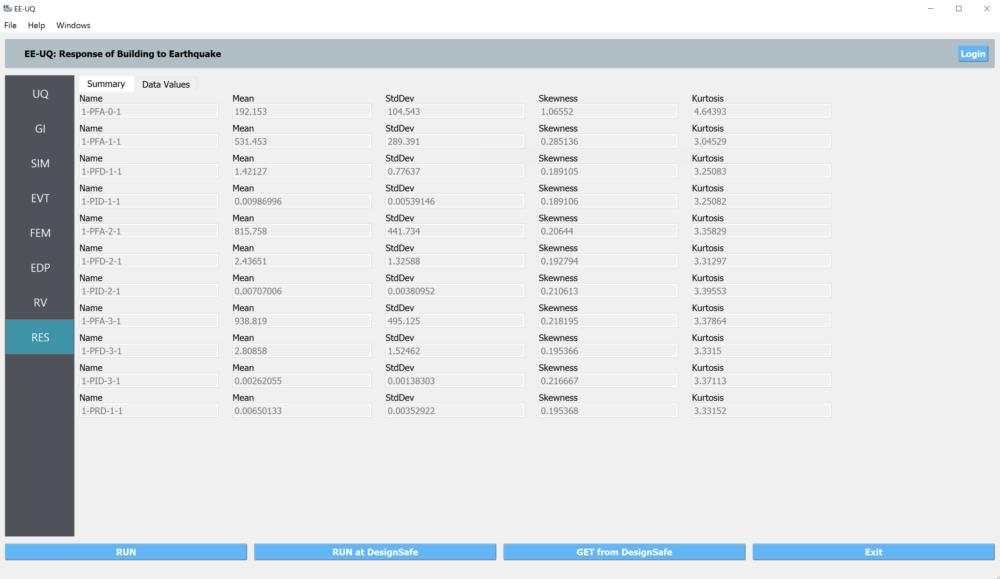
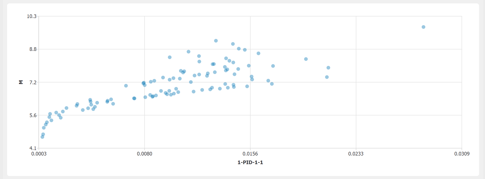
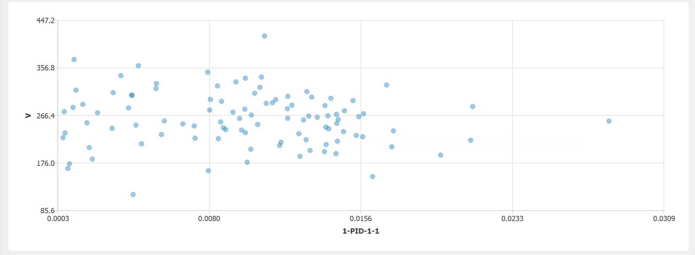
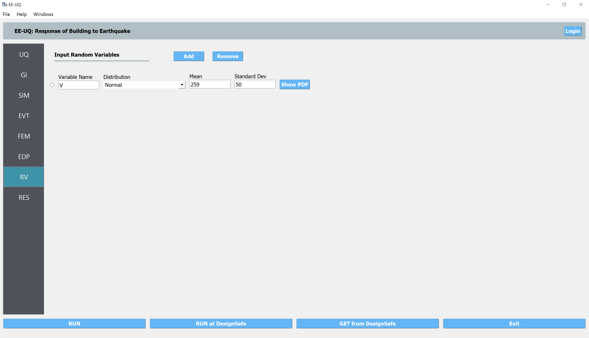
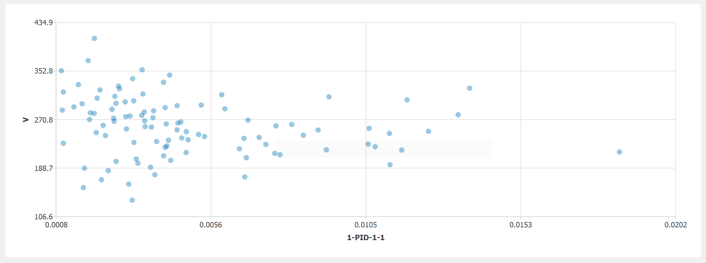
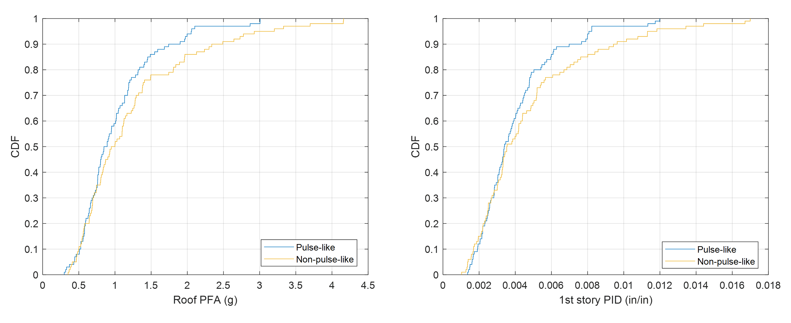

Shear Building: Synthetic Ground Motion
=============================================

Consider the problem of uncertainty quantification in a three story shear building where the ground shaking will be 
represented by sythetic ground motion records based on two methods ([VPD18]_, [DD18]_)

   Three Story Shear Building Model (P10.2.9, "Dynamics of Structures", A.K.Chopra)

The exercise will use the OpenSees, :ref:`lblOpenSeesSIM`, structural generators. For the OpenSees generator the following model script, `ShearBuilding3.tcl <https://github.com/NHERI-SimCenter/EE-UQ/blob/master/Examples/ShearBuilding3/ShearBuilding3.tcl>`_ , is used:

.. literalinclude:: ShearBuilding3.tcl
   :language: tcl

.. warning::

   Do not place the file in your root, downloads, or desktop folder as when the application runs it will copy the contents on the directories and subdirectories containing this file multiple times (a copy will be made for each sample specified). If you are like us, your root, Downloads or Documents folders contains and awful lot of files and when the backend workflow runs you will slowly find you will run out of disk space!

Vlacho-Papakonstantinou-Deodatis Method
^^^^^^^^^^^^^^^^^^^^^^^^^^^^^^^^^^^^^^^^

We will first demonstrate the steps to perform a sampling analysis to study the effects of earthquake magnitude, site-source distance, and soil velocity 
on structural dynamic responses, using the Vlacho-Papakonstantinou-Deodatis syntheic ground motion model.

To perform a Sampling or Forward propagation uncertainty analysis the user would perform the following steps:

1. Upon opening the application the **UQ** tab will be highlighted. In is panel, keep the **UQ engine** as that selected, 
   i.e. Dakota, and the **UQ Method Category** as **Forward Propagation**, and the **Method** field as **LHS** 
   (Latin Hypercube). Change the **#samples** field to ``100`` as shown in the following figure.

.. figure:: figures/uq.png
   :align: center
   :width: 700
   :figclass: align-center

2. The **GI** panel will not be used for this run; For the time being leave the default values as is, and they will be automatically updated based on the information entered in the remaining tabs.

3. Next select the **SIM** panel from the input panel. This will default in the MDOF model generator. 
   From the **Model Generator** pull down menu select **OpenSees** and select the example 
   :download:`3-story frame model </src/ShearBuilding3.tcl>`. For recording story responses, we also specify the 
   node numbers on a column line (e.g., 1, 2, 3, 4 in the OpenSees model).

.. figure:: figures/sim.png
   :align: center
   :width: 700
   :figclass: align-center

4. Next select the **EVT** panel. From the **Load Generator** pull down menu select the **Stochastic Ground Motion** 
   option. This will present a new page of stochastic loading models. We first use the "Vlachos et al. (2018)" and 
   for the three earthquake parameters: magnitude, distance, and shear-wave velocity, we define variables which 
   will be randomized later in the **RV** panel

.. figure:: figures/evt.png
   :align: center
   :width: 700
   :figclass: align-center

5. Next choose the **FEM** panel. Here we will change the entries to use Rayleigh damping, with Rayleigh factor chosen using the 
   first and second modes. 

6. We will skip the **EDP** panel leaving it in it's default condition, that being to use the **Standard Earthquake** EDP generator.

7. For the **RV** panel, we will enter the distributions and values for our random variables. For demostration purposes, 
   we assume all three variables follow normal distributions: the magnitude has a mean of 7 and standard deviation of 1; 
   the distance has a mean of 20 km and standard deviation of 5 km; and the soil velocity has a mea of 259 m/s and 
   standard deviation of 50 m/s.

.. figure:: figures/rv.png
   :align: center
   :width: 700
   :figclass: align-center

8. Next click on the **Run** button. This will cause the backend application to launch Dakota. When the analysis is complete the **RES** tab will be selected and the results will be displayed. The results show the values for the mean and standard deviation. 
   

If the user selects the **Data** tab in the **RES** panel, they will be presented with both a graphical plot 
and a tabular listing of the data. By left- and right-clicking with the mouse in the individual columns 
the axis changes (left mouse click controls vertical axis, right mouse click the horizontal axis). For example, 
we can now see the influences from the magitude (:math:`M`), distance (:math:`R`), and soil velocity (:math:`V`) on the 1st stroy peak story drift 
ratio (:math:`1-PID-1-1`).

.. figure:: figures/inf_r1.png
   :align: center
   :width: 700
   :figclass: align-center

Dabaghi-Der Kiureghian Method
^^^^^^^^^^^^^^^^^^^^^^^^^^^^^^^

The Dabaghi-Kiureghian model looks into the near-fault ground motion pulse feature and can generate pairs of 
synthetic pulse-like and non-pulse-like components in appropriate proportions. In this example, we would like to 
(1) understand the effects from the randomness in site-source distance (as similar 
but comparable to the first example above) and (2) compare the differences in structural responses due to the 
distinct characteristics of pulse-like and non-pulse-like records.

1. All the configurations are maintained the same as the first example except in the **EVT** panel, we select the 
   "Dabaghi & Der Kiureghian (2018)" method. And we first fix the fault type to "Stike-Slip" and enable both the 
   pulse-like and non-pulse-like records.

2. For the Depth to Top of Rupture Plane, we specify 0.0 km as a constant; and for the other earthquake parameters (
   moment magnitude,  closest distance to the site, parallel distance, and angel), we define their values as the figure 
   shown in below. The random varaiable average shear-wave velocity (V) will be specified in the **RV** panel.

.. figure:: figures/evt2.png
   :align: center
   :width: 700
   :figclass: align-center

3. In the **RV** panel, we specify the normal distribution for the R variable.

4. In the **RES** panel, similar to the first example, the maximum story drift ratio and peak acceleration demands are
   recorded (e.g., 1st story 1-PID-1-1 and 3rd floor 1-PFA-3-1). And we could examine the influence from the site soil 
   velocity on the 1st story peak story drift ratio.

.. figure:: figures/all_sdr1.png
   :align: center
   :width: 700
   :figclass: align-center

.. figure:: figures/all_pfa3.png
   :align: center
   :width: 700
   :figclass: align-center

5. The second part of this example is to compare the pulse-like and non-pulse-like records. So, we navigate back 
   to the **EVT** panel and first select the "Only pulse-like" and then the "Non-pulse-like only" to run the analysis 
   again. As seen in the figure below, the non-pulse-like group, on average, results in 10% to 15% higher structural responses in this 
   example.

.. [VPD18]
   Vlachos, C., Papakonstantinou, K. G., & Deodatis, G. (2018). Predictive model for site specific simulation of ground motions based on earthquake scenarios. Earthquake Engineering & Structural Dynamics, 47(1), 195-218.

.. [DD18]
Dabaghi, M., & Der Kiureghian, A. (2018). Simulation of orthogonal horizontal components of near-fault ground motion for specified earthquake source and site characteristics. Earthquake Engineering & Structural Dynamics, 47(6), 1369-1393.