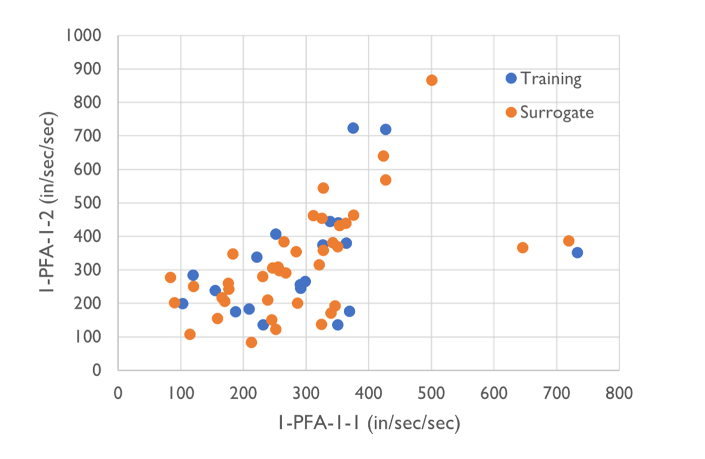

.. _eeuq-0006:

PLoM Surrogate Model
======================

One essential step in seismic structural performance assessment is evaluating structural responses 
under earthquake ground motion inputs. The typical workflow is demonstrated in `Example 4.3 
<https://nheri-simcenter.github.io/EE-UQ-Documentation/common/user_manual/examples/desktop/eeuq-0003/README.html>`_.
The trade-off between computational efficiency and accuracy is one of the major challenges in problems that 
require a large number of time history analyses (e.g., risk analysis, and structural optimization). One 
possible solution is using surrogate models (e.g., response surface, kriging). The surrogate models are first 
trained for interested responses given a set of relatively expensive simulations. The resulting models can then be 
applied to predict new realizations more efficiently.

 1000. The data points are mostly clustered in the lower left quadrant of the graph, indicating a correlation between the two variables for both the training and surrogate data. Some outlier points are spread out towards the higher values on both axes.
   :width: 400
   :figclass: align-center

   Samples generated from the physical simulation model (blue) and the surrogate model (orange)

This example demonstrates using a novel method, Probabilistic Learning on Manifolds (PLoM) [Soize2016]_, to develop surrogate models 
for structural responses under earthquake ground motion inputs.
   
Configure UQ Engine
^^^^^^^^^^^^^^^^^^^^^

1. Navigate to the **UQ** tab in the left menu. In this panel, select the **SimCenterUQ** as the 
   **UQ Engine**. In the **SimCenterUQ Method Category**, select the **PLoM Model** method. There are
   two options for defining a training dataset, **Import Data File** and **Sampling and Simulation**. We 
   start with **Sampling and Simulation** here while the former will be introduced later. **LHS** is 
   used as the sampling method with 20 samples (corresponding to the 20 ground motions in the run). And we 
   would like to generate 40 new realizations from the 20 training samples 
   (i.e., the **New Sample Number Ratio** is 2).

.. figure:: figures/uq_plom.png
   :name: fig_uq_plot
   :alt: Screenshot of a software interface labeled 'UQ Engine' displaying settings for uncertainty quantification analysis. The interface shows options for 'SimCenterUQ Method Category' set to 'PLOM Model', 'Training Dataset' set to 'Sampling and Simulation', and 'Method' set to 'LHS'. There are fields for '# Samples' with a value of 20, 'Seed' with a value of 314, and 'New Sample Number Ratio' with a value of 2. The user interface has a clean, minimalistic design with drop-down menus and input boxes for various parameters.
   :align: center
   :width: 100%
   :figclass: align-center

2. Activate the **Advanced Options** and select **Affiliate Variable**. In the **Type** options, select 
   **Ground Motion Intensity** - **Intensity Measure Calculation** window would be displayed and allow 
   users to add/remove intensity measures to the surrogate models. In this example, we add two intensity 
   measures, **Pseudo Spectral Acceleration** and **SaRatio**.

.. figure:: figures/uq_imc.png
   :name: fig_bim
   :alt: Screenshot of a graphical user interface for ground motion intensity calculation. It includes an "Advanced Options" section with a dropdown menu labeled "Type" set to "Ground Motion Intensity" and a selectable "Affiliate Variable" toggle. Below that, there's a section for "Intensity Measure Calculation" with "Add" and "Remove" buttons. Two radio button options are shown: "Pseudo Spectral Acceleration" with dropdown menus for "Gravitational constant (g)" set to a value and "Periods: 0.5"; and "SaRatio" with dropdown menus for "Unitless (scalar)" and "Periods: 0.1,0.5,1.5." The interface has a clean design with a light background and clear delineation of options.
   :align: center
   :width: 100%
   :figclass: align-center

Configure Structural Analysis
^^^^^^^^^^^^^^^^^^^^^^^^^^^^^

1. Navigate to the **SIM** tab and select the **MDOF** as the **Building Model Generator**. In this example 
   we use a simple nonlinear SDOF model (yield displacement is 0.01 inch and hardening ratio is 0.1).

.. figure:: figures/sim.png
   :name: fig_sim
   :alt: Screenshot of a computer interface titled 'Building Model Generator' with input fields for building information parameters such as 'Number Stories', 'Floor Weights', and 'Story Stiffness' among others. To the right side of the inputs, there is a visualization of a simple one-story building structure represented as a vertical line with a square on top, indicating a model generated based on the input parameters. The interface is designed for creating a multi-degree-of-freedom (MDOF) system for structural analysis.
   :align: center
   :width: 100%
   :figclass: align-center

2. Navigate to the **EVT** tab and select the **PEER NGA Records**. We select 20 ground motions to match the 
   default Design Spectrum for analyzing the structural responses under earthquake inputs.

.. figure:: figures/evt.png
   :name: fig_evt
   :alt: Screenshot of a software interface with two main sections related to earthquake engineering. The left panel is titled "Load Generator" with tabs for "PEER NGA Records" and options for Target Spectrum, Output Directory, Ground Motion Components, and Scaling/Selection Criteria. The right panel displays a chart titled "Response Spectra," showing multiple overlapping curves representing spectral acceleration vs. period, with associated legend indicating average and standard deviation values. The interface includes numerical inputs and dropdown menus for selecting and analyzing earthquake ground motion data.
   :align: center
   :width: 100%
   :figclass: align-center

3. For the **FEM** and **EDP** panels, we use default setups to analyze the structural model and record the 
   standard earthquake EDPs, i.e., peak displacement, drift ratio, and acceleration demands.

.. figure:: figures/fem.png
   :name: fig_fem
   :alt: Screenshot of a computer interface for a finite element (FE) application, possibly named OpenSees, with various fields to set up a simulation. The fields include settings for Analysis (options for a Transient analysis with sub-levels and sub-steps), Integration (Newmark method with beta and gamma values), Algorithm (Newton), ConvergenceTest (NormUnbalance), Solver (Umfpack), Damping Model (Rayleigh Damping with a damping ratio), Selected Tangent Stiffness, and fields to input values for Mode 1 and Mode 2. There is also an input field for an Analysis Script, and a 'Choose' button at the bottom right. The interface is pragmatic with a focus on functionality.
   :align: center
   :width: 100%
   :figclass: align-center

.. figure:: figures/edp.png
   :name: fig_edp
   :alt: A screenshot of a computer interface with a dropdown menu titled "Engineering Demand Parameter Generator" next to a selected option named "Standard Earthquake" with a downward arrow indicating more options are available in the dropdown menu.
   :align: center
   :width: 100%
   :figclass: align-center

Run the analysis and post-process results
^^^^^^^^^^^^^^^^^^^^^^^^^^^^^^^^^^^^^^^^^^

1. Next click on the **Run** button. This will call the backend application to launch the analysis. When done 
   the **RES** panel will first arrive at the **Summary** panel. Two plots are created to summarize the PLoM training 
   results in the panel (i.e., errors in PCA approximation and diffusion-maps eigenvalues) which can be switched around 
   by clicking the **PCA** and **KDE** tabs located on the top-right corner of the chart.

.. figure:: figures/res_summary.png
   :name: fig_res_summary
   :alt: A screenshot of a software interface showing the results of a surrogate model training with a graph titled "PLOM Training Results." The graph plots 'PCA Error' against 'PCA Eigenvalues' in a scatter plot with a line connecting the points, indicating a decreasing trend in error with smaller eigenvalues. The interface also includes text indicating "Surrogate Modeling Completed! termination code unidentified," "# training samples 20," "# model simulations 0," and "Analysis time 0.0 min." A panel on the left side contains navigation tabs labelled UQ, GI, SIM, EVT, FEM, EDP, RV, and RES, with the PLOM Training Results displayed in the central section of the interface. Below the graph, there is a "Save PLOM Model" button.
   :align: center
   :width: 100%
   :figclass: align-center

.. figure:: figures/res_kde.png
   :name: fig_res_kde
   :alt: A graph titled "PLoM Training Results" displaying the relationship between 'Diff. Maps Eigenvalue' (y-axis) and 'Number of Component' (x-axis). The graph shows a blue line plot with eigenvalues starting high at the first component and decreasing sharply as the number of components increases before plateauing. A horizontal red line marks the 'Minimum eigen considered' threshold, which intersects the blue line plot around the sixth component, suggesting the point after which additional components have a lower eigenvalue than the considered minimum.
   :align: center
   :width: 60%
   :figclass: align-center

2. One could save the PLoM model by clicking on **Save PLoM Model** - an HDF-formatted database along with supplemental 
   files will be stored in the user-defined directory. The saved model can be imported for generating new realizations 
   which will be introduced in a second.

.. figure:: figures/res_save.png
   :name: fig_res_save
   :alt: Screenshot of a Windows Save Data dialog box with 'This PC > Desktop > testFiles' as the save location. The file name is entered as 'SurrogatePLoM.h5' with the file type set to 'H5 File (*.h5)'. The dialog box shows an empty folder with columns for Name, Date modified, Type, and Size. Several folders are listed on the left side pane, and options to save or cancel are presented at the bottom of the window.
   :align: center
   :width: 100%
   :figclass: align-center

3. One could navigate to the **Data Value** panel to visualize and save the new realizations.

.. figure:: figures/res_data.png
   :name: fig_res_data
   :alt: A screenshot displaying a scatter plot with various data points spread across the chart, which seems to depict some form of scientific or statistical data. On the bottom, a data table is visible with numerical values labeled "Run #," "1-PSA(0.5)-0-1," "1-SaRatio-0-1," and other headers, suggesting the scatter plot above correlates to these data entries. There are buttons to "Save Table" and "Save Columns Separately." The scatter plot has labeled axes, but the details are not fully legible in this image.
   :align: center
   :width: 70%
   :figclass: align-center

4. The two figures below compare the data scatter plots between the simulation samples (training set) and 
   surrogate samples (prediction set) which are in good agreement.

.. figure:: figures/res_comp1.png
   :name: fig_res_comp1
   :alt: A scatter plot with two sets of data points labeled as 'Training' in blue and 'Surrogate' in orange. The horizontal axis is labeled 'I-SaRatio-0-I' and ranges from 0 to 2. The vertical axis is labeled '|-PDi-l - I (in)' and ranges from 0 to 30. The distribution of data points is scattered mostly in the center of the graph with no clear pattern, and both 'Training' and 'Surrogate' points are interspersed throughout.
   :align: center
   :width: 60%
   :figclass: align-center

.. figure:: figures/res_comp2.png
   :name: fig_res_comp1
   :alt: A scatter plot comparing two variables indicated as "|-PFA-1-|2 (in/sec/sec)" on the y-axis and "|-PFA-1-|" on the x-axis (also in units of in/sec/sec), with points plotted for 'Training' in blue and 'Surrogate' in orange. The data points are dispersed across the graph, with a concentration of points towards the lower left corner where both variables have smaller values. There's no clear trend or correlation visible from the distribution of points. The range of the x-axis is from 0 to approximately 800 in/sec/sec and the y-axis from 0 to roughly 1000 in/sec/sec.
   :align: center
   :width: 60%
   :figclass: align-center

.. [Soize2016]
   Soize, C., & Ghanem, R. (2016). Data-driven probability concentration and sampling on the manifold. Journal of Computational Physics, 321, 242-258.