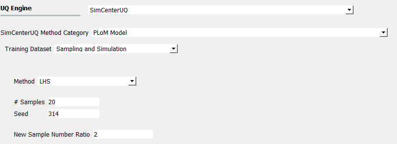
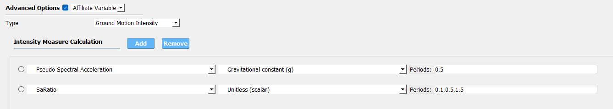
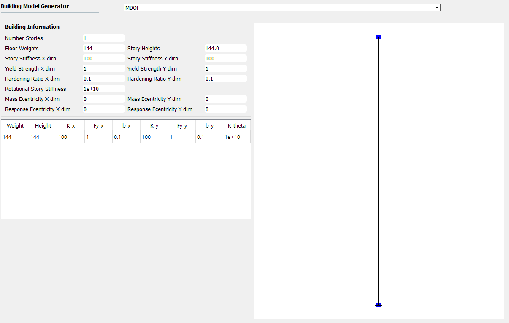
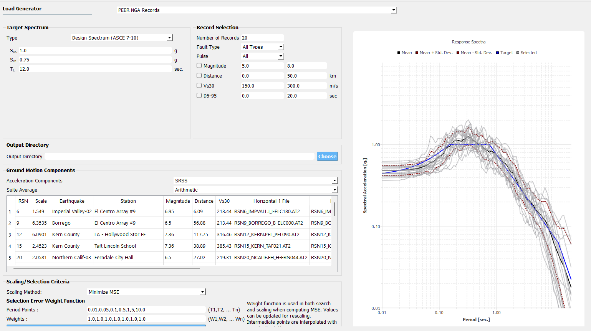
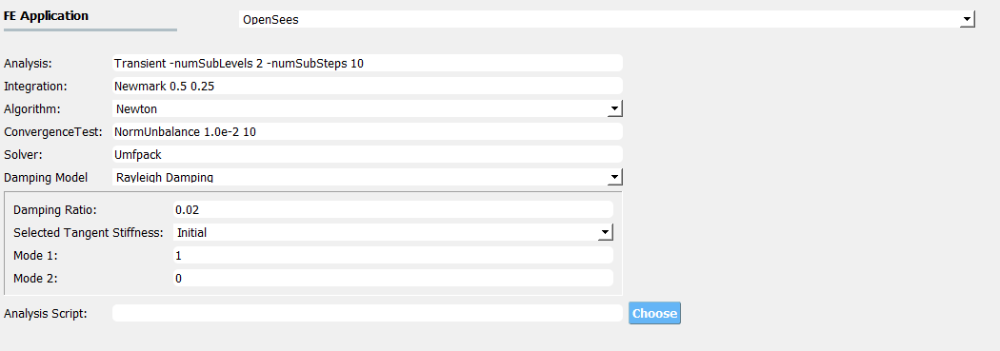
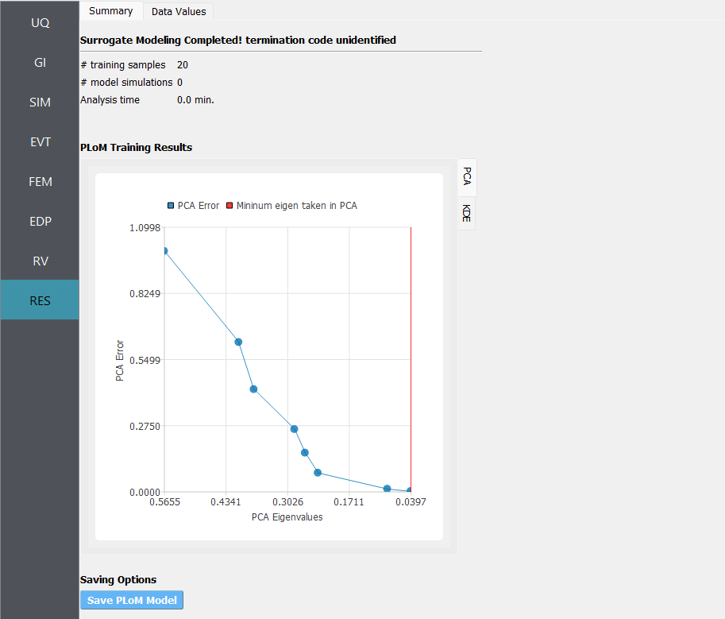
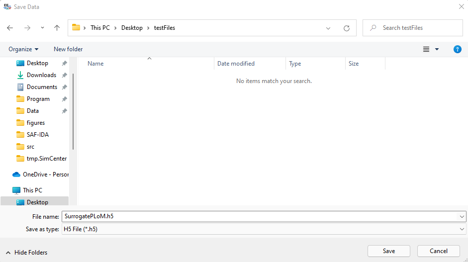
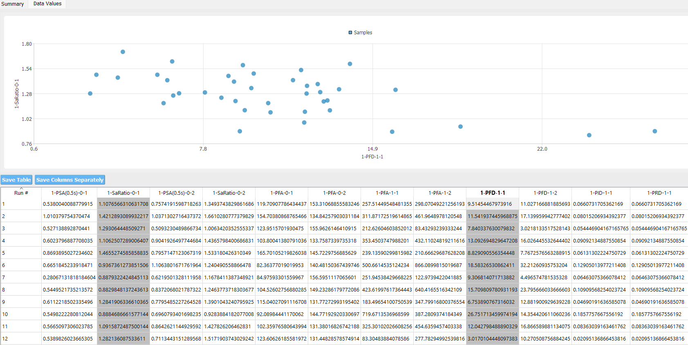
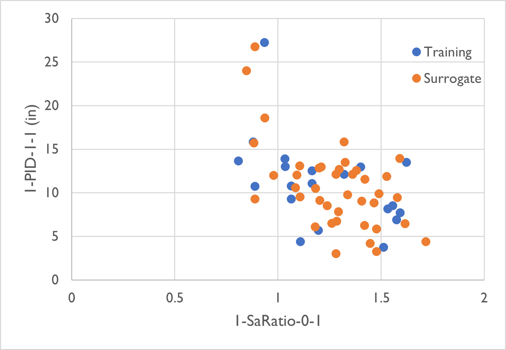
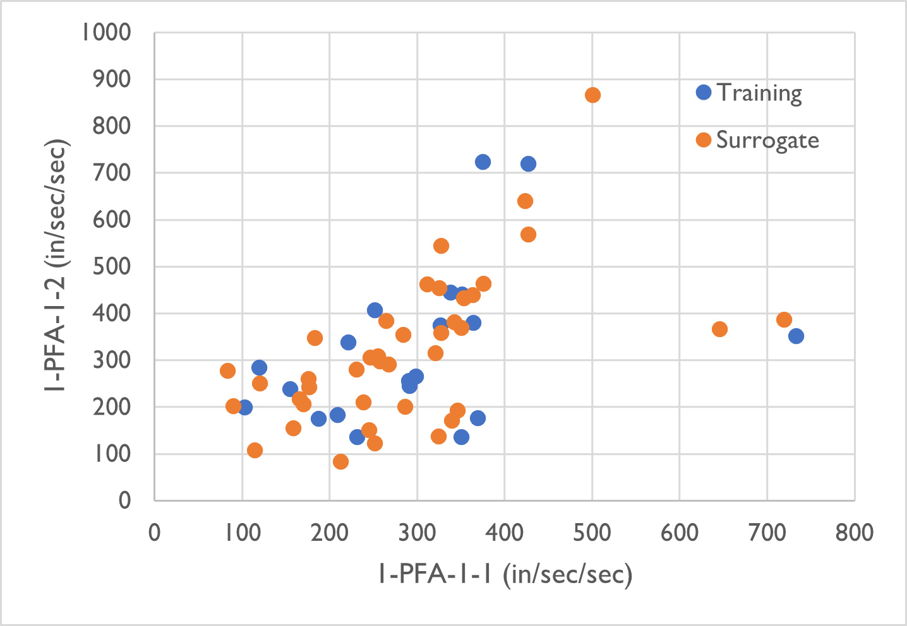

Surrogate Model for Structural Response Prediction (Probabilistic Learning on Manifolds)
========================================================================================

One essential step in seismic structural performance assessment is evaluating structural responses 
under earthquake ground motion inputs. The typical workflow is demonstrated in `Example 4.3 
<https://nheri-simcenter.github.io/EE-UQ-Documentation/common/user_manual/examples/desktop/eeuq-0003/README.html>`_.
The trade-off between computational efficiency and accuracy is one of the major challenges in problems that 
require a large number of time history analyses (e.g., risk analysis, and structural optimization). One 
possible solution is using surrogate models (e.g., response surface, kriging). The surrogate models are first 
trained for interested responses given a set of relatively expensive simulations. The resulting models can then be 
applied to predict new realizations more efficiently.

This example demonstrates using a novel method, Probabilistic Learning on Manifolds (PLoM) [Soize2016]_, to develop surrogate models 
for structural responses under earthquake ground motion inputs.
   
Configure UQ Engine
^^^^^^^^^^^^^^^^^^^^^

1. Navigate to the **UQ** tab in the left menu. In this panel, select the **SimCenterUQ** as the 
   **UQ Engine**. In the **SimCenterUQ Method Category**, select the **PLoM Model** method. There are
   two options for defining a training dataset, **Import Data File** and **Sampling and Simulation**. We 
   start with **Sampling and Simulation** here while the former will be introduced later. **LHS** is 
   used as the sampling method with 20 samples (corresponding to the 20 ground motions in the run). And we 
   would like to generate 40 new realizations from the 20 training samples 
   (i.e., the **New Sample Number Ratio** is 2).

2. Activate the **Advanced Options** and select **Affiliate Variable**. In the **Type** options, select 
   **Ground Motion Intensity** - a **Intensity Measure Calculation** window would be displayed and allow 
   users to add/remove intensity measures to the surrogate models. In this example, we add two intensity 
   measures, **Pseudo Spectral Acceleration** and **SaRatio**.

Configure Structural Analysis
^^^^^^^^^^^^^^^^^^^^^^^^^^^^^

1. Navigate to the **SIM** tab and select the **MDOF** as the **Building Model Generator**. In this example 
   we use a simple nonlinear SDOF model (yield displacement is 0.01 inch and hardening ratio is 0.1).

2. Navigate to the **EVT** tab and select the **PEER NGA Records**. We select 20 ground motions to match the 
   default Design Spectrum for analyzing the structural responses under earthquake inputs.

3. For the **FEM** and **EDP** panels, we use default setups to analyze the structural model and record the 
   standard earthquake EDPs, i.e., peak displacement, drift ratio, and acceleration demands.

.. figure:: figures/edp.png
   :name: fig_edp
   :align: center
   :width: 600
   :figclass: align-center

1. In the Building Data Files section, clicking the Save File button will automatically generate four modeling data 
   files in the user-defined location (:download:`ELFParameters.csv <src/ELFParameters.csv>`, 
   :download:`Geometry.csv <src/Geometry.csv>`, :download:`Loads.csv <src/Loads.csv>`, and 
   :download:`MemberDepth.csv <src/MemberDepth.csv>`). These four files store the data from the four discussed 
   sections above. Users can also directly modify these data tables. 

.. figure:: figures/bdf.png
   :name: fig_bdf
   :align: center
   :width: 600
   :figclass: align-center

Run the analysis and post-process results
^^^^^^^^^^^^^^^^^^^^^^^^^^^^^^^^^^^^^^^^^^

1. Next click on the **Run** button. This will call the backend application to launch the analysis. When done 
   the **RES** panel will first arrive at the **Summary** panel. Two plots are created to summarize the PLoM training 
   results in the panel (i.e., errors in PCA approximation and diffusion-maps eigenvalues) which can be switched around 
   by clicking the **PCA** and **KDE** tabs located on the top-right corner of the chart.

.. figure:: figures/res_kde.png
   :name: fig_res_kde
   :align: center
   :width: 400
   :figclass: align-center

2. One could save the PLoM model by clicking on **Save PLoM Model** - an HDF-formatted database along with supplemental 
   files will be stored in the user-defined directory. The saved model can be imported for generating new realizations 
   which will be introduced in a second.

3. One could navigate to the **Data Value** panel to visualize and save the new realizations.

4. The two figures below compare the data scatter plots between the simulation samples (training set) and 
   surrogate samples (prediction set) which are in good agreement.

.. [Soize2016]
   Soize, C., & Ghanem, R. (2016). Data-driven probability concentration and sampling on manifold. Journal of Computational Physics, 321, 242-258.