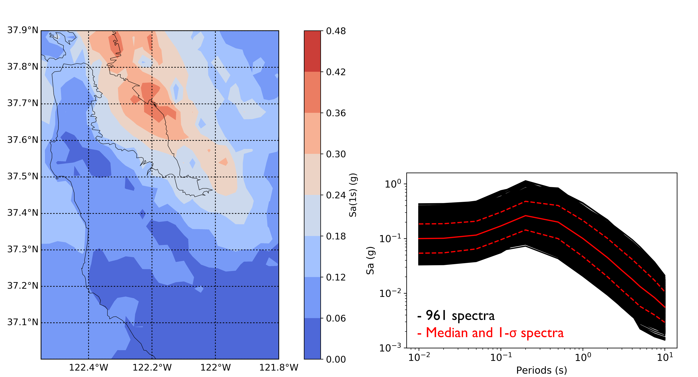

Target Spectrum by Surrogate Hazard GP Model
==============================================

In some cases, users may want to specify the target response spectrum in ground motion selection using a pre-trained surrogate
hazard model. This example demonstrates using quoFEM-trained Gaussian Process hazard model to get a target response spectrum 
at a specific site location in San Francisco Bay Area given the seismicity from the Hayward Fault.
   
Pre-trained Gaussian Process Surrogate Model
^^^^^^^^^^^^^^^^^^^^^^^^^^^^^^^^^^^^^^^^^^^^^

1. In this example, the Gaussian Process (GP) model is trained on regional earthquake intensity measure maps that are generated 
   for 147 possible Hayward earthquake scenarios in UCERF-2 model. For each scenario, the response spectral accelerations at periods 
   from 0.01 sec to 10.0 sec are evaluated for overall 961 sites (31 times 31) in the San Francisco Bay Area. Inter-event and intra-event 
   correlations are considered for all the sites whose median spectra are used as the training dataset.
    

2. The training dataset (:download:`X.txt <./src/X.txt>` and :download:`Y.txt <./src/Y.txt>`) is then loaded in 
   `quoFEM <https://nheri-simcenter.github.io/quoFEM-Documentation/common/user_manual/usage/desktop/SimCenterUQSurrogate.html>`_ 
   to train a GP model where the Longitude and Latitude are input variables and the median response spectrum 
   at that site location is the output. The training takes about 25 sec and shows good performance and accuracy in the 
   cross-validation. The trained model is saved into two files (:download:`SimGpModel.json <./src/SimGpModel.json>` and 
   :download:`SimGpModel.pkl <./src/SimGpModel.pkl>`) for the use in EE-UQ.

.. figure:: figures/trainingConfig.png
   :name: fig_trainingConfig
   :align: center
   :width: 600
   :figclass: align-center

.. figure:: figures/trainingRes.png
   :name: fig_trainingRes
   :align: center
   :width: 600
   :figclass: align-center

Configure Surrogate Target Spectrum
^^^^^^^^^^^^^^^^^^^^^^^^^^^^^^^^^^^^^

1. Navigate to the **EVT** tab and select the **PEER NGA Records** as the **Load Generator**. In this example 
   we use the **Spectrum from Hazard Surrogate** as the Target Spectrum (specified in the dropdown list).

2. Click **Choose** buttons to select and load the **SimGpModel.json** and **SimGpModel.pkl** files as the 
   hazard surrogate GP model.

3. In the **Intensity Measure Periods (sec):** textbox, fill in the periods for the response spectral accelerations which 
   are "0.01, 0.02, 0.05, 0.1, 0.2, 0.5, 1, 2, 3, 4, 5, 7.5, 10" in this example.

4. Two random variables ("RV_column1" and "RV_column2") are automatically populated from the loaded surrogate model, and 
   users can specify the desired site location to evaluate the target response spectrum.

.. figure:: figures/configSpectrum.png
   :name: fig_configSpectrum
   :align: center
   :width: 600
   :figclass: align-center

5. Once the above configurations are set up, click **Get Spectrum** button which will launch backend surrogate applications 
   to predict the response spectrum at the provided location. Note although this example shows the application for 
   predicting the response spectrum at a given location, the surrogate model can be trained on other input variables (not necessarily 
   Longitude and Latitude).

6. Once the prediction is completed, the Target Spectrum widget will automatically switch to **User Specified** option with the 
   tabulated response spectrum predicted for the given input variables.

.. figure:: figures/resSpectrum.png
   :name: fig_resSpectrum
   :align: center
   :width: 600
   :figclass: align-center

Select Ground Motion and Run Analysis
^^^^^^^^^^^^^^^^^^^^^^^^^^^^^^^^^^^^^^^

1. Once the target response spectrum is available, users can follow the same procedure as introduced in 
   `EE-UQ Example 3 <https://nheri-simcenter.github.io/EE-UQ-Documentation/common/user_manual/examples/desktop/eeuq-0003/README.html#select-and-scale-ground-motion-records>`_ to 
   select and scale ground motion records.

.. figure:: figures/evt.png
   :name: fig_evt
   :align: center
   :width: 600
   :figclass: align-center

2. In the example, a simple SDOF model is used in **SIM** tab to demonstrate the structural analysis step and default configurations 
   are used in the **FEM** and **EDP** tabs.

.. figure:: figures/sim.png
   :name: fig_sim
   :align: center
   :width: 600
   :figclass: align-center

.. figure:: figures/fem.png
   :name: fig_fem
   :align: center
   :width: 600
   :figclass: align-center

.. figure:: figures/edp.png
   :name: fig_fem
   :align: center
   :width: 600
   :figclass: align-center

3. By clicking **Run** button, one can launch the analysis and the application will automatically switch to the **RES** tab 
   once the analysis is completed. One could navigate to the **Data Value** panel to visualize and save the new realizations.

.. figure:: figures/res1.png
   :name: fig_res_data
   :align: center
   :width: 600
   :figclass: align-center

.. figure:: figures/res2.png
   :name: fig_res_comp1
   :align: center
   :width: 600
   :figclass: align-center