.. _eeuq-0007:

Target Spectrum by Surrogate Hazard GP Model
==============================================

In some cases, users may want to specify the target response spectrum in ground motion selection using a pre-trained surrogate
hazard model. This example demonstrates using quoFEM-trained Gaussian Process hazard model to get a target response spectrum 
at a specific site location in the San Francisco Bay Area given the seismicity from the Hayward Fault.
   
Pre-trained Gaussian Process Surrogate Model
^^^^^^^^^^^^^^^^^^^^^^^^^^^^^^^^^^^^^^^^^^^^^

1. In this example, the Gaussian Process (GP) model is trained on regional earthquake intensity measure maps that are generated 
   for 147 possible Hayward earthquake scenarios in the UCERF-2 model. For each scenario, the response spectral accelerations at periods 
   from 0.01 sec to 10.0 sec are evaluated for overall 961 sites (31 times 31) in the San Francisco Bay Area. Inter-event and intra-event 
   correlations are considered for all the sites whose median spectra are used as the training dataset.
    

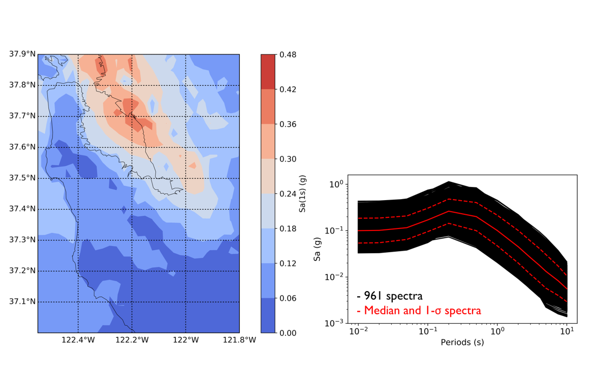s. The map is overlaid with a grid and marked by latitude and longitude coordinates, with a color scale on the right-hand side to interpret the data values. On the right is a log-log plot with a dark background, illustrating statistical distributions with a median trend shown in a solid red line and a range indicating plus and minus one standard deviation from the median represented by dashed red lines. The x-axis indicates period (s), while the y-axis represents spectral acceleration (g)."
   :align: center
   :width: 600
   :figclass: align-center

2. The training dataset (:eeuq-0007:`X.txt <./src/X.txt>` and :eeuq-0007:`Y.txt <./src/Y.txt>`) is then loaded in 
   `quoFEM <https://nheri-simcenter.github.io/quoFEM-Documentation/common/user_manual/usage/desktop/SimCenterUQSurrogate.html>`_ 
   to train a GP model where the Longitude and Latitude are input variables and the median response spectrum 
   at that site location is the output. The training takes about 25 sec and shows good performance and accuracy in the 
   cross-validation. The trained model is saved into two files (:eeuq-0007:`SimGpModel.json <./src/SimGpModel.json>` and 
   :eeuq-0007:`SimGpModel.pkl <./src/SimGpModel.pkl>`) for the use in EE-UQ.

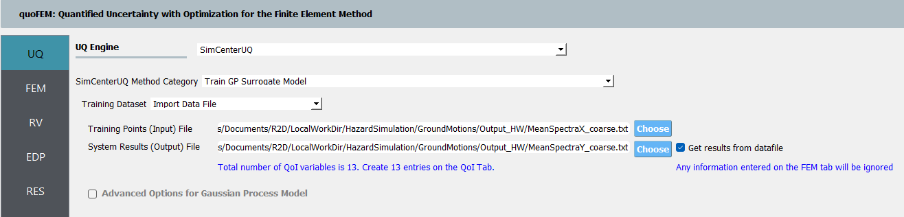to "Train GP Surrogate Model." File paths for "Training Points (Input) File" and "System Results (Output) File" are displayed, alongside an option to 'Choose' files. A checkbox for "Advanced Options for Gaussian Process Model" and a note stating "Any information entered on the FEM tab will be ignored" are visible at the bottom.
   :align: center
   :width: 100%
   :figclass: align-center

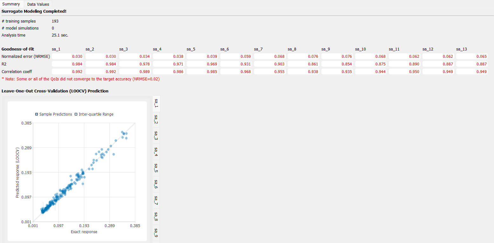ning samples, 0 model simulations, and an analysis time of 25.1 seconds. The goodness-of-fit section shows values for normalized error (NRMSE) ranging from 0.030 to 0.076 and corresponding R-squared (R2) values from 0.854 to 0.984 across different variables labeled sa_1 through sa_13. The scatter plot depicts a close alignment of predicted responses (LOOCV) against exact responses, with the points closely huddled along the diagonal line, suggesting a strong predictive performance.
   :align: center
   :width: 100%
   :figclass: align-center

Configure Surrogate Target Spectrum
^^^^^^^^^^^^^^^^^^^^^^^^^^^^^^^^^^^^^

1. Navigate to the **EVT** tab and select the **PEER NGA Records** as the **Load Generator**. In this example 
   we use the **Spectrum from Hazard Surrogate** as the Target Spectrum (specified in the dropdown list).

2. Click **Choose** buttons to select and load the **SimGpModel.json** and **SimGpModel.pkl** files as the 
   hazard surrogate GP model.

3. In the **Intensity Measure Periods (sec):** textbox, fill in the periods for the response spectral accelerations which 
   are "0.01, 0.02, 0.05, 0.1, 0.2, 0.5, 1, 2, 3, 4, 5, 7.5, 10" in this example.

4. Two random variables ("RV_column1" and "RV_column2") are automatically populated from the loaded surrogate model, and 
   users can specify the desired site location to evaluate the target response spectrum.

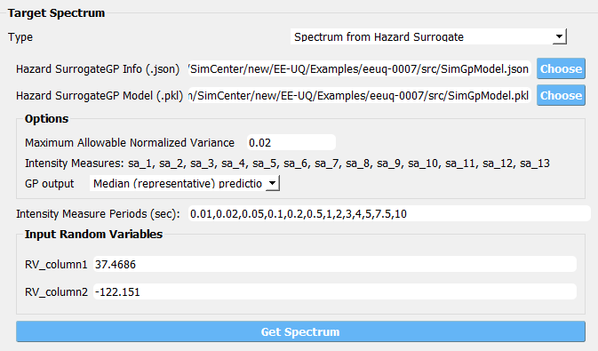ection of options such as "Maximum Allowable Normalized Variance" and "Intensity Measures". There is also a dropdown menu for "GP output" and a list for "Intensity Measure Periods (secs)". Below is a section titled "Input Random Variables" with numerical values listed, and a button labeled "Get Spectrum" at the bottom.
   :align: center
   :width: 600
   :figclass: align-center

5. Once the above configurations are set up, click **Get Spectrum** button which will launch backend surrogate applications 
   to predict the response spectrum at the provided location. Note although this example shows the application for 
   predicting the response spectrum at a given location, the surrogate model can be trained on other input variables (not necessarily 
   Longitude and Latitude).

6. Once the prediction is completed, the Target Spectrum widget will automatically switch to **User Specified** option with the 
   tabulated response spectrum predicted for the given input variables.

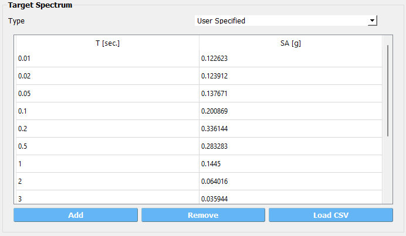g. The interface includes buttons labeled "Add," "Remove," and "Load CSV" at the bottom, and a dropdown menu at the top right with the option "User Specified" displayed.
   :align: center
   :width: 600
   :figclass: align-center

Select Ground Motion and Run Analysis
^^^^^^^^^^^^^^^^^^^^^^^^^^^^^^^^^^^^^^^

1. Once the target response spectrum is available, users can follow the same procedure as introduced in 
   `EE-UQ Example 3 <https://nheri-simcenter.github.io/EE-UQ-Documentation/common/user_manual/examples/desktop/eeuq-0003/README.html#select-and-scale-ground-motion-records>`_ to 
   select and scale ground motion records.

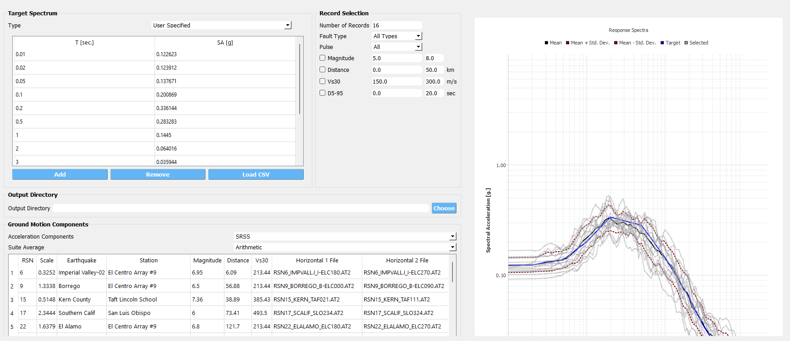round Motion Components" list detailing earthquake records with columns like "RSN," "Scale," "Earthquake," and "Station." The top right panel is titled "Record Selection" with fields for specifying the number of records, fault type, magnitude range, and other seismic parameters. The main graph to the right displays a "Response Spectra" chart with multiple curves representing spectral acceleration over periods and shows mean, standard deviation, target, and selected response spectra.
   :align: center
   :width: 600
   :figclass: align-center

2. In the example, a simple SDOF model is used in **SIM** tab to demonstrate the structural analysis step and default configurations 
   are used in the **FEM** and **EDP** tabs.

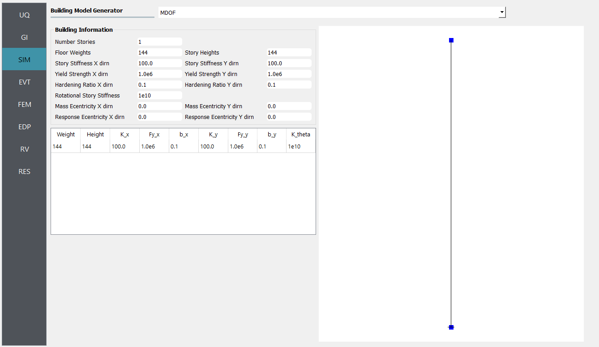ing structure is displayed on the right side of the interface.
   :align: center
   :width: 100%
   :figclass: align-center

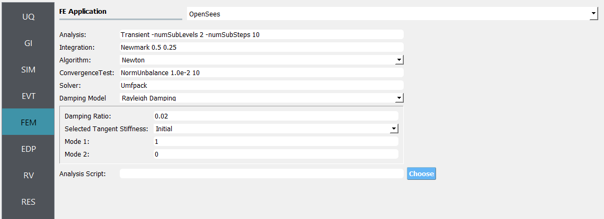g numerical integration parameters, selecting an algorithm (Newton), specifying convergence tests, solvers, damping models, damping ratios, and selecting tangent stiffness options. There is also an input field for an analysis script and a "Choose" button, possibly for loading or confirming settings.
   :align: center
   :width: 100%
   :figclass: align-center

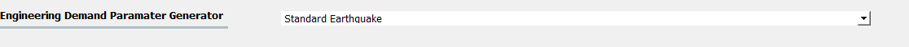

3. By clicking **Run** button, one can launch the analysis and the application will automatically switch to the **RES** tab 
   once the analysis is completed. One could navigate to the **Data Value** panel to visualize and save the new realizations.

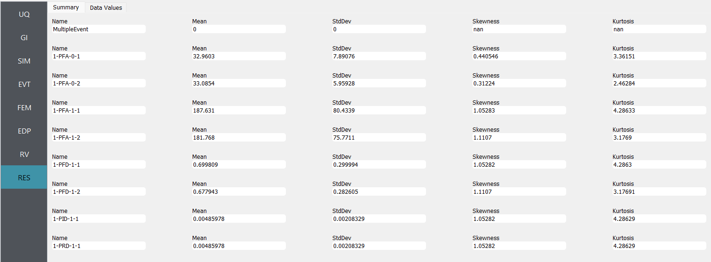rent sections such as UQ, GI, SIM, EVT, FEM, EDP, RV, and RES, each with specific entries like "1-PFA-0-1," "1-PFA-0-2," "1-PFA-1-1," and so on, followed by their corresponding statistical measurements.
   :align: center
   :width: 100%
   :figclass: align-center

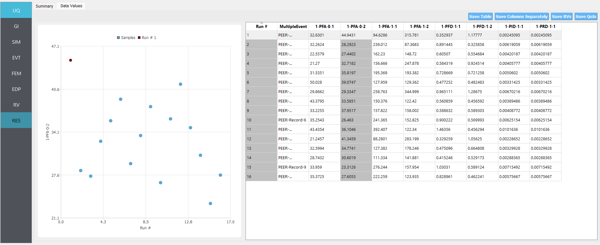displays a data table titled 'MultipleEvent' with columns including 'Run #', '1-PFA-0-1', '1-PFA-0-2', '1-PFA-1-1', '1-PFA-1-2', '1-PFD-1-1', '1-PFD-1-2', '1-PID-1-1', and '1-PRD-1-1', among others. Each row corresponds to a numbered run with various numerical values. The top of the interface offers options to 'Save Table', 'Save Columns Separately', 'Save RVs', and 'Save QoIs'.
   :align: center
   :width: 100%
   :figclass: align-center