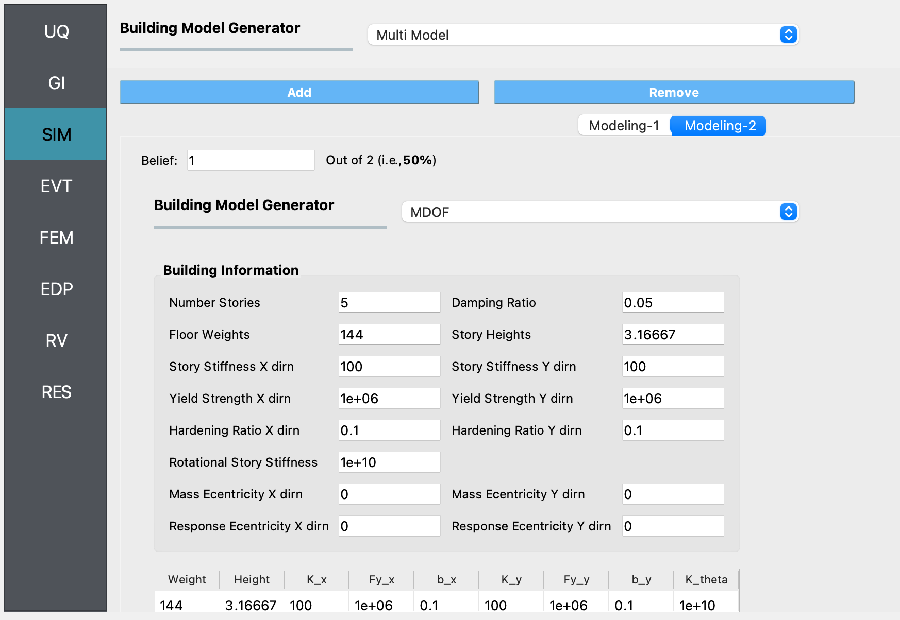
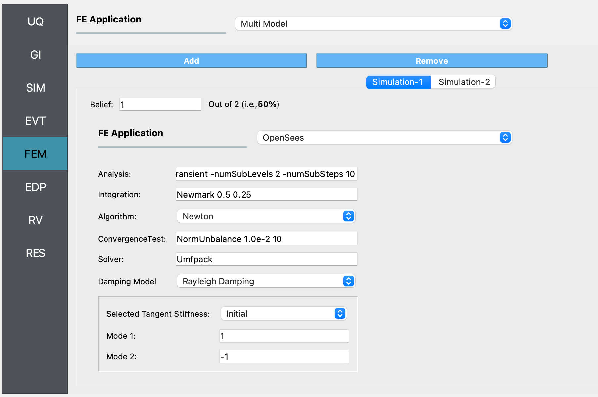
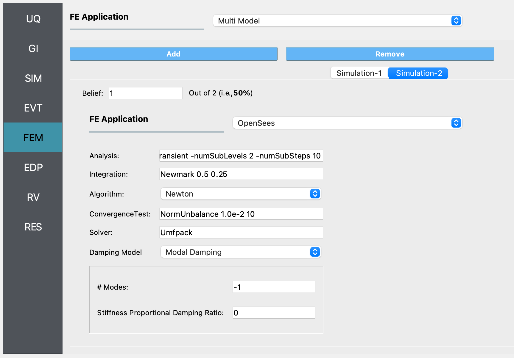
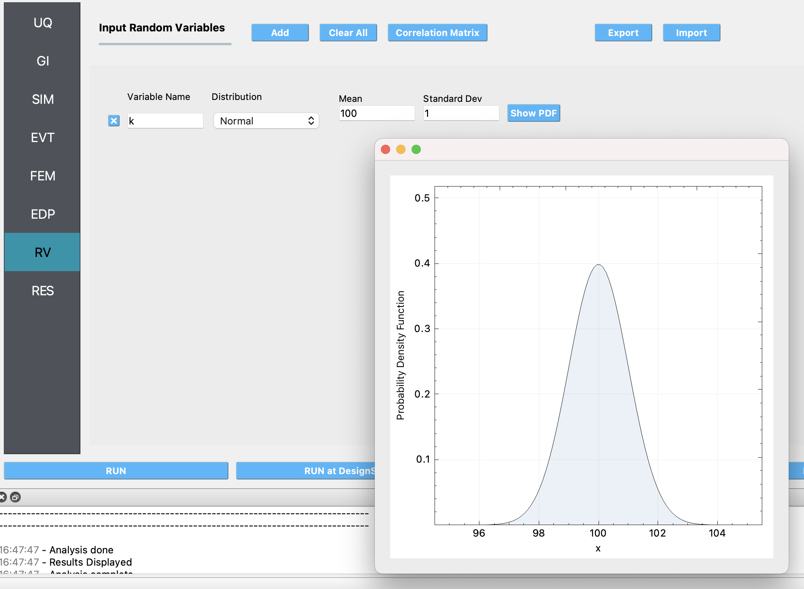

Using Multiple Models and Analysis Options in EE-UQ
===================================================

This example showcases the use of multiple structural models and finite element analysis options to predict structural responses to earthquake ground motion inputs. 

Non-linear time history analysis is conducted using OpenSees, employing a simple model of a 5-story structure, subjected to recorded ground acceleration time history during an earthquake. The response of the model is used to extract commonly used engineering demand parameters while considering uncertainties in the value of story stiffnesses and model formulation. By including or excluding the uncertainty in the story stiffness and using modal or Rayleigh damping, four possible models are obtained, with each model having an equal chance of being randomly picked to predict the response of the structure. The resulting distribution of the engineering demand parameters is that obtained by propagating model form uncertainty as well as uncertainty about the value of a parameter of the model.

   
Configure UQ Engine
^^^^^^^^^^^^^^^^^^^^^

1. Navigate to the **UQ** tab in the left menu. In this panel, select **Forward Propagation** as the UQ Method and **Dakota** as the 
   **UQ Engine**.  **LHS** is used as the sampling method. Enter the values needed for the LHS method, as shown in the figure below:

.. figure:: figures/ee8-UQ.png
   :align: center
   :width: 600
   :figclass: align-center

Configure Structural Analysis
^^^^^^^^^^^^^^^^^^^^^^^^^^^^^

1. Navigate to the **SIM** tab and select the **Multi Model** option for the **Building Model Generator**. We will use two simulation models for the 5 story structure in this example. Use the **Add** or **Remove** button as appropriate to create two tabs, corresponding to the two models that we will define next. In each of the tabs, choose **MDOF** as the **Building Model Generator**. The difference between the two models in this example is that in one of them, we consider the story stiffness in the X and Y directions as being uncertain.

.. figure:: figures/ee8-SIM1.png
   :align: center
   :width: 600
   :figclass: align-center

2. Navigate to the **EVT** tab and select the **Multiple PEER**. We will use a single ground motion in this example. Select the file that contains the acceleration values from the El Centro earthquake. This file can be found in the `Examples` folder that is in the EE-UQ application on your filesystem, under the `eeuq-0001/src` directory. 

3. In the **FEM** panel, we will select a **Multi Model** FE Application which allows us to define multiple structural analysis options. In this example, we will use the OpenSees FE Application and specify Raleigh Damping with the options shown in the first figure below for **Simulation-1**, and Modal Damping with the options shown in the second figure below in the **Simulation-2** tab.

4. In the **EDP** panel, we use the default option to record the 
   standard earthquake EDPs, i.e., peak displacement, drift ratio, and acceleration demands.

.. figure:: figures/ee8-EDP.png
   :align: center
   :width: 600
   :figclass: align-center

5. The **RV** panel will be auto-populated with the name of the variable for the story stiffness that was entered in the **SIM** panel. In this example, we will assume that the uncertainty about the story stiffness value is represented by a Normal distribution with a mean value of 100 units and a standard deviation of 1. By pressing the **Show PDF** button, a visualization of the Probability Density Function will be displayed in a separate window. For the probability distribution used in this example, about 95% of the randomly sampled values of the story stiffness will be between 98 and 102.

Run the analysis and observe the results
^^^^^^^^^^^^^^^^^^^^^^^^^^^^^^^^^^^^^^^^

1. Next, click on the **Run** button. This will call the backend application to launch the analysis. When the analysis is finished, 
   the **RES** panel will be displayed, which shows summary statistics of the output quantities in the **Summary** tab. 

.. note::
   The use of multiple models in the analysis results in the automatic creation of new variables by the tools during the analysis. In this example, two variables named 'Multimodel-Modeling' and 'Multimodel-Simulation' are created automatically, with their values representing the index of the models as defined within the **SIM** and **FEM** panels, respectively.

2. In the **Data Value** tab, a spreadsheet shows the sampled values of the input random variables and the corresponding output engineering demand parameters. A chart shows scatter plots of the sampled values, and by clicking the left or right mouse buttons within the spreadsheet, the chart shows a histogram or a plot of the cumulative frequency distribution of the sampled values. 

.. figure:: figures/ee8-RES.png
   :align: center
   :width: 600
   :figclass: align-center

In this figure, it is observed that if there is uncertainty about the story stiffness, there is a resulting uncertainty in the predicted engineering demand parameters, which can be characterized by performing the forward propagation analysis as shown in this example. To precisely characterize the uncertainty in the predicted EDPs, a large number of sample values (at least in the order of 1000) must be used. Running such a large number of model evaluations easily is facilitated by EE-UQ through the **RUN at DesignSafe** option. This allows the users of the tool to utilize the high-performance computing resources provided by DesignSafe. A DesignSafe account, which is free to obtain, is required to use this facility.

