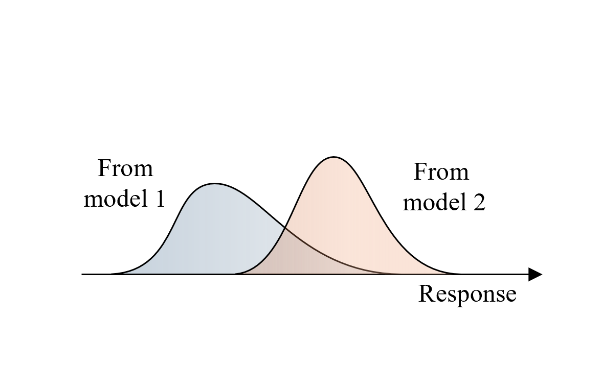

Using Multiple Models and Analysis Options in EE-UQ
===================================================

This example showcases the use of multiple structural models and finite element analysis options to predict structural responses to earthquake ground motion inputs. 

Non-linear time history analysis is conducted using OpenSees, employing a simple model of a 5-story structure, subjected to recorded ground acceleration time history during an earthquake. The response of the model is used to extract commonly used engineering demand parameters while considering uncertainties in the value of story stiffnesses and model formulation. By including or excluding the uncertainty in the story stiffness and using modal or Rayleigh damping, four possible models are obtained, with each model having an equal chance of being randomly picked to predict the response of the structure. The resulting distribution of the engineering demand parameters is that obtained by propagating model form uncertainty as well as uncertainty about the value of a parameter of the model.

   
stical data with different means and similar variances.
   :width: 40%
   :figclass: align-center

Configure UQ Engine
^^^^^^^^^^^^^^^^^^^^^

1. Navigate to the **UQ** tab in the left menu. In this panel, select **Forward Propagation** as the UQ Method and **Dakota** as the 
   **UQ Engine**.  **LHS** is used as the sampling method. Enter the values needed for the LHS method, as shown in the figure below:

.. figure:: figures/ee8-UQ.png
   :align: center
   :alt: Screenshot of a graphical user interface for uncertainty quantification settings, showing options under the 'UQ Method' section such as 'Forward Propagation,' 'UQ Engine: Dakota,' toggles for 'Parallel Execution' and 'Save Working dirs,' and fields to set 'Method' as 'LHS,' '# Samples' to '50,' and 'Seed' to '56.' The sidebar on the left contains tabs labeled 'GI,' 'SIM,' 'EVT,' 'FEM,' 'EDP,' 'RV,' and 'RES,' with the 'UQ' tab highlighted.
   :width: 80%
   :figclass: align-center

Configure Structural Analysis
^^^^^^^^^^^^^^^^^^^^^^^^^^^^^

1. Navigate to the **SIM** tab and select the **Multi Model** option for the **Building Model Generator**. We will use two simulation models for the 5 story structure in this example. Use the **Add** or **Remove** button as appropriate to create two tabs, corresponding to the two models that we will define next. In each of the tabs, choose **MDOF** as the **Building Model Generator**. The difference between the two models in this example is that in one of them, we consider the story stiffness in the X and Y directions as being uncertain.

.. figure:: figures/ee8-SIM1.png
   :align: center
   :alt: Screenshot of a software interface showing the Building Model Generator tool. The tool includes fields for inputting data such as Number of Stories (5), Floor Weights (144), and various parameters for stiffness, damping, and yield strength in different directions, with some values filled in (e.g., Damping Ratio 0.05, Story Heights 3.16667, Yield Strength X and Y dirn 1e+06). Several buttons like 'Add', 'Remove', and tabs for 'Modeling-1' and 'Modeling-2' indicate interactive options for the user. The interface has a blue and gray color scheme.
   :width: 80%
   :figclass: align-center

.. figure:: figures/ee8-SIM2.png
   :align: center
   :alt: Screenshot of a "Building Model Generator" interface with various input fields and parameters for building design. The interface includes options for adding or removing models and tabs named Multi Model, Modeling-1, and Modeling-2. Parameters such as "Number Stories," "Floor Weights," "Damping Ratio," and "Story Stiffness X dirn" are displayed, with numerical values provided for each. The color scheme consists of blues and grays with a simple, user-friendly layout.
   :width: 80%
   :figclass: align-center

2. Navigate to the **EVT** tab and select the **Multiple PEER**. We will use a single ground motion in this example. Select the file that contains the acceleration values from the El Centro earthquake. This file can be found in the `Examples` folder that is in the EE-UQ application on your filesystem, under the `eeuq-0001/src` directory. 

3. In the **FEM** panel, we will select a **Multi Model** FE Application which allows us to define multiple structural analysis options. In this example, we will use the OpenSees FE Application and specify Raleigh Damping with the options shown in the first figure below for **Simulation-1**, and Modal Damping with the options shown in the second figure below in the **Simulation-2** tab.

.. figure:: figures/ee8-FEM1.png
   :align: center
   :alt: Screenshot of a software interface with a focus on finite element (FE) application settings. The interface includes options and parameters such as "Add" and "Remove" buttons, tabs for "Simulation-1" and "Simulation-2", input fields for analysis configurations like "Integration: Newmark 0.5 0.25", "Algorithm: Newton", "ConvergenceTest: NormUnbalance 1.0e-2 10", and a selection for "Solver: Umfpack". There's also an option for "Damping Model: Rayleigh Damping" and fields for selecting "Tangent Stiffness" and defining modes with numerical inputs. The left sidebar shows additional menu items like "UQ", "GI", "SIM", "EVT", "FEM", "EDP", "RV", and "RES", suggesting this is part of a larger engineering or simulation software.
   :width: 80%
   :figclass: align-center

.. figure:: figures/ee8-FEM2.png
   :align: center
   :alt: Screenshot of a software interface related to Finite Element (FE) application settings. The panel includes options to add or remove simulations, tabs for "Simulation-1" and "Simulation-2," and various input fields for specifying analysis parameters such as Analysis Type, Integration, Algorithm, Convergence Test, Solver, and Damping Model. Settings indicate the use of a transient analysis with Newmark integration, Newton algorithm, norm unbalance convergence test, Umfpack solver, and modal damping.
   :width: 80%
   :figclass: align-center

4. In the **EDP** panel, we use the default option to record the 
   standard earthquake EDPs, i.e., peak displacement, drift ratio, and acceleration demands.

.. figure:: figures/ee8-EDP.png
   :align: center
   :alt: Screenshot of a software interface with a left sidebar showing options labeled "UQ," "GI," "SIM," "EVT," "FEM," "EDP" highlighted in blue, "RV," and "RES." The main panel is titled "Engineering Demand Parameter Generator" with an option for "Standard Earthquake" and a checkmark icon on the right. The rest of the main panel content is not visible.
   :width: 80%
   :figclass: align-center

5. The **RV** panel will be auto-populated with the name of the variable for the story stiffness that was entered in the **SIM** panel. In this example, we will assume that the uncertainty about the story stiffness value is represented by a Normal distribution with a mean value of 100 units and a standard deviation of 1. By pressing the **Show PDF** button, a visualization of the Probability Density Function will be displayed in a separate window. For the probability distribution used in this example, about 95% of the randomly sampled values of the story stiffness will be between 98 and 102.

.. figure:: figures/ee8-RV.png
   :align: center
   :alt: Screenshot of a software interface displaying a probability distribution function. On the left side, there is a navigation panel with options like UQ, GI, SIM, EVT, FEM, EDP, RV, and RES, with RV highlighted. In the main panel, a section titled "Input Random Variables" lists a variable named 'k' with a normal distribution, mean of 100, and standard deviation of 1. There are buttons for "Add," "Clear All," and "Correlation Matrix," as well as "Export" and "Import." On the right side, there's a plot showing a bell-shaped normal distribution curve centered around the value 100 on the x-axis with probability density on the y-axis. The area under the curve is shaded blue. At the bottom, there are status messages that read "Analysis done" and "Results Displayed."
   :width: 80%
   :figclass: align-center

Run the analysis and observe the results
^^^^^^^^^^^^^^^^^^^^^^^^^^^^^^^^^^^^^^^^

1. Next, click on the **Run** button. This will call the backend application to launch the analysis. When the analysis is finished, 
   the **RES** panel will be displayed, which shows summary statistics of the output quantities in the **Summary** tab. 

.. note::
   The use of multiple models in the analysis results in the automatic creation of new variables by the tools during the analysis. In this example, two variables named 'Multimodel-Modeling' and 'Multimodel-Simulation' are created automatically, with their values representing the index of the models as defined within the **SIM** and **FEM** panels, respectively.

2. In the **Data Value** tab, a spreadsheet shows the sampled values of the input random variables and the corresponding output engineering demand parameters. A chart shows scatter plots of the sampled values, and by clicking the left or right mouse buttons within the spreadsheet, the chart shows a histogram or a plot of the cumulative frequency distribution of the sampled values. 

.. figure:: figures/ee8-RES.png
   :align: center
   :alt: Screenshot of a data analysis software interface with a scatter plot on the left and a data table on the right. The scatter plot is titled "1-P(Pb> 5)" versus "MultiModel-Modeling" with a series of blue dots showing a downward trend and a noted correlation coefficient of -0.67. On the right, the data table, under "Data Values" tab, has columns labeled "Run #," "k," and several others with numerical data. Row number 10 is highlighted, indicating a selected data point corresponding to one of the scatter plot points. Options to "Save Table," "Save Columns Separately," "Save RVs," and "Save QoIs" are visible at the top of the data table.
   :width: 80%
   :figclass: align-center

In this figure, it is observed that if there is uncertainty about the story stiffness, there is a resulting uncertainty in the predicted engineering demand parameters, which can be characterized by performing the forward propagation analysis as shown in this example. To precisely characterize the uncertainty in the predicted EDPs, a large number of sample values (at least in the order of 1000) must be used. Running such a large number of model evaluations easily is facilitated by EE-UQ through the **RUN at DesignSafe** option. This allows the users of the tool to utilize the high-performance computing resources provided by DesignSafe. A DesignSafe account, which is free to obtain, is required to use this facility.

