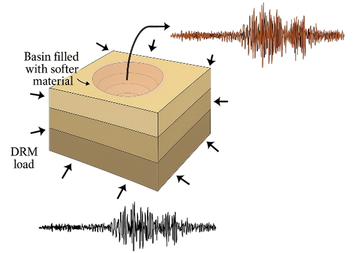

.. _eeuq-0012:

Seismic Wave Basin Effects Model (DRM Example)
================================================================

What is Femora?
---------------
Femora is a tool that helps users create models for OpenSees that can run efficiently on multiple CPU cores. It does not perform the simulation itself, but generates the input files and workflow needed for OpenSees to run parallel analyses. Femora provides both a graphical user interface (GUI) and a simple Python workflow, enabling users to build complex finite element models—including advanced meshing and geometry—without needing to know the details of OpenSees scripting. This makes it much easier for engineers and researchers to set up large, high-fidelity earthquake engineering simulations.

Why use a library like Femora?
-----------------------------
Traditional simulation workflows require users to manually write and manage complex input files for each case, which is error-prone and hard to scale. A library like Femora enables:
- Programmatic model generation and modification
- Automation of repetitive or parametric studies
- Advanced meshing and geometry handling (e.g., external mesh, boolean operations)
- Integration with Python's scientific ecosystem for pre- and post-processing

Femora as a Backend in EE-UQ
----------------------------
EE-UQ now supports Femora as a backend for model generation and simulation. This means you can use Python scripts to define your models and leverage all of Femora's advanced features directly within the EE-UQ uncertainty quantification workflow.

Parallel OpenSees Simulations with Femora
-----------------------------------------
Previously, each case in an EE-UQ uncertainty quantification (UQ) study would run on a single core, even if the underlying OpenSees model was large. With Femora, each simulation case can now launch a parallel OpenSees job using multiple CPU cores. This enables UQ studies on massive, high-fidelity models that were previously impractical, dramatically reducing total analysis time and making large-scale parametric studies feasible.

This example demonstrates the effect of a semi-hemispherical sedimentary basin on seismic wave propagation using the Domain Reduction Method (DRM) in EE-UQ, based on [Femora Example 3](https://amnp95.github.io/Femora/introduction/DRMExamples/example3.html). The model uses an external mesh to represent the basin geometry and soft soil materials, highlighting basin amplification and resonance effects.

Domain Reduction Method (DRM) Overview
--------------------------------------

The Domain Reduction Method (DRM) is a powerful technique for modeling seismic wave propagation in a computationally efficient manner. DRM, first proposed by Bielak et al. (2003), is a two-step approach:

1. **Background Analysis:** A large-scale (often simplified) simulation is performed to capture regional wave propagation from the earthquake source to the vicinity of the site of interest.
2. **Local Analysis:** A detailed analysis is then performed on a smaller, high-resolution domain (the "local domain"), using the results from the background analysis as boundary conditions.

**Why use DRM?**

- **Computational Efficiency:** DRM focuses computational resources on the domain of interest, avoiding the need to model the entire source-to-site path at high resolution.
- **Realistic Wave Input:** It enables the use of complex, realistic wavefields as input, capturing effects such as wave scattering, focusing, and basin resonance that would be missed with simple boundary conditions.
- **Flexibility:** DRM works with various wave types, source mechanisms, and site conditions, making it suitable for a wide range of earthquake engineering problems.
- **Enhanced Resolution:** It allows for detailed analysis of local site effects and structure-soil interaction, which is critical for understanding seismic response in complex geological settings.

**Why is DRM useful in this example?**

In this semi-hemispherical basin example, DRM is essential because it allows us to:

- Apply realistic, multi-directional seismic wavefields to a complex, 3D basin geometry without modeling the entire regional domain at high resolution.
- Accurately capture the effects of wave focusing, resonance, and amplification within the basin, which are highly sensitive to the incoming wavefield.
- Efficiently study the influence of local soil and basin properties on ground motion, while keeping computational costs manageable.

By using DRM, we can focus our computational effort on the basin and its immediate surroundings, ensuring that the simulated ground motions reflect both the complexity of the incoming waves and the detailed local site effects.

About the Semi-Hemispherical Basin Example
-----------------------------------------

This example models a semi-hemispherical sedimentary basin embedded in a layered soil domain. The basin is created by intersecting a half-sphere with the upper layers of the soil, resulting in a realistic, curved geometry that mimics natural sedimentary basins found in many earthquake-prone regions.

**Model Details:**

- **Soil Domain:**

  - 128m × 128m domain (from -64m to 64m in both X and Y directions)
  - Total depth of 48m
  - Six distinct soil layers, each 8m thick
  - Properties that vary with depth (density, wave velocities, and damping)

- **Basin Geometry:**

  - Semi-hemispherical basin shape—chosen for its geometric simplicity while still capturing the essential physics of wave focusing and multi-dimensional resonance
  - Center coordinates: (0, 0, 70) meters—positioned at the top surface of the model to maximize surface wave interaction
  - Radius: 85 meters—selected to create significant basin effects while maintaining computational efficiency
  - Only intersects with Layer 1 and Layer 2 of the soil profile—allowing study of soft soil deposits in the near-surface region most important for engineering applications
  - External mesh implementation for precise geometric representation—enabling accurate modeling of the curved basin interface that cannot be achieved with rectilinear elements

- **Materials:**

  - Elastic-isotropic materials with properties calculated from wave velocities
  - Density (rho) increasing with depth from 2142 to 2162 kg/m³
  - Shear wave velocity (Vs) increasing with depth from 353 to 599 m/s
  - P-wave velocity (Vp) increasing with depth from 669 to 1135 m/s
  - Damping ratio decreasing with depth

- **Mesh:**

  - Element sizes: 4.0m × 4.0m × 4.0m uniform grid
  - 32 × 32 elements in horizontal directions
  - 2 elements per layer in vertical direction

- **Damping:**

  - Frequency-dependent Rayleigh damping
  - Target frequencies: f1 = 3 Hz and f2 = 15 Hz
  - Damping ratio varying by layer (from 2.1% to 3.0%)

- **Boundary Conditions:**

  - Rayleigh damping elements as absorbing boundaries
  - 8 element layers in PML

- **Loading:**

  - Domain Reduction Method (DRM) loading
  - Input from external H5DRM file
  - Simulation duration: 30 seconds with 0.01s time step

**Why this example?**

- Sedimentary basins are known to amplify and prolong earthquake ground motions due to their geometry and soft soil properties. Modeling these effects is critical for accurate seismic hazard assessment in cities built on or near such basins.
- The semi-hemispherical shape is chosen for its simplicity and its ability to capture the essential physics of wave focusing, resonance, and energy trapping that occur in real basins.

**What do we expect to see?**

- Compared to a regular layered soil profile, the presence of the soft, curved basin should lead to:
  - Amplified ground motions at the surface above the basin
  - Longer duration of shaking due to wave trapping and resonance
  - Complex wave patterns, including focusing and lateral variations, that would not occur in flat-layered models

**Why are we doing this example?**

- To demonstrate how advanced meshing and modeling (enabled by Femora and EE-UQ) can be used to study important site effects in earthquake engineering.
- To show the value of uncertainty quantification (UQ) for such complex models, where both the geometry and material properties can strongly influence seismic response.
- To provide a reproducible, extensible workflow for researchers and engineers interested in basin effects, parallel simulation, and UQ.
--------------

The model consists of a layered soil domain with a semi-hemispherical basin embedded at the center. The basin is modeled using an external mesh and assigned soft soil properties (Vs = 150 m/s). The geometry and material properties are chosen to demonstrate strong basin effects on ground motion.

   Schematic of the semi-hemispherical basin model.

Additional Results: Effect of Basin Softness
--------------------------------------------
The following figures compare the surface acceleration time histories for three cases:
- Regular layered soil (no basin)
- Basin with Vs = 200 m/s (stiffer soft soil)
- Basin with Vs = 150 m/s (softer soil)

.. list-table::
   :widths: 50 50
   :header-rows: 0

   * - .. figure:: figures/acceleration_comparison_Regular_Vs200.png
          :width: 400
          :align: center
          :figclass: align-center

          Regular soil vs. basin (Vs = 200 m/s)
     - .. figure:: figures/acceleration_comparison_Regular_Vs150.png
          :width: 400
          :align: center
          :figclass: align-center

          Regular soil vs. basin (Vs = 150 m/s)

These results show that the softer the basin material (lower Vs), the greater the amplification and duration of ground motion at the surface. This highlights the importance of accurately modeling basin geometry and material properties in seismic hazard analysis.

Uncertainty in Basin Properties
------------------------------
In the next part of this example, we introduce uncertainty in the properties of the soft basin material (such as shear wave velocity, density, or damping). We will investigate how the response—specifically, the ground motion recorded at the center of the basin at the surface—varies as these properties change. This allows us to quantify the impact of material uncertainty on seismic site response in complex basin settings.

Step-by-Step Procedure in EE-UQ
-------------------------------

1. **UQ Panel**: Select the UQ engine and method (e.g., Forward Propagation with Dakota). Set the number of samples as needed.

   In this example, we use the Forward Propagation method and recommend running at least 50 samples to capture the variability in the response due to uncertain basin properties.

   .. figure:: figures/ee12_UQ.png
      :align: center
      :width: 500
      :alt: UQ panel setup for DRM basin example.
      :figclass: align-center

2. **GI Panel**: Enter general information about the project and model. For this example, set the **Structure Type** and **Design Level** fields to `N/A` since there is no structure being modeled. For the **units**, use **kilonewtons (kN)** for force, **meters (m)** for length, and **seconds (s)** for time.

   .. figure:: figures/ee12_GI.png
      :align: center
      :width: 500
      :alt: General information panel for DRM basin example.
      :figclass: align-center

3. **SIM Panel**: In the Simulation panel, first select **Building Model Generator** as **Femora**. Then, select the Femora Python script (`femoramodel.py`) as the building model. This script defines the layered soil, basin geometry, and material properties using external mesh parts.

   The SIM model for Femora is very similar to the OpenSees input, except that you should specify how many CPU cores your model will use for parallel simulation. Additionally, since you may use complex damping, there is a checkbox to enable the use of a damping ratio (as in the OpenSees inputs). By default, this box is unchecked, assuming your Femora model does not require additional damping. If you enable it, the same damping options as in the OpenSees inputs will be available and applied to your model.

   In the Femora SIM panel, you also need to add any random variables you want to use in your Femora model. These random variables should be referenced in your Femora script, but you do not need to define their values in your code. EE-UQ will automatically provide the appropriate values for each simulation sample. This allows you to easily perform uncertainty quantification by sampling different values for these variables across multiple runs.

   For this example, the random variables you should define are: `softMat_vs`, `softMat_vp_vs_ratio`, and `softMat_rho`. These will be used in your Femora model to set the shear wave velocity, the ratio of P-wave to S-wave velocity, and the density of the basin material, respectively.

   .. note::
      The `femoramodel.py` script used in this example has three main differences from the one used in the original Femora documentation:
      
      1. It uses the values of `softMat_vs` and `softMat_rho` for the basin directly from the random variables, and calculates `vp` from `vs` and the random variable `softMat_vp_vs_ratio`.
      2. The model does not include additional steps such as introducing the DRM load or adding steps for dynamic analysis—these are handled by the EE-UQ workflow, so they are omitted from the script.
      3. The model uses an XML recorder at the center of the basin (coordinate 0, 0, 0) instead of a VTK/HDF recorder, since only the response at the central surface point of the basin is needed for this study.

   .. figure:: figures/ee12_SIM.png
      :align: center
      :width: 500
      :alt: SIM panel with Femora model selection.
      :figclass: align-center

4. **EVT Panel**: Choose the DRM event type and provide the required DRM input file. The event panel allows you to specify the earthquake input as a DRM load.

   In the Event panel, you need to choose the **DRM event** type. From there, you have the option to either select an H5DRM file for OpenSees from your local machine or use DRM files that have been uploaded to the DesignSafe repository as predefined DRM events. At the time of writing this example, there are three different H5DRM datasets uploaded to DesignSafe related to the Hayward Fault, corresponding to near, mid, and far field distances from the fault. Each of these uses a uniform mesh of 4 meters, and the required box for the DRM should be at least 128 meters by 128 meters in x and y, and 48 meters in z (depth), centered at the surface.

   The idea behind predefined DRM files is that these H5DRM files are very large, so selecting them from your local computer is often not practical. Therefore, several predefined DRM loads are available on DesignSafe for you to use directly. If you choose a local DRM file (which is often the case for very large simulations), and you are running your case on a remote machine, EE-UQ will upload your file to DesignSafe, which may take significant time due to the file size. For local DRM files, you must specify the parameters for your H5DRM file yourself. For predefined DRM files, most of the parameters are already defined; you just need to choose the center of your model, as well as `dt` and `numSteps`. If you set `dt` and `numSteps` to -1, EE-UQ will automatically determine these values for you.

   For this example, we choose the `HaywardFaultSW4_nearField` predefined DRM file. In both the local and predefined DRM panels, there is a viewer next to the table of DRM events that provides information about the predefined DRM or the parameters you need to define the DRM event in the local case.

   .. figure:: figures/ee12_event_predefinedDRM.png
      :align: center
      :width: 500
      :alt: DRM event setup in EE-UQ.
      :figclass: align-center

   .. figure:: figures/ee12_predefinedDRM_Options.png
      :align: center
      :width: 500
      :alt: DRM event options in EE-UQ.
      :figclass: align-center

5. **FEM Panel**: In the FEM panel, we use OpenSees as the analysis engine because the Femora input essentially generates an OpenSees model. The analysis is performed using the `analysis.tcl` file, which is set up for multi-core execution using OpenSeesMP. Below is the content of the `analysis.tcl` file used for this example:

   ::

      constraints Plain
      numberer ParallelRCM
      system Mumps -ICNTL14 200 -ICNTL7 7
      algorithm ModifiedNewton -factoronce
      test EnergyIncr 0.0001 10 5
      integrator Newmark 0.5 0.25
      analysis Transient
      while {[getTime] < 20.0} {
          if {$pid == 0} {puts "Time : [getTime]"}
          set Ok [analyze 1 0.01]
      }
      wipeAnalysis

   .. figure:: figures/ee12_FEM.png
      :align: center
      :width: 500
      :alt: FEM panel for DRM basin example.
      :figclass: align-center

6. **EDP Panel**: In the EDP panel, we use the recorder output from the center node at the surface of the basin. The post-processing is performed using the provided `postprocess.py` script, which extracts engineering demand parameters (EDPs) from the XML recorder file at the central surface point.

   The following EDPs are calculated:

   - **PGA (Peak Ground Acceleration)** in x, y, and z directions (`pga_x`, `pga_y`, `pga_z`)
   - **PGV (Peak Ground Velocity)** in x, y, and z directions (`pgv_x`, `pgv_y`, `pgv_z`)
   - **PGD (Peak Ground Displacement)** in x, y, and z directions (`pgd_x`, `pgd_y`, `pgd_z`)
   - **Arias Intensity** in x, y, and z directions (`Arias_x`, `Arias_y`, `Arias_z`)
   - **Cumulative Absolute Velocity (CAV)** in x, y, and z directions (`CAV_x`, `CAV_y`, `CAV_z`)
   - **RMS Acceleration** in x, y, and z directions (`RMS_x`, `RMS_y`, `RMS_z`)
   - **Significant Duration (5–95% Arias Intensity)** in x, y, and z directions (`duration_x`, `duration_y`, `duration_z`)

   The `postprocess.py` script reads the XML output, computes these EDPs, and writes them to `results.out` in the order specified by the arguments passed to the script. This allows for automated extraction and analysis of the ground motion response at the most critical location in the model.

   .. figure:: figures/ee12_EDP.png
      :align: center
      :width: 500
      :alt: EDP panel for DRM basin example.
      :figclass: align-center

7. **RV Panel**: Define any random variables for the study (e.g., material properties, input motion scaling).

   In the RV (Random Variables) panel, we define the uncertain parameters for the study:

   - `softMat_vs`: Shear wave velocity of the basin material. We use a **Uniform** distribution between 100 and 300 m/s to reflect a wide but physically reasonable range of possible soft soil velocities, without bias toward any particular value within the range.
   - `softMat_vp_vs_ratio`: The ratio of P-wave to S-wave velocity. We use a **Normal** distribution with mean 2.1 and standard deviation 0.15, which is typical for unconsolidated sediments and allows for natural variability around the expected value.
   - `softMat_rho`: Density of the basin material. We use a **Normal** distribution with mean 1.8 (g/cm³) and standard deviation 0.15, representing typical values for soft soils and their natural scatter.

   The choice of distributions reflects both the physical variability and the available knowledge for each parameter: Uniform for a broad, non-informative range (vs), and Normal for parameters where a central value and natural scatter are expected (vp/vs ratio and density).

   .. figure:: figures/ee12_RV.png
      :align: center
      :width: 500
      :alt: RV panel for DRM basin example.
      :figclass: align-center
   The **correlation matrix** is specified as:

   ::

      [
        1,
        -0.25,
        0.5,
        -0.25,
        1,
        -0.3,
        0.5,
        -0.3,
        1
      ]

   This matrix encodes the assumed statistical relationships between the random variables. For example, a negative correlation between `softMat_vs` and `softMat_vp_vs_ratio` (-0.25) means that higher shear wave velocities are likely to be associated with slightly lower vp/vs ratios, and vice versa. The positive correlation (0.5) between `softMat_vs` and `softMat_rho` reflects that denser soils tend to have higher wave velocities. The negative correlation (-0.3) between `softMat_vp_vs_ratio` and `softMat_rho` reflects that, for a given vs, a higher vp/vs ratio may be associated with slightly lower density. These values are chosen to reflect plausible physical relationships and to avoid unrealistic combinations of properties in the UQ study.

   .. figure:: figures/ee12_correlation.png
      :align: center
      :width: 500
      :alt: Correlation plot for DRM basin example.
      :figclass: align-center

8. **Submit Panel**: After setting up your random variables, go to the Submit panel. Here, you should select **Run at DesignSafe**. After logging in to your DesignSafe account, choose the following job configuration: **2 nodes** and **48 cores per node** for **480 minutes** (8 hours). This configuration is recommended to ensure sufficient resources for the parallel OpenSees simulations in this example.

   .. figure:: figures/ee12_submit.png
      :align: center
      :width: 500
      :alt: Submit panel for DRM basin example.
      :figclass: align-center

9. **RES Panel**: After completing the job, press **Get from DesignSafe** in the RES panel to retrieve your submitted job and results. You can then analyze and plot the results, such as plotting `softMat_vs` versus EDPs like PGA, CAV, and Arias intensity. These plots will show that decreasing the shear wave velocity (`vs`) leads to a drastic increase in these EDPs.
   However, it is important to note that while we expect to see amplification with decreasing `vs`, in reality, as `vs` decreases, the soil would behave more plastically and exhibit significant damping. Therefore, the level of amplification observed here is unrealistically high and mainly occurs at the initial steps of loading. This example still demonstrates the correct physical trend, as we use an elastic material model for the basin in this study.

   .. figure:: figures/ee12_res1.png
      :align: center
      :width: 500
      :alt: Surface acceleration comparison for regular soil and basin model.
      :figclass: align-center

   .. figure:: figures/ee12_res2.png
      :align: center
      :width: 500
      :alt: Additional results for DRM basin example.
      :figclass: align-center

These results show that the softer the basin material (lower Vs), the greater the amplification and duration of ground motion at the surface. This highlights the importance of accurately modeling basin geometry and material properties in seismic hazard analysis.
For more details and the underlying Python model, see the included `femoramodel.py` and the [Femora Example 3 documentation](https://amnp95.github.io/Femora/introduction/DRMExamples/example3.html).
