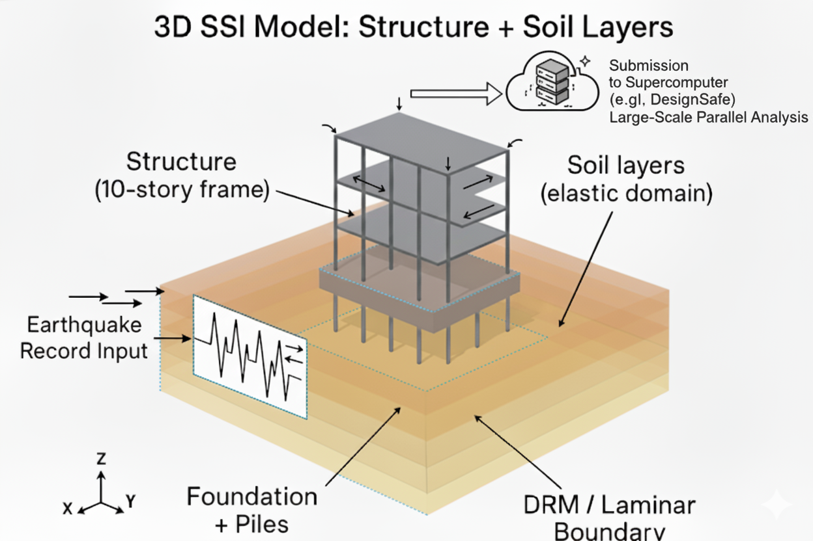

.. _eeuq-0013:

Full 3D SSI Model with Laminar and DRM Inputs (Custom 3D Building)
==================================================================

This example demonstrates creating a full three-dimensional soil–structure interaction (SSI) model in |short tool id| using the new SSI Modeling workflow. It showcases two alternative boundary condition workflows for the same 10‑story steel moment frame on an elastic soil domain:

- Laminar/perimeter boundaries driven by a recorded ground motion (PEER)
- Domain Reduction Method (DRM) boundaries driven by a precomputed 3D wavefield (DesignSafe predefined DRM)

The building is provided as an OpenSees 3D model, and the soil–foundation system is specified through the SSI widgets. Both cases share the same structure and soil layering and differ primarily in the soil boundary condition and loading.

Purpose and how to use this example
-----------------------------------

- This example is not intended as a head‑to‑head comparison between laminar and DRM boundary conditions. It illustrates two valid ways to provide input to the same 3D SSI model in |short tool id|.

- When to choose each input:

  - Laminar/perimeter (PEER record): simplest for recorded motions applied at the base. Use when you want a quick end‑to‑end SSI demonstration with a ground motion file.
  - DRM (predefined DesignSafe): use when you need realistic, spatially varying 3D wavefields entering the local domain from an external regional simulation.

- Prerequisites and conventions:

  - Units are metric: force in kN, length in m, time in sec. Ensure your structural model and input motions follow these units.
  - Structural base must be free (not fixed): remove base fixities from a fixed‑base TCL; the SSI workflow couples the base to soil/foundation automatically.
  - Provide base column node tags and coordinates (``Columns base``) and story response nodes (``Response Nodes``) as described below.

Model overview
--------------

- Structure: 10‑story, 3D steel moment frame (FEMA 355C inspired), modeled in OpenSees (`steel_frame.tcl`). The domain bounds, response nodes, and base column locations match the model.
- Soil domain: 128 m × 128 m in plan (x, y from −64 m to 64 m), depth 48 m in multiple elastic layers with frequency‑dependent Rayleigh damping. Mesh resolution and layer counts are aligned with DRM requirements and structural footprint.
- Foundation: elastic block with embedment, optional piles interface definition in the widget. Column section properties are configurable to transmit forces at the interface.
- Two workflows:

  - Laminar: Periodic/laminar boundary conditions, driven by recorded time history (el Centro), enabling a unified workflow within EE‑UQ.
  - DRM: DRM boundary conditions, driven by a predefined `H5DRM` dataset on DesignSafe; mesh and box extents are consistent with one of the uploaded Hayward Fault DRM datasets.

  

   Overview of the full 3D SSI model and boundary condition alternatives.

Files included
--------------

- ``input_laminar.json``: EE‑UQ workflow inputs for the laminar boundary case with a PEER ground motion
- ``analysis_laminar.tcl``: OpenSees transient analysis script for laminar case
- ``input_DRM.json``: EE‑UQ workflow inputs for the DRM case using a predefined DesignSafe H5DRM
- ``analysis_DRM.tcl``: OpenSees transient analysis script for DRM case
- ``steel_frame.tcl``: 3D building model
- ``building.vtkhdf``: Optional mesh file for building geometry visualization (used by the Building widget if desired)
- ``elCentro.AT2``: Ground motion record (PEER) used in the laminar case

Step‑by‑step: Laminar boundary workflow
--------------------------------------

1. UQ panel

   - Select **Forward Propagation** with **SimCenterUQ**; use LHS sampling or 1–2 samples for a quick run.
   - For demonstration, set the sample count to 4 to reduce turnaround while previewing the full workflow.

   .. figure:: figures/ee13_UQ.png
      :align: center
      :width: 600
      :alt: UQ panel for laminar case
      :figclass: align-center

2. GI panel

   - Use units: **kN**, **m**, **sec** (compatible with the predefined DRM datasets). Structure type and design level can be left as needed.

   .. figure:: figures/ee13_GI.png
      :align: center
      :width: 500
      :alt: GI panel for laminar case
      :figclass: align-center

3. SIM panel (SSI)

   - Select **SSI** as the model generator.
   - The SSI Type 1 widget is backed by Femora (``soil_foundation_type_one.py``). It automatically creates the soil, mat foundation and optional pile‑supported foundation head, and couples them to the building—no manual constraint scripting needed.
   - Building tab: choose **Custom 3D Building**. Provide:

     - ``Model file`` → ``steel_frame.tcl``
     - Optional ``Mesh file`` → ``building.vtkhdf``
     - ``Response Nodes`` → 11 tags from base to roof (e.g., 101, 117, …, 261)
     - ``Bounds`` → x/y from −13.716 to 13.716; z from 0.0 to 40.8432
     - ``Columns base`` → base node tags and coordinates (x, y, z) for the column grid (16 entries). Femora uses these tags and coordinates to place building–foundation connections, apply embedment, and align with the SSI mesh.
     
   - Soil and Foundation tab: set soil domain and layering to match 128×128×48 m with 6 layers and frequency‑dependent Rayleigh damping. Set foundation block (dx, dy, dz), embedment, and section properties.
   - For the laminar case, set ``boundary_conditions`` to ``periodic`` (laminar/perimeter style).
   - If your structural TCL had base fixities for fixed‑base analysis, remove or comment them; in SSI the base is coupled to soil/foundation, not fixed.

   - **About ``Columns base`` and ``Response Nodes``:**

     - ``Columns base`` entries list the structural node tag and its coordinates (x, y, z) at each column support. The SSI builder uses these to:

       - place building–foundation connections and embedment
       - align the foundation head and piles to the building footprint
       - enforce the interface constraints consistently with the SSI mesh

     - ``Response Nodes`` are the story‑level nodes (e.g., COM nodes) used by Standard Earthquake EDP extraction to compute PFA, PFD, and PID for each floor.

   .. figure:: figures/ee13_SIM_building.png
      :align: center
      :width: 900
      :alt: SSI Building tab
      :figclass: align-center

   .. figure:: figures/ee13_SIM_soil.png
      :align: center
      :width: 900
      :alt: SSI Soil and Foundation tab
      :figclass: align-center

   .. figure:: figures/ee13_SIM_foundation.png
      :align: center
      :width: 900
      :alt: Foundation block parameters (dx, dy, dz, embedment)
      :figclass: align-center

   .. figure:: figures/ee13_SIM_pile.png
      :align: center
      :width: 900
      :alt: Pile profile and pile–structure interface discretization
      :figclass: align-center

4. EVT panel

   - Select **Existing PEER Records** and load ``elCentro.AT2``.

   .. figure:: figures/ee13_EVT_laminar.png
      :align: center
      :width: 900
      :alt: Event panel for laminar case (PEER record)
      :figclass: align-center

5. FEM panel

   - Use **OpenSees** with the analysis script ``analysis_laminar.tcl``.

   .. figure:: figures/ee13_FEM.png
      :align: center
      :width: 900
      :alt: FEM panel for laminar case
      :figclass: align-center

6. EDP panel

   - Choose **Standard Earthquake EDP**; responses will be extracted at the specified response nodes per floor. For laminar inputs, this option is supported when the structure runs in a single partition. If using multiple partitions or custom outputs, use **User‑Defined EDP** with your own ``recorders.tcl``.

   

7. RV panel

   - Define material RVs for steel (e.g., ``E_kips``, ``Fy_kips``) and optional event scale factor if desired.

   

8. Submit and retrieve (DesignSafe)

   - In the Submit panel, select **Run at DesignSafe**. For this example (4 samples), use:
     - Nodes: **1**
     - Cores per node: **20** (total 20 cores)
     - Max wall time: **270 minutes**
   - After the job completes, go to **RES** and click **Get from DesignSafe** to retrieve results and view per‑floor PFAs, PFDs, PIDs, etc.

   .. figure:: figures/ee13_submit.png
      :align: center
      :width: 900
      :alt: Example DesignSafe job submission (4 samples, 1×20 cores, 270 min)
      :figclass: align-center

Step‑by‑step: DRM boundary workflow
-----------------------------------

1. UQ and GI panels

   - Same as the laminar case.

2. SIM panel (SSI)

   - Building tab: same model file and response nodes as laminar.
   - Soil and Foundation tab: set ``boundary_conditions`` to ``DRM``. Configure ``DRM options`` consistent with the absorbing layer (Rayleigh or PML), number of layers, and partitions. The soil mesh is aligned with 4 m elements over 128×128×48 m, consistent with the predefined SW4 Hayward datasets.
   - The same Columns base tags and coordinates are used to tie the building to the foundation and piles.
   - Partitions and cores per sample: cores_per_sample ≈ Building.num_partitions + Soil.num_partitions + Foundation.num_partitions + DRM.num_partitions. Adjust partitions to meet resource limits.
   
   .. figure:: figures/ee13_EVT_DRM_options.png
      :align: center
      :width: 900
      :alt: DRM boundary options/details
      :figclass: align-center

   

3. EVT panel (DRM)

   - Choose **DRM** → ``predefined-designsafe`` and select the Hayward Fault SW4 dataset (e.g., Site1). Parameters ``dT`` and ``numSteps`` may be auto‑filled; otherwise set as in the dataset viewer.

   .. figure:: figures/ee13_EVT_DRM.png
      :align: center
      :width: 900
      :alt: DRM event panel with predefined dataset
      :figclass: align-center

4. FEM panel

   - Use **OpenSees** with ``analysis_DRM.tcl``.

5. EDP and RV panels

   - For DRM, provide your own recorders via **User‑Defined EDP** if you need specific outputs from structural and/or soil nodes while using boundary conditions.

   .. figure:: figures/ee13_RV.png
      :align: center
      :width: 900
      :alt: RV panel (if applicable)
      :figclass: align-center

6. Submit and retrieve (DesignSafe)

   - Use **Run at DesignSafe** with a similar configuration (e.g., 1 node × 20 cores, 270 minutes) for 4 samples. Adjust if you increase concurrent samples or partitions. As a rule of thumb, cores_per_sample ≈ Building.num_partitions + Soil.num_partitions + Foundation.num_partitions (+ DRM.num_partitions for DRM).
   - After completion, in **RES** click **Get from DesignSafe** to download results.

   .. figure:: figures/ee13_RES_laminar.png
      :align: center
      :width: 900
      :alt: Sample results view
      :figclass: align-center

Important notes
---------------

- SSI widgets: The SSI interface is split into two tabs — ``Building`` and ``Soil and Foundation`` — each with compact, aligned groups:

  - Building: Files & Cores, Bounds, Columns base table, Response Nodes
  - Soil and Foundation: Soil bounds/mesh, Soil profile table, Boundary Conditions (with DRM options panel), Foundation block and profile, Pile profile and interface discretization

- Random variables: The SSI widgets automatically harvest RV names referenced in soil/foundation tables when entered as tokens (e.g., ``RV.vs1``). The building widget also registers constants from ``pset`` statements in the TCL.
- DRM consistency: The chosen soil box extents and mesh are consistent with the SW4 Hayward predefined H5DRM datasets on DesignSafe, ensuring the DRM stencil aligns with the local domain.

Common pitfalls and tips
------------------------

- Units mismatch (e.g., inches or kips) will produce inconsistent stiffness and mass; keep everything in kN–m–sec.
- Base fixities left in the structural TCL will over‑constrain the model; remove them for SSI.
- ``Columns base`` coordinates must lie within the foundation block extents; otherwise connections land outside the foundation.
- Standard Earthquake EDPs require the structure to run in a single partition (laminar case). For multi‑partition runs or DRM, use **User‑Defined EDP** with your own recorders.
- For DRM, confirm the DRM box center, size, and time step (``dT``) and number of steps (``numSteps``) in the event viewer. Use predefined datasets when possible to avoid transferring very large files.

Reproducibility
---------------

- Laminar case runs from ``input_laminar.json`` and ``analysis_laminar.tcl`` using the PEER record ``elCentro.AT2``.
- DRM case runs from ``input_DRM.json`` and ``analysis_DRM.tcl`` and uses a predefined DRM file on DesignSafe (no download required).

References and further reading
------------------------------

- DRM background and EE‑UQ Example 12 illustrate basin DRM usage and submission to DesignSafe.

