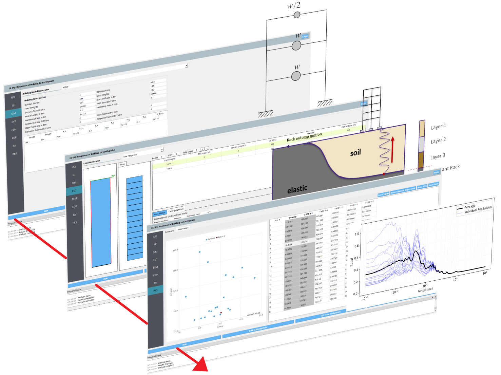
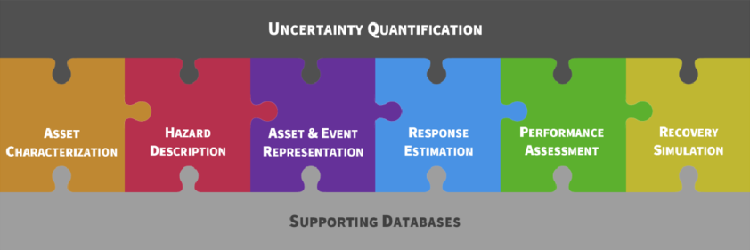
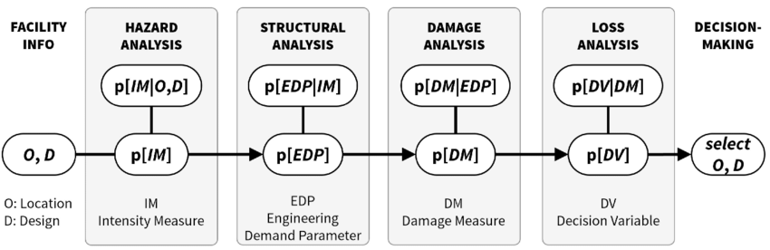

#

<div style="display: flex; justify-content: center;">
  <a href="https://github.com/NHERI-SimCenter/EE-UQ/#gh-light-mode-only"></a>
  <a href="https://github.com/NHERI-SimCenter/EE-UQ/#gh-dark-mode-only"></a>
  <span style="display:inline-block; width: 25px;"></span>
  <div>
    <p>
      <h3 class="subtitle"><b>EE-UQ - Desktop App</b></h3>
      <h3>Earthquake Engineering with Uncertainty Quantification</h3>
      <h5><i>Frank McKenna, Kuanshi Zhong, Michael Gardner, Adam Zsarnoczay, Sang-ri Yi, Aakash Bangalore Satish, Charles Wang, Wael Elhaddad & Peter Mackenzie-Helnwein</i></h5>
      <h5>NHERI SimCenter, 2017-2025</h5>
      <br>
    </p>
  </div>
</div>

---

<div style="display: flex; justify-content: center;">
    
    
</div>

---

[](https://github.com/NHERI-SimCenter/EE-UQ/releases/latest)   <span style="display:inline-block; width: 20px;"></span> [](https://doi.org/10.5281/zenodo.1439079)   <span style="display:inline-block; width: 20px;"></span> [](https://ci.appveyor.com/project/fmckenna/ee-uq)  <span style="display:inline-block; width: 20px;"></span> [](https://raw.githubusercontent.com/NHERI-SimCenter/EE-UQ/master/LICENSE)  <span style="display:inline-block; width: 20px;"></span> [](https://github.com/NHERI-SimCenter)  <span style="display:inline-block; width: 20px;"></span>  [](https://www.linkedin.com/company/nheri-simcenter) <span style="display:inline-block; width: 20px;"></span>  [](https://www.youtube.com/@DesignSafe) <span style="display:inline-block; width: 20px;"></span>  

---

# Why Use EE-UQ

The ``EE-UQ`` desktop application is a user-facing portal for cutting-edge engineering workflows targeting earthquake demands on structures. It is a free, open-source, graphical software for simulating a structures's response with uncertainty quantification (UQ) during seismic hazard loading. The application's interchangeable workflow allows you to swap between popular uncertainty quantification methods (e.g. Forward, Sensitivity, Reliability), upgrading your previously deterministic models to probabilistic analysis. Modular design lets you drop-in your own building models (SIM), event types (EVT), nonlinear structural analysis (FEM), engineering demand parameters (EDP), and more.


## Capabilities

Get ground motions that fit your workflow:
  - Stochastic generation of acceleration time histories from earthquake rupture characteristics.
  - Select records from the PEER NGA West 2 or a user-sepecified ground-motion database to match a target spectrum or to fill an intensity-measure space.
  - Simulate free-field shaking based on specified bedrock motions and soil column information using OpenSees-based site-response analysis.
  - Incorporate physics-based M9 simulations.
  - Provide your own ground motion time histories.

Multiple ways to create structural models that characterize your design:
    - Automatic generation of an idealized Opensees shear column model from basic building information.
    - Automatic generation of a steel or reinforced concrete OpenSees frame model from detailed design.
    - User-specified OpenSees model in Tcl or Python format.
    - User-specified Python script that prepares a structural model and performs the response simulation.
    - Import a user-specified structural-response surrogate model.
    - A multi-model approach, which allows you to specify multiple combinations of the above options.
    - Multi-fidelity Monte Carlo (MFMC) routines for accurate and expedient results by using both high and low fidelity models.

Robust catalogue of drop-in uncertainty quantification:
    - Forward propagation: Define a set of random input parameters and perform Monte Carlo simulations to obtain a corresponding sample of output parameters.
    - Sensitivity analysis: Measure the influence of variability in each input on the uncertainty of outputs.
    - Reliability analysis: Algorithms to estimate the probability of exceeding a failure threshold.
    - Surrogate models: Generate training data and develop surrogate models using Gaussian Process (GP) and Probabilistic Learning on Manifolds techniques (PLoM).
  

## Quick Links

- [Download Application](https://www.designsafe-ci.org/data/browser/public/designsafe.storage.community/SimCenter/Software/EE_UQ)
- [Step-by-Step Examples](https://nheri-simcenter.github.io/EE-UQ-Documentation/common/user_manual/examples/desktop/examples)
- [Documentation & Guides](https://nheri-simcenter.github.io/EE-UQ-Documentation)
- [Overview Web-Page](https://simcenter.designsafe-ci.org/research-tools/ee-uq-application)
- [Forum & Feature Requests](http://simcenter-messageboard.designsafe-ci.org/smf/index.php?board=6.0)


## Citing this Work

If you use ``EE-UQ`` [](https://doi.org/10.5281/zenodo.10902075) in your own work, please cite our software as:

```bibtex
@software{McKennaZhongGardnerZsarnoczayYiSatishWangElhaddad2024EEUQ,
  author       = {Frank McKenna and
                  Kuanshi Zhong and
                  Michael Gardner and
                  Adam Zsarnoczay and
                  Sang-ri Yi and
                  Aakash Bangalore Satish and
                  Charles Wang and
                  Wael Elhaddad},
  title        = {NHERI-SimCenter/EE-UQ: Version 3.5.0},
  month        = apr,
  year         = 2024,
  publisher    = {Zenodo},
  version      = {v3.5.0},
  doi          = {10.5281/zenodo.10902075},
  url          = {https://doi.org/10.5281/zenodo.10902075}
}
```

and include the NHERI SimCenter's workflow architecture [](https://www.frontiersin.org/articles/10.3389/fbuil.2020.558706) using:

```bibtex
@Article{Deierlein2020,
  author={Deierlein, Gregory G. and McKenna, Frank and Zsarnóczay, Adam and Kijewski-Correa, Tracy and Kareem, Ahsan and Elhaddad, Wael and Lowes, Laura and Schoettler, Matthew J. and Govindjee, Sanjay},   
  title={A Cloud-Enabled Application Framework for Simulating Regional-Scale Impacts of Natural Hazards on the Built Environment},      
  journal={Frontiers in Built Environment},      
  volume={6},           
  year={2020},      
  url={https://www.frontiersin.org/articles/10.3389/fbuil.2020.558706},       
  doi={10.3389/fbuil.2020.558706},      
  issn={2297-3362},   
}
```

---

## SimCenter Eco-System

The challenges of natural hazards engineering are addressed by the NHERI SimCenter through a suite of applications that provide cutting-edge tools for researchers, practitioners, and stakeholders. The applications are designed to work together to provide a comprehensive solution for natural hazards engineering. A puzzle-piece diagram of the SimCenter ecosystem is shown below:


<a href="https://github.com/NHERI-SimCenter/"></a>


In reality, this is a software workflow representation of the PEER Performance-Based Earthquake Engineering (PBEE) framework that has been extended to include other natural hazards:


<a href="https://github.com/NHERI-SimCenter/"></a>


``EE-UQ`` is just one part of the [NHERI SimCenter](https://simcenter.designsafe-ci.org) ecosystem that provides cutting-edge open-source tools for natural hazards engineering. Tools like ``quoFEM``, ``EE-UQ``, ``WE-UQ``, ``HydroUQ``, ``PBE``, and ``R2D`` work together to provide a comprehensive solution for natural hazards engineering. The SimCenter ecosytem forms a modular hierarchy that allows users to pick and choose the tools they need for their specific research or engineering problem.


While ``R2D`` is the top-level application that provides a regional resilience assessment, ``EE-UQ``, ``WE-UQ``, and ``HydroUQ`` provide uncertainty quantified simulations for earthquake, wind, and water-borne natural hazards, respectively. ``quoFEM`` is the backend UQ functionality they use.

Additional tools, such as ``BRAILS`` and ``TInF``, have special use-cases including AI-augmentation of building stock and creation of turbulent wind inflow for OpenFOAM CFD simulations.


All applications are free, open-source, and available for download on the [DesignSafe-CI](https://www.designsafe-ci.org) website. See the table below for more information on each application:


| Application | Full Title | Download | GitHub | Version |
|:-----------:|:-----------|:--------:|:------:|:-------:|
| ``R2D`` | Regional Resilience Determination Application | [](https://www.designsafe-ci.org/data/browser/public/designsafe.storage.community/SimCenter/Software/R2Dt) | [](https://github.com/NHERI-SimCenter/R2DTool) | [](https://github.com/NHERI-SimCenter/R2DTool/releases/latest) |
| ``PBE`` | Performance-Based Engineering Application | [](https://www.designsafe-ci.org/data/browser/public/designsafe.storage.community/SimCenter/Software/PBE) | [](https://github.com/NHERI-SimCenter/PBE) | [](https://github.com/NHERI-SimCenter/PBE/releases/latest) |
| ``EE-UQ`` | Earthquake Engineering with Uncertainty Quantification Application | [](https://www.designsafe-ci.org/data/browser/public/designsafe.storage.community/SimCenter/Software/EE_UQ) | [](https://github.com/NHERI-SimCenter/EE-UQ) | [](https://github.com/NHERI-SimCenter/EE-UQ/releases/latest) |
| ``WE-UQ`` | Wind Engineering with Uncertainty Quantification Application | [](https://www.designsafe-ci.org/data/browser/public/designsafe.storage.community/SimCenter/Software/WE_UQ) | [](https://github.com/NHERI-SimCenter/WE-UQ)  | [](https://github.com/NHERI-SimCenter/WE-UQ/releases/latest) |
| ``HydroUQ`` | Water-Borne Natural Hazards Engineering with Uncertainty Quantification Application | [](https://www.designsafe-ci.org/data/browser/public/designsafe.storage.community/SimCenter/Software/HydroUQ) | [](https://github.com/NHERI-SimCenter/HydroUQ)  | [](https://github.com/NHERI-SimCenter/HydroUQ/releases/latest) |
| ``quoFEM`` | Quantified Uncertainty with Optimization for the Finite Element Method Application | [](https://www.designsafe-ci.org/data/browser/public/designsafe.storage.community/SimCenter/Software/quoFEM) | [](https://github.com/NHERI-SimCenter/quoFEM) |  [](https://github.com/NHERI-SimCenter/quoFEM/releases/latest) |
| ``TInF`` | Turbulence Inflow Generation for CFD Application | [](https://www.designsafe-ci.org/data/browser/public/designsafe.storage.community//SimCenter/Software/TurbulenceInflowTool) | [](https://github.com/NHERI-SimCenter/TurbulenceInflowTool) | [](https://github.com/NHERI-SimCenter/TurbulenceInflowTool/releases/latest) |
| ``BRAILS`` | Building Recognition with AI at Large-Scale Application | ``pip install BRAILS`` | [](https://github.com/NHERI-SimCenter/BRAILS) | [](https://github.com/NHERI-SimCenter/BRAILS/releases/latest) |


---

## Getting Started

The ``EE-UQ`` application can be [downloaded](https://www.designsafe-ci.org/data/browser/public/designsafe.storage.community/SimCenter/Software/EE_UQ), [installed](https://nheri-simcenter.github.io/EE-Documentation/common/user_manual/installation/desktop/installation.html), [built](https://nheri-simcenter.github.io/EE-UQ-Documentation/common/developer_manual/how_to_build/desktop/how_to_build.html), and [launched](https://nheri-simcenter.github.io/EE-UQ-Documentation/common/user_manual/installation/desktop/installation.html) on Windows, Mac, and Linux operating systems. With a [free DesignSafe account](https://www.designsafe-ci.org/account/register/), you can run ``EE-UQ`` simulations remotely on powerful supercomputers including ``Frontera`` and ``Stampede3``.


### Download EE-UQ

The ``EE-UQ`` desktop application is available for download on Windows and Mac operating systems from the DesignSafe-CI website at the [EE-UQ Download Link](https://www.designsafe-ci.org/data/browser/public/designsafe.storage.community/SimCenter/Software/EE_UQ).


### Install EE-UQ

The ``EE-UQ`` installation instructions are available in the [EE-UQ Installation Guide](https://nheri-simcenter.github.io/EE-UQ-Documentation/common/user_manual/installation/desktop/installation.html).


### Build EE-UQ

The ``EE-UQ`` application can be built from source code on Windows, Mac, and Linux operating systems. The source code is available in this repository. 

Clone the repository using the following command if the Github CLI is installed on your system:
```
git clone https://github.com/NHERI-SimCenter/EE-UQ.git
```

Otherwise, you can clone the repository on this page by clicking on the green ``Code`` button and then clicking on ``Download ZIP``. Extract the downloaded ZIP file to a location on your system.

Instructions on building the ``EE-UQ`` application from downloaded source code are available in the [EE-UQ How-To-Build Guide](https://nheri-simcenter.github.io/EE-UQ-Documentation/common/developer_manual/how_to_build/desktop/how_to_build.html)


### Launch EE-UQ

The ``EE-UQ`` application can be run by executing the ``EE_UQ`` executable file. The instructions to run the ``EE-UQ`` application are available in the [EE-UQ Documentation](https://nheri-simcenter.github.io/EE-UQ-Documentation/common/user_manual/installation/desktop/installation.html)


### Run EE-UQ Remotely

With a free DesignSafe account you can use the `EE-UQ` desktop app to launch a remote job to run simulations on powerful supercomputers with ease.

[Sign-up for DesignSafe](https://www.designsafe-ci.org/account/register/)

Available systems are the ``Frontera`` and ``Stampede3`` supercomputers. Systems are located at the Texas Advanced Computing Center (TACC) and made available to you through NSF's NHERI DesignSafe-CI, the cyberinfrastructure provider for NHERI. 


---

## Get Involved

``EE-UQ`` is an open-source project developed for practitioners, researchers, students, and stakeholders by our team of experts at the NHERI SimCenter. We welcome contributions from the community to help improve the application and add new features.


### Contributing to EE-UQ

Interested in contributing to the open-source ``EE-UQ`` project? Find out how in the [EE-UQ Documentation](https://nheri-simcenter.github.io/EE-UQ-Documentation/).

We encourage practitioners, researchers, and students to comment on what additional features or step-by-step examples they would like to see in ``EE-UQ``. If you want it, chances are many of your colleagues will also benefit from it. We appreciate all input from the earthquake engineering community during the active development of ``EE-UQ``.

Submit your requests on the [SimCenter forum](https://simcenter-messageboard.designsafe-ci.org/smf/index.php?board=6.0).

### Contact Us

Message us on the [SimCenter Message Board](http://simcenter-messageboard.designsafe-ci.org/smf/index.php?board=6.0) for any questions, feature requests, or issues.

| Developer | Email | Role |
|:----|:-----|:----|
| Frank McKenna | fmckenna@berkeley.edu | [](mailto:fmckenna@berkeley.edu) | 
| Sang-ri Yi | yisangri@berkeley.edu | [](mailto:yisangri@berkeley.edu) | 
| Kuanshi Zhong | kuanshi.zhong@uc.edu | [](mailto:kuanshi.zhong@uc.edu) |
| NHERI SimCenter | nheri-simcenter@berkeley.edu | [](mailto:nheri-simcenter@berkeley.edu) |


### Sign-up for Updates

Stay up-to-date with the latest news, updates, and releases with the [NHERI Newsletter](https://4407eb04.sibforms.com/serve/MUIEAIae4IGtEQHh04xSx9x2pNIIb4m-IjUaN83IpiIrwDW4CtpySmL9ec5ASFjgZSBYRNfgSLwXl1B8sLFSgVYB3Hc2JJP6ORmrNoj9ouHNiX8zAZVmsM1_A18STCEKs3cRP6OXJZGdvUfR7PZd5G0VN_DKVhibD3g9aRAWY7wkEfrCVeJnclbaTXMV8YuGf0KFMZQxOntb5M7Z) and the [SimCenter Newsletter](https://simcenter.designsafe-ci.org/survey/?_gl=1*1mn7c1n*_ga*MTMxNzc2NjI2MC4xNzA5MDIyOTAx*_ga_D96RT1T24K*MTcxNDQ0NDAwOS4xNC4xLjE3MTQ0NDU4NzAuMC4wLjA) newsletters.


---

## Release License
[](https://raw.githubusercontent.com/NHERI-SimCenter/EE-UQ/master/LICENSE)

``EE-UQ`` is released as an open-source research application under a [BSD 2-Clause License](https://nheri-simcenter.github.io/EE-UQ-Documentation/common/front-matter/license.html)


## Acknowledgement


This material is based upon work supported by the National Science Foundation under Grant [No. 1612843](https://www.nsf.gov/awardsearch/showAward?AWD_ID=1612843) and [No. 2131111](https://www.nsf.gov/awardsearch/showAward?AWD_ID=2131111). Any opinions, findings, conclusions or recommendations expressed in this material are those of the author(s) and do not necessarily reflect the views of the U.S. National Science Foundation.
